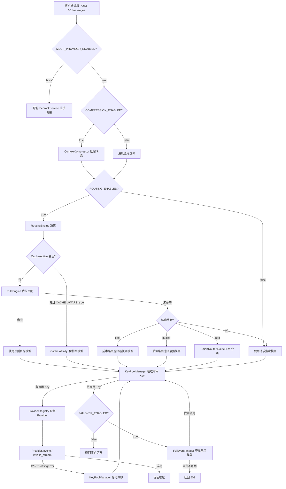
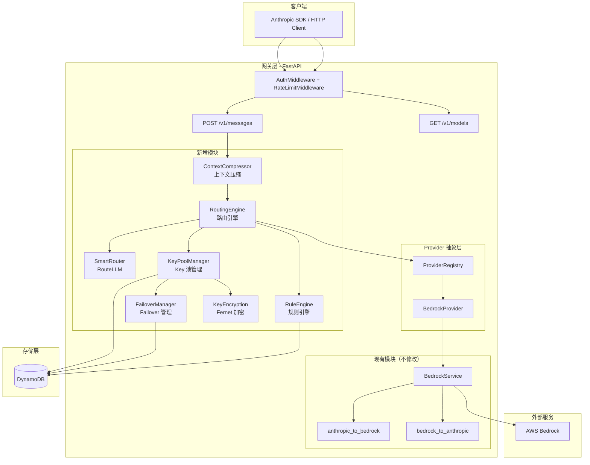
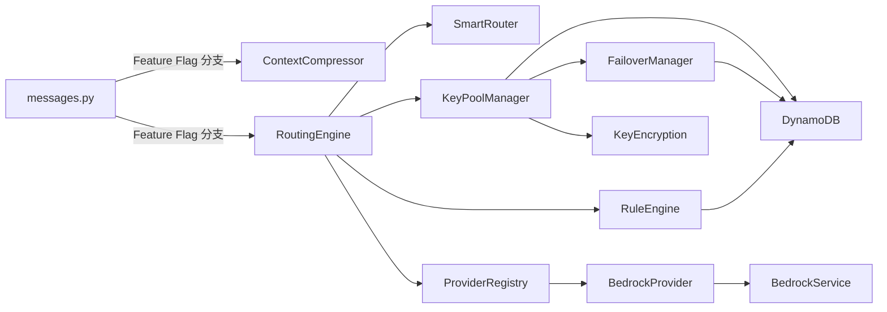

# 设计文档：多 Provider 智能路由网关

## 概述

本设计将现有 `anthropic_api_proxy` 升级为多 Provider 智能路由网关，在不修改现有 30K+ 行代码的前提下，通过新增模块实现 Provider 抽象、多 Key 池管理、智能路由和上下文压缩四大核心能力。

### 设计原则

1. **扩展不重写**：所有新功能通过新模块实现，现有文件仅做最小化修改（添加 Feature Flag 分支）
2. **Feature Flag 控制**：所有新功能默认关闭，通过环境变量按需开启
3. **向后兼容**：Feature Flag 全部关闭时，行为与升级前完全一致
4. **DynamoDB 唯一存储**：不引入 Redis 或其他数据库依赖
5. **Prompt Cache 感知**：面向 Agent 场景，路由和压缩决策必须考虑 prompt cache 命中率，避免切换模型或修改缓存前缀导致 cache 失效、成本反增

### 核心请求流程



## 架构

### 系统架构图



### 模块依赖关系



### 文件结构

新增文件（不修改现有文件的核心逻辑）：

```
app/
├── services/
│   ├── provider_base.py          # LLMProvider ABC + ProviderResponse
│   ├── provider_registry.py      # ProviderRegistry 单例
│   └── bedrock_provider.py       # BedrockProvider 包装
├── keypool/
│   ├── __init__.py
│   ├── manager.py                # KeyPoolManager
│   ├── failover.py               # FailoverManager
│   └── encryption.py             # KeyEncryption (Fernet)
├── routing/
│   ├── __init__.py
│   ├── engine.py                 # RoutingEngine
│   ├── rules.py                  # RuleEngine
│   └── smart.py                  # SmartRouter (RouteLLM)
├── compression/
│   ├── __init__.py
│   └── context_compressor.py     # ContextCompressor
├── core/
│   └── config.py                 # 扩展 Settings（新增 Feature Flag 和配置项）
└── db/
    └── dynamodb.py               # 扩展（新增 RoutingConfigManager、FailoverConfigManager）

admin_portal/
├── backend/
│   ├── api/
│   │   ├── provider_keys.py      # Provider Key CRUD API
│   │   ├── routing.py            # 路由规则 + 智能路由配置 API
│   │   ├── compression.py        # 压缩策略 API（仅 per-key 字段更新）
│   │   └── failover.py           # Failover 链配置 API
│   └── schemas/
│       ├── provider_key.py       # Provider Key schemas
│       ├── routing.py            # 路由规则 schemas
│       └── failover.py           # Failover 链 schemas
└── frontend/src/
    ├── pages/
    │   ├── ProviderKeys.tsx       # Provider Key 管理页面
    │   ├── RoutingConfig.tsx      # 路由规则 + 智能路由配置页面
    │   └── FailoverConfig.tsx     # Failover 链配置页面
    ├── types/
    │   ├── provider-key.ts        # Provider Key 类型
    │   ├── routing.ts             # 路由规则类型
    │   └── failover.ts            # Failover 链类型
    └── hooks/
        ├── useProviderKeys.ts     # Provider Key React Query hooks
        ├── useRouting.ts          # 路由配置 hooks
        └── useFailover.ts         # Failover 配置 hooks
```

需要最小化修改的现有文件：

| 文件 | 修改内容 |
|------|---------|
| `app/core/config.py` | 新增 Feature Flag 和配置项到 Settings 类 |
| `app/api/messages.py` | 在 `create_message` 函数中添加 Feature Flag 分支，调用新模块 |
| `app/api/models.py` | 在 `list_models` 中添加多 Provider 模型聚合逻辑 |
| `app/db/dynamodb.py` | 新增 `RoutingConfigManager`、`FailoverConfigManager` 类，扩展 `create_tables` |
| `app/core/exceptions.py` | 新增 `NoProviderAvailableError` 异常类 |
| `admin_portal/backend/main.py` | 注册新的 API 路由 |
| `admin_portal/backend/schemas/api_key.py` | `ApiKeyCreate`/`ApiKeyUpdate` 新增 `routing_strategy`、`compression_strategy` 字段 |
| `admin_portal/frontend/src/App.tsx` | 新增页面路由 |
| `admin_portal/frontend/src/types/api-key.ts` | 新增 `routing_strategy`、`compression_strategy` 字段 |
| `admin_portal/frontend/src/services/api.ts` | 新增 Provider Key、路由、Failover API 客户端 |

## 组件与接口

### 1. Provider 抽象层

#### LLMProvider 基类 (`app/services/provider_base.py`)

```python
from abc import ABC, abstractmethod
from dataclasses import dataclass
from typing import Any, AsyncIterator, Dict, List, Optional

from app.schemas.anthropic import MessageRequest, MessageResponse


@dataclass
class ProviderResponse:
    """Provider 统一响应包装"""
    response: MessageResponse
    provider_name: str
    model_used: str
    latency_ms: float


@dataclass
class ProviderStreamChunk:
    """Provider 流式响应块"""
    data: str  # SSE 格式的事件数据
    provider_name: str


class LLMProvider(ABC):
    """LLM Provider 抽象基类"""

    @property
    @abstractmethod
    def name(self) -> str:
        """Provider 名称，如 'bedrock', 'openai'"""
        ...

    @abstractmethod
    async def invoke(
        self,
        request: MessageRequest,
        model_id: str,
        api_key_info: Dict[str, Any],
        **kwargs,
    ) -> ProviderResponse:
        """同步调用模型"""
        ...

    @abstractmethod
    async def invoke_stream(
        self,
        request: MessageRequest,
        model_id: str,
        api_key_info: Dict[str, Any],
        **kwargs,
    ) -> AsyncIterator[str]:
        """流式调用模型，返回 SSE 事件流"""
        ...

    @abstractmethod
    def supports_model(self, model_id: str) -> bool:
        """是否支持指定模型"""
        ...

    @abstractmethod
    def get_cost(self, model_id: str, input_tokens: int, output_tokens: int) -> float:
        """计算调用成本（美元）"""
        ...

    @abstractmethod
    def list_models(self) -> List[Dict[str, Any]]:
        """列出所有支持的模型"""
        ...
```

#### ProviderRegistry (`app/services/provider_registry.py`)

```python
from typing import Dict, List, Optional
from app.services.provider_base import LLMProvider


class ProviderRegistry:
    """Provider 注册中心，管理所有已注册的 Provider 实例"""

    def __init__(self):
        self._providers: Dict[str, LLMProvider] = {}  # name -> provider

    def register(self, provider: LLMProvider) -> None:
        """注册 Provider 实例"""
        self._providers[provider.name] = provider

    def unregister(self, name: str) -> None:
        """注销 Provider 实例"""
        self._providers.pop(name, None)

    def get_providers_for_model(self, model_id: str) -> List[LLMProvider]:
        """按模型名查找支持该模型的 Provider 列表"""
        return [p for p in self._providers.values() if p.supports_model(model_id)]

    def get_provider(self, name: str) -> Optional[LLMProvider]:
        """按名称获取 Provider"""
        return self._providers.get(name)

    def list_all_models(self) -> List[Dict[str, Any]]:
        """聚合所有 Provider 的可用模型列表"""
        models = []
        for provider in self._providers.values():
            for model in provider.list_models():
                model["provider"] = provider.name
                models.append(model)
        return models
```

#### BedrockProvider (`app/services/bedrock_provider.py`)

```python
class BedrockProvider(LLMProvider):
    """包装现有 BedrockService 的 Provider 实现"""

    def __init__(self, bedrock_service: BedrockService, pricing_manager: ModelPricingManager):
        self._service = bedrock_service
        self._pricing = pricing_manager

    @property
    def name(self) -> str:
        return "bedrock"

    async def invoke(self, request, model_id, api_key_info, **kwargs) -> ProviderResponse:
        """委托给 BedrockService.invoke_model，包装返回值"""
        start = time.monotonic()
        response = await self._service.invoke_model(request, api_key_info)
        latency = (time.monotonic() - start) * 1000
        return ProviderResponse(
            response=response, provider_name="bedrock",
            model_used=model_id, latency_ms=latency,
        )

    async def invoke_stream(self, request, model_id, api_key_info, **kwargs):
        """委托给 BedrockService.invoke_model_stream"""
        async for chunk in self._service.invoke_model_stream(request, api_key_info):
            yield chunk

    def supports_model(self, model_id: str) -> bool:
        """检查 default_model_mapping 和 DynamoDB model_mapping"""
        return self._service._get_bedrock_model_id(model_id) is not None

    def get_cost(self, model_id, input_tokens, output_tokens) -> float:
        """从 ModelPricingManager 获取定价计算成本"""
        pricing = self._pricing.get_pricing(model_id)
        if not pricing:
            return 0.0
        return (input_tokens * pricing.get("input_price", 0) +
                output_tokens * pricing.get("output_price", 0)) / 1_000_000

    def list_models(self):
        return self._service.list_available_models()
```

### 2. Key 池与 Failover

#### KeyEncryption (`app/keypool/encryption.py`)

```python
from cryptography.fernet import Fernet
import base64
import hashlib


class KeyEncryption:
    """使用 Fernet (AES-128-CBC + HMAC-SHA256) 加密 Provider API Key"""

    def __init__(self, secret: str):
        # 从 PROVIDER_KEY_ENCRYPTION_SECRET 派生 Fernet 密钥
        key = hashlib.sha256(secret.encode()).digest()
        self._fernet = Fernet(base64.urlsafe_b64encode(key))

    def encrypt(self, plaintext: str) -> str:
        """加密，返回 base64 编码的密文"""
        return self._fernet.encrypt(plaintext.encode()).decode()

    def decrypt(self, ciphertext: str) -> str:
        """解密，返回明文"""
        return self._fernet.decrypt(ciphertext.encode()).decode()

    @staticmethod
    def mask(key: str) -> str:
        """脱敏显示：前4位 + **** + 后4位"""
        if len(key) <= 8:
            return "****"
        return f"{key[:4]}****{key[-4:]}"
```

#### KeyPoolManager (`app/keypool/manager.py`)

```python
import time
from dataclasses import dataclass, field
from typing import Dict, List, Optional, Tuple


@dataclass
class KeyState:
    """单个 Key 的运行时状态"""
    provider_key_id: str       # DynamoDB 中的记录 ID
    provider: str              # provider 名称
    encrypted_key: str         # 加密后的 key
    models: List[str]          # 该 key 支持的模型列表
    is_enabled: bool = True    # 管理员是否启用
    cooldown_until: float = 0  # 冷却到期时间戳（Unix）
    request_count: int = 0     # 轮换计数器


class KeyPoolManager:
    """管理各 Provider 多个 API Key 的轮换和冷却"""

    def __init__(self, encryption: KeyEncryption, dynamodb_client):
        self._encryption = encryption
        self._db = dynamodb_client
        self._keys: Dict[str, List[KeyState]] = {}  # provider -> [KeyState]
        self._rr_index: Dict[str, int] = {}          # provider -> round-robin index

    def load_keys(self) -> None:
        """从 DynamoDB 加载所有 Provider Key 到内存"""
        ...

    def get_available_key(self, provider: str, model_id: str) -> Optional[Tuple[str, str]]:
        """
        Round-Robin 获取可用 Key。
        返回 (decrypted_key, key_id) 或 None（全部冷却中）。
        自动跳过冷却中和禁用的 Key。
        """
        keys = self._keys.get(provider, [])
        available = [k for k in keys
                     if k.is_enabled
                     and model_id in k.models
                     and k.cooldown_until < time.time()]
        if not available:
            return None

        idx = self._rr_index.get(provider, 0) % len(available)
        self._rr_index[provider] = idx + 1
        key_state = available[idx]
        key_state.request_count += 1

        decrypted = self._encryption.decrypt(key_state.encrypted_key)
        return (decrypted, key_state.provider_key_id)

    def mark_rate_limited(self, provider: str, key_id: str,
                          retry_after: Optional[int] = None) -> None:
        """标记 Key 为限流状态，设置冷却时间"""
        cooldown = retry_after or 60  # 默认 60 秒
        for key in self._keys.get(provider, []):
            if key.provider_key_id == key_id:
                key.cooldown_until = time.time() + cooldown
                break

    def mark_preemptive_cooldown(self, provider: str, key_id: str) -> None:
        """x-ratelimit-remaining=0 时主动冷却"""
        self.mark_rate_limited(provider, key_id, retry_after=60)

    def has_available_keys(self, provider: str, model_id: str) -> bool:
        """检查是否有可用 Key"""
        return self.get_available_key(provider, model_id) is not None
```

#### FailoverManager (`app/keypool/failover.py`)

```python
from typing import Dict, List, Optional, Tuple
import logging

logger = logging.getLogger(__name__)


@dataclass
class FailoverTarget:
    """Failover 目标"""
    provider: str
    model: str


class FailoverManager:
    """Failover 链管理，当所有 Key 不可用时切换到备用模型"""

    def __init__(self, key_pool: KeyPoolManager, dynamodb_client):
        self._key_pool = key_pool
        self._db = dynamodb_client
        # source_model -> [FailoverTarget] 有序列表
        self._chains: Dict[str, List[FailoverTarget]] = {}

    def load_chains(self) -> None:
        """从 DynamoDB 加载 Failover 链配置"""
        ...

    def find_failover(self, source_model: str) -> Optional[Tuple[str, str, str, str]]:
        """
        查找可用的 Failover 目标。
        返回 (decrypted_key, key_id, target_provider, target_model) 或 None。
        """
        targets = self._chains.get(source_model, [])
        for target in targets:
            key_result = self._key_pool.get_available_key(target.provider, target.model)
            if key_result:
                decrypted_key, key_id = key_result
                logger.info(
                    "Failover triggered",
                    extra={
                        "from_model": source_model,
                        "to_provider": target.provider,
                        "to_model": target.model,
                    }
                )
                return (decrypted_key, key_id, target.provider, target.model)
        return None
```

### 3. 路由引擎

#### RoutingEngine (`app/routing/engine.py`)

```python
from dataclasses import dataclass
from typing import Optional
import logging

logger = logging.getLogger(__name__)


@dataclass
class RoutingDecision:
    """路由决策结果"""
    provider: str
    model: str
    reason: str  # 决策原因，用于日志


class RoutingEngine:
    """根据策略决定请求路由到哪个 Provider 和模型"""

    def __init__(self, rule_engine, smart_router, provider_registry, pricing_manager,
                 cache_aware_routing: bool = True):
        self._rules = rule_engine
        self._smart = smart_router
        self._registry = provider_registry
        self._pricing = pricing_manager
        self._cache_aware = cache_aware_routing

    def route(
        self,
        request_model: str,
        user_message: str,
        api_key_info: dict,
        is_cache_active: bool = False,
    ) -> RoutingDecision:
        """
        执行路由决策。

        流程：
        0. Cache Affinity 检查（cache-active 会话保持模型粘性）
        1. 检查路由策略（off 直接返回）
        2. 规则引擎优先匹配
        3. 预算感知降级检查
        4. 按策略（cost/quality/auto）选择模型
        """
        strategy = api_key_info.get("routing_strategy", "off")

        if strategy == "off":
            return RoutingDecision(
                provider="bedrock", model=request_model,
                reason="routing_off"
            )

        # 0. Cache Affinity — cache-active 会话保持模型粘性
        if self._cache_aware and is_cache_active:
            return RoutingDecision(
                provider="bedrock", model=request_model,
                reason="cache_affinity"
            )

        # 1. 规则引擎优先
        rule_match = self._rules.match(user_message, request_model)
        if rule_match:
            logger.info("Rule matched", extra={"rule": rule_match.rule_name, "target": rule_match.target_model})
            return RoutingDecision(
                provider=rule_match.target_provider or "bedrock",
                model=rule_match.target_model,
                reason=f"rule:{rule_match.rule_name}"
            )

        # 2. 预算感知降级
        if self._should_degrade(api_key_info):
            return RoutingDecision(
                provider="bedrock",
                model=self._smart.weak_model,
                reason="budget_degradation"
            )

        # 3. 按策略路由
        if strategy == "cost":
            return self._route_by_cost(request_model)
        elif strategy == "quality":
            return self._route_by_quality(request_model)
        elif strategy == "auto":
            return self._route_by_smart(user_message, request_model)

        return RoutingDecision(provider="bedrock", model=request_model, reason="fallback")

    def _should_degrade(self, api_key_info: dict) -> bool:
        """预算使用超过 80% 时降级"""
        budget = api_key_info.get("monthly_budget", 0)
        used = api_key_info.get("budget_used_mtd", 0)
        if budget <= 0:
            return False
        return (used / budget) >= 0.8

    def _route_by_cost(self, request_model: str) -> RoutingDecision:
        """按 token 单价排序，选择最便宜的可用模型"""
        all_pricing = self._pricing.list_all_pricing()
        # 标准化成本：1000 input + 500 output tokens
        scored = []
        for p in all_pricing.get("items", []):
            cost = (1000 * p.get("input_price", 0) + 500 * p.get("output_price", 0)) / 1_000_000
            scored.append((cost, p["model_id"], p.get("provider", "bedrock")))
        scored.sort(key=lambda x: x[0])

        for cost, model, provider in scored:
            providers = self._registry.get_providers_for_model(model)
            if providers:
                return RoutingDecision(provider=provider, model=model, reason=f"cost:{cost:.6f}")

        raise NoProviderAvailableError("No available model for cost routing")

    def _route_by_quality(self, request_model: str) -> RoutingDecision:
        """选择配置中质量最高的可用模型（按定价倒序作为质量代理）"""
        all_pricing = self._pricing.list_all_pricing()
        scored = []
        for p in all_pricing.get("items", []):
            cost = (1000 * p.get("input_price", 0) + 500 * p.get("output_price", 0)) / 1_000_000
            scored.append((cost, p["model_id"], p.get("provider", "bedrock")))
        scored.sort(key=lambda x: x[0], reverse=True)  # 最贵 = 最高质量

        for cost, model, provider in scored:
            providers = self._registry.get_providers_for_model(model)
            if providers:
                return RoutingDecision(provider=provider, model=model, reason=f"quality:{model}")

        raise NoProviderAvailableError("No available model for quality routing")

    def _route_by_smart(self, user_message: str, request_model: str) -> RoutingDecision:
        """使用 RouteLLM 分类复杂度"""
        complexity = self._smart.classify(user_message)
        if complexity == "high":
            model = self._smart.strong_model
            reason = "smart:high_complexity"
        else:
            model = self._smart.weak_model
            reason = "smart:low_complexity"
        return RoutingDecision(provider="bedrock", model=model, reason=reason)
```

#### RuleEngine (`app/routing/rules.py`)

```python
import re
from dataclasses import dataclass
from typing import List, Optional


@dataclass
class RoutingRule:
    """路由规则定义"""
    rule_id: str
    rule_name: str
    rule_type: str          # "keyword" | "regex" | "model"
    pattern: str            # 关键词/正则/模型名
    target_model: str
    target_provider: str = "bedrock"
    priority: int = 0       # 越小优先级越高


@dataclass
class RuleMatch:
    """规则匹配结果"""
    rule_name: str
    target_model: str
    target_provider: Optional[str] = None


class RuleEngine:
    """基于关键词、正则、模型名的 if-else 规则匹配"""

    def __init__(self):
        self._rules: List[RoutingRule] = []

    def load_rules(self, rules: List[RoutingRule]) -> None:
        """加载规则列表（已按 priority 排序）"""
        self._rules = sorted(rules, key=lambda r: r.priority)

    def match(self, user_message: str, request_model: str) -> Optional[RuleMatch]:
        """
        按优先级顺序匹配规则，返回第一条命中的规则。
        - keyword: 不区分大小写包含匹配
        - regex: 正则匹配
        - model: 模型名精确匹配
        """
        for rule in self._rules:
            if rule.rule_type == "keyword":
                keywords = [k.strip() for k in rule.pattern.split(",")]
                if any(kw.lower() in user_message.lower() for kw in keywords):
                    return RuleMatch(rule.rule_name, rule.target_model, rule.target_provider)

            elif rule.rule_type == "regex":
                if re.search(rule.pattern, user_message):
                    return RuleMatch(rule.rule_name, rule.target_model, rule.target_provider)

            elif rule.rule_type == "model":
                source_models = [m.strip() for m in rule.pattern.split(",")]
                if request_model in source_models:
                    return RuleMatch(rule.rule_name, rule.target_model, rule.target_provider)

        return None
```

#### SmartRouter (`app/routing/smart.py`)

```python
from typing import Optional
import logging

logger = logging.getLogger(__name__)


class SmartRouter:
    """集成 RouteLLM 库，基于 query 复杂度自动分类"""

    def __init__(self, strong_model: str, weak_model: str, threshold: float = 0.5):
        self.strong_model = strong_model
        self.weak_model = weak_model
        self.threshold = threshold
        self._router = None  # 延迟加载 RouteLLM

    def _ensure_loaded(self) -> None:
        """延迟加载 RouteLLM，仅在 SMART_ROUTING_ENABLED=true 时调用"""
        if self._router is None:
            from routellm.controller import Controller
            self._router = Controller(
                routers=["mf"],
                strong_model=self.strong_model,
                weak_model=self.weak_model,
            )

    def classify(self, user_message: str) -> str:
        """
        分类 query 复杂度。
        返回 "high" 或 "low"。
        """
        self._ensure_loaded()
        try:
            result = self._router.completion(
                model=f"router-mf-{self.threshold}",
                messages=[{"role": "user", "content": user_message}],
            )
            # RouteLLM 返回的 model 字段表示选择了哪个模型
            chosen = result.model if hasattr(result, 'model') else ""
            if chosen == self.strong_model:
                return "high"
            return "low"
        except Exception as e:
            logger.warning(f"SmartRouter classification failed, defaulting to high: {e}")
            return "high"  # 失败时保守选择强模型
```

### 4. 上下文压缩

#### ContextCompressor (`app/compression/context_compressor.py`)

```python
from dataclasses import dataclass
from typing import List, Optional
from app.schemas.anthropic import Message


@dataclass
class CompressionStats:
    """压缩统计"""
    original_chars: int
    compressed_chars: int
    savings_ratio: float  # 0.0 ~ 1.0


class ContextCompressor:
    """Agent 上下文压缩器"""

    def __init__(
        self,
        tool_result_max_chars: int = 2000,
        tool_result_head_chars: int = 500,
        tool_result_tail_chars: int = 500,
        fold_after_turns: int = 6,
        fold_min_length: int = 200,
        fold_summary_length: int = 150,
    ):
        self.tool_result_max_chars = tool_result_max_chars
        self.tool_result_head_chars = tool_result_head_chars
        self.tool_result_tail_chars = tool_result_tail_chars
        self.fold_after_turns = fold_after_turns
        self.fold_min_length = fold_min_length
        self.fold_summary_length = fold_summary_length

    def compress(
        self,
        messages: List[dict],
        strategy: str,  # "aggressive" | "moderate" | "conservative" | "off"
    ) -> tuple[List[dict], CompressionStats]:
        """
        压缩消息列表。

        策略：
        - off: 不压缩，原样返回
        - conservative: 仅工具结果截断
        - moderate: 工具结果截断 + 历史对话折叠
        - aggressive: 工具结果截断 + 历史对话折叠
        """
        if strategy == "off":
            total = sum(len(str(m)) for m in messages)
            return messages, CompressionStats(total, total, 0.0)

        original_chars = sum(len(str(m)) for m in messages)
        result = list(messages)  # shallow copy

        # 工具结果截断（conservative、moderate、aggressive 都执行）
        result = self._truncate_tool_results(result)

        # 历史对话折叠（moderate 和 aggressive 执行）
        if strategy in ("moderate", "aggressive"):
            result = self._fold_history(result)

        compressed_chars = sum(len(str(m)) for m in result)
        savings = 1.0 - (compressed_chars / original_chars) if original_chars > 0 else 0.0

        return result, CompressionStats(original_chars, compressed_chars, savings)

    def _truncate_tool_results(self, messages: List[dict]) -> List[dict]:
        """截断过长的 tool_result 内容"""
        result = []
        for msg in messages:
            if msg.get("role") == "user" and isinstance(msg.get("content"), list):
                new_content = []
                for block in msg["content"]:
                    if block.get("type") == "tool_result":
                        block = self._truncate_single_tool_result(block)
                    new_content.append(block)
                result.append({**msg, "content": new_content})
            else:
                result.append(msg)
        return result

    def _truncate_single_tool_result(self, block: dict) -> dict:
        """截断单个 tool_result（跳过包含 cache_control 的块）"""
        if block.get("cache_control"):
            return block  # 保护 prompt cache 前缀
        content = block.get("content", "")
        if isinstance(content, str) and len(content) > self.tool_result_max_chars:
            head = content[:self.tool_result_head_chars]
            tail = content[-self.tool_result_tail_chars:]
            omitted = len(content) - self.tool_result_head_chars - self.tool_result_tail_chars
            truncated = f"{head}\n\n... [已省略 {len(content)} 字符中的 {omitted} 字符] ...\n\n{tail}"
            return {**block, "content": truncated}
        return block

    def _fold_history(self, messages: List[dict]) -> List[dict]:
        """折叠超过 N 轮的旧 assistant 消息"""
        total = len(messages)
        # 计算折叠边界：保留最后 fold_after_turns * 2 条消息（user+assistant 为一轮）
        keep_count = self.fold_after_turns * 2
        fold_boundary = total - keep_count

        if fold_boundary <= 0:
            return messages

        result = []
        for i, msg in enumerate(messages):
            if i < fold_boundary and msg.get("role") == "assistant":
                # 跳过包含 cache_control 的消息，保护 prompt cache 前缀
                if self._has_cache_control(msg):
                    result.append(msg)
                    continue
                content = self._extract_text(msg)
                if len(content) > self.fold_min_length:
                    summary = content[:self.fold_summary_length] + "..."
                    result.append({**msg, "content": summary})
                    continue
            result.append(msg)
        return result

    def _extract_text(self, msg: dict) -> str:
        """从消息中提取文本内容"""
        content = msg.get("content", "")
        if isinstance(content, str):
            return content
        if isinstance(content, list):
            texts = [b.get("text", "") for b in content if b.get("type") == "text"]
            return " ".join(texts)
        return ""
```

### 5. Feature Flag 控制

在 `app/core/config.py` 的 `Settings` 类中新增：

```python
# === 多 Provider 网关 Feature Flags ===
multi_provider_enabled: bool = Field(default=False, alias="MULTI_PROVIDER_ENABLED")
routing_enabled: bool = Field(default=False, alias="ROUTING_ENABLED")
smart_routing_enabled: bool = Field(default=False, alias="SMART_ROUTING_ENABLED")
failover_enabled: bool = Field(default=True, alias="FAILOVER_ENABLED")
compression_enabled: bool = Field(default=False, alias="COMPRESSION_ENABLED")

# === Provider Key 加密 ===
provider_key_encryption_secret: Optional[str] = Field(
    default=None, alias="PROVIDER_KEY_ENCRYPTION_SECRET"
)

# === 智能路由配置 ===
smart_routing_strong_model: str = Field(
    default="claude-sonnet-4-5-20250929", alias="SMART_ROUTING_STRONG_MODEL"
)
smart_routing_weak_model: str = Field(
    default="claude-haiku-4-5-20251001", alias="SMART_ROUTING_WEAK_MODEL"
)
smart_routing_threshold: float = Field(
    default=0.5, alias="SMART_ROUTING_THRESHOLD"
)

# === 压缩配置 ===
compression_tool_result_max_chars: int = Field(
    default=2000, alias="COMPRESSION_TOOL_RESULT_MAX_CHARS"
)
compression_fold_after_turns: int = Field(
    default=6, alias="COMPRESSION_FOLD_AFTER_TURNS"
)

# === Failover 配置 ===
failover_chains: Optional[str] = Field(
    default=None, alias="FAILOVER_CHAINS",
    description="JSON 格式的 Failover 链，如 {\"model_a\": [\"model_b\", \"model_c\"]}"
)

# === Cache-Aware 路由 ===
cache_aware_routing_enabled: bool = Field(
    default=True, alias="CACHE_AWARE_ROUTING_ENABLED",
    description="Cache-active 会话保持模型粘性，避免切换导致 cache 失效"
)
```

### 6. messages.py 集成点

在 `app/api/messages.py` 的 `create_message` 函数中添加 Feature Flag 分支（伪代码）：

```python
async def create_message(request: MessageRequest, ...):
    # ... 现有认证、限流逻辑不变 ...

    if settings.multi_provider_enabled:
        # === 新路径：多 Provider 网关 ===

        # 1. 上下文压缩
        compression_stats = None
        if settings.compression_enabled:
            strategy = api_key_info.get("compression_strategy", "off")
            messages, compression_stats = context_compressor.compress(
                request.messages, strategy
            )
            request = request.model_copy(update={"messages": messages})

        # 2. 路由决策
        if settings.routing_enabled:
            user_msg = _extract_last_user_text(request.messages)
            is_cache_active = _is_cache_active_session(request)
            decision = routing_engine.route(
                request.model, user_msg, api_key_info,
                is_cache_active=is_cache_active,
            )
            target_provider = decision.provider
            target_model = decision.model
            logger.info("Routing decision", extra={
                "original_model": request.model,
                "target_model": target_model,
                "reason": decision.reason,
            })
        else:
            target_provider = "bedrock"
            target_model = request.model

        # 3. Key 获取 + Failover
        key_result = key_pool_manager.get_available_key(target_provider, target_model)
        if key_result is None and settings.failover_enabled:
            failover_result = failover_manager.find_failover(target_model)
            if failover_result:
                decrypted_key, key_id, target_provider, target_model = failover_result
            else:
                raise ServiceUnavailableError("All providers unavailable")
        elif key_result is None:
            # Failover 关闭，直接报错
            raise ServiceUnavailableError("No available key")
        else:
            decrypted_key, key_id = key_result

        # 4. 调用 Provider
        provider = provider_registry.get_provider(target_provider)
        # 对于 Bedrock Provider，不需要 API Key（使用 IAM），忽略 decrypted_key
        if request.stream:
            return StreamingResponse(
                provider.invoke_stream(request, target_model, api_key_info),
                media_type="text/event-stream",
            )
        else:
            result = await provider.invoke(request, target_model, api_key_info)
            return result.response
    else:
        # === 原有路径：直接调用 BedrockService（完全不变）===
        # ... 现有代码保持不变 ...
```

### 7. 异常扩展

在 `app/core/exceptions.py` 新增：

```python
class NoProviderAvailableError(BedrockAPIError):
    """所有 Provider 均不可用"""
    def __init__(self, error_message: str):
        super().__init__(
            error_code="NoProviderAvailable",
            error_message=error_message,
            http_status=503,
            error_type="api_error"
        )
```

## 数据模型

### DynamoDB 表扩展

#### 1. api-keys 表扩展字段

在现有 `anthropic-proxy-api-keys` 表中新增字段（无需新建表）：

| 字段名 | 类型 | 默认值 | 说明 |
|--------|------|--------|------|
| `routing_strategy` | String | `"off"` | 路由策略：cost/quality/auto/off |
| `compression_strategy` | String | `"off"` | 压缩策略：aggressive/moderate/conservative/off |

#### 2. 新增 Provider Keys 表 (`anthropic-proxy-provider-keys`)

| 字段名 | 类型 | 说明 |
|--------|------|------|
| `key_id` (PK) | String | UUID，主键 |
| `provider` | String | Provider 名称：bedrock/openai/anthropic/deepseek |
| `encrypted_api_key` | String | Fernet 加密后的 API Key |
| `models` | List[String] | 该 Key 支持的模型列表 |
| `is_enabled` | Boolean | 是否启用 |
| `status` | String | 状态：available/cooldown/disabled |
| `created_at` | String | ISO 8601 创建时间 |
| `updated_at` | String | ISO 8601 更新时间 |

GSI: `provider-index` (PK: `provider`)

#### 3. 新增路由规则表 (`anthropic-proxy-routing-rules`)

| 字段名 | 类型 | 说明 |
|--------|------|------|
| `rule_id` (PK) | String | UUID，主键 |
| `rule_name` | String | 规则名称 |
| `rule_type` | String | keyword/regex/model |
| `pattern` | String | 匹配模式 |
| `target_model` | String | 目标模型 |
| `target_provider` | String | 目标 Provider |
| `priority` | Number | 优先级（越小越高） |
| `is_enabled` | Boolean | 是否启用 |
| `created_at` | String | ISO 8601 |
| `updated_at` | String | ISO 8601 |

#### 4. 新增 Failover 链表 (`anthropic-proxy-failover-chains`)

| 字段名 | 类型 | 说明 |
|--------|------|------|
| `source_model` (PK) | String | 源模型名，主键 |
| `targets` | List[Map] | 有序 Failover 目标列表 `[{provider, model}]` |
| `created_at` | String | ISO 8601 |
| `updated_at` | String | ISO 8601 |

#### 5. 新增智能路由配置表 (`anthropic-proxy-smart-routing-config`)

| 字段名 | 类型 | 说明 |
|--------|------|------|
| `config_id` (PK) | String | 固定值 `"global"` |
| `strong_model` | String | 强模型 ID |
| `weak_model` | String | 弱模型 ID |
| `threshold` | Number | 分类阈值 0.0~1.0 |
| `updated_at` | String | ISO 8601 |

### Admin Portal 后端 API

#### Provider Key API (`/api/provider-keys`)

| 方法 | 路径 | 说明 |
|------|------|------|
| GET | `/api/provider-keys` | 列出所有 Provider Key（Key 脱敏显示） |
| POST | `/api/provider-keys` | 新增 Provider Key（加密存储） |
| PUT | `/api/provider-keys/{key_id}` | 编辑 Provider Key（模型列表、启用状态） |
| DELETE | `/api/provider-keys/{key_id}` | 删除 Provider Key |

请求/响应 Schema：

```python
# admin_portal/backend/schemas/provider_key.py
class ProviderKeyCreate(BaseModel):
    provider: str  # bedrock/openai/anthropic/deepseek
    api_key: str   # 明文，后端加密存储
    models: List[str]

class ProviderKeyUpdate(BaseModel):
    models: Optional[List[str]] = None
    is_enabled: Optional[bool] = None

class ProviderKeyResponse(BaseModel):
    key_id: str
    provider: str
    api_key_masked: str  # 前4+****+后4
    models: List[str]
    is_enabled: bool
    status: str  # available/cooldown/disabled
    created_at: str
    updated_at: Optional[str] = None
```

#### 路由配置 API (`/api/routing`)

| 方法 | 路径 | 说明 |
|------|------|------|
| GET | `/api/routing/rules` | 列出所有路由规则（按 priority 排序） |
| POST | `/api/routing/rules` | 新增路由规则 |
| PUT | `/api/routing/rules/{rule_id}` | 编辑路由规则 |
| DELETE | `/api/routing/rules/{rule_id}` | 删除路由规则 |
| PUT | `/api/routing/rules/reorder` | 批量更新规则优先级 |
| GET | `/api/routing/smart-config` | 获取智能路由全局配置 |
| PUT | `/api/routing/smart-config` | 更新智能路由全局配置 |

```python
# admin_portal/backend/schemas/routing.py
class RoutingRuleCreate(BaseModel):
    rule_name: str
    rule_type: str  # keyword/regex/model
    pattern: str
    target_model: str
    target_provider: str = "bedrock"

class RoutingRuleUpdate(BaseModel):
    rule_name: Optional[str] = None
    rule_type: Optional[str] = None
    pattern: Optional[str] = None
    target_model: Optional[str] = None
    target_provider: Optional[str] = None
    is_enabled: Optional[bool] = None

class RoutingRuleResponse(BaseModel):
    rule_id: str
    rule_name: str
    rule_type: str
    pattern: str
    target_model: str
    target_provider: str
    priority: int
    is_enabled: bool
    created_at: str
    updated_at: Optional[str] = None

class RuleReorderRequest(BaseModel):
    rule_ids: List[str]  # 按新优先级排序的 rule_id 列表

class SmartRoutingConfig(BaseModel):
    strong_model: str
    weak_model: str
    threshold: float = 0.5
```

#### Failover 链 API (`/api/failover`)

| 方法 | 路径 | 说明 |
|------|------|------|
| GET | `/api/failover/chains` | 列出所有 Failover 链 |
| POST | `/api/failover/chains` | 新增 Failover 链 |
| PUT | `/api/failover/chains/{source_model}` | 编辑 Failover 链 |
| DELETE | `/api/failover/chains/{source_model}` | 删除 Failover 链 |

```python
# admin_portal/backend/schemas/failover.py
class FailoverTarget(BaseModel):
    provider: str
    model: str

class FailoverChainCreate(BaseModel):
    source_model: str
    targets: List[FailoverTarget]

class FailoverChainUpdate(BaseModel):
    targets: List[FailoverTarget]

class FailoverChainResponse(BaseModel):
    source_model: str
    targets: List[FailoverTarget]
    created_at: str
    updated_at: Optional[str] = None
```

#### API Key 扩展字段

在现有 `ApiKeyCreate` / `ApiKeyUpdate` 中新增：

```python
# admin_portal/backend/schemas/api_key.py 扩展
class ApiKeyCreate(BaseModel):
    # ... 现有字段 ...
    routing_strategy: Optional[str] = Field("off", description="cost/quality/auto/off")
    compression_strategy: Optional[str] = Field("off", description="aggressive/moderate/conservative/off")

class ApiKeyUpdate(BaseModel):
    # ... 现有字段 ...
    routing_strategy: Optional[str] = None
    compression_strategy: Optional[str] = None
```

### Admin Portal 前端组件

#### 新增页面

1. **ProviderKeys.tsx** — Provider Key 管理
   - Key 列表表格（Provider、脱敏 Key、模型列表、状态标签）
   - 新增/编辑 Modal（Provider 下拉、Key 输入、模型多选）
   - 删除确认 Dialog

2. **RoutingConfig.tsx** — 路由规则 + 智能路由配置
   - 规则列表表格（支持拖拽排序）
   - 新增/编辑规则 Modal（类型选择、模式输入、目标模型选择）
   - 智能路由配置面板（strong_model 下拉、weak_model 下拉、threshold 滑块）

3. **FailoverConfig.tsx** — Failover 链配置
   - Failover 链列表
   - 新增/编辑 Modal（源模型选择、目标列表可排序）

#### 扩展现有页面

- **ApiKeys.tsx** — 在 API Key 编辑表单中新增路由策略下拉和压缩策略下拉

#### 新增 TypeScript 类型

```typescript
// types/provider-key.ts
export interface ProviderKey {
  key_id: string;
  provider: string;
  api_key_masked: string;
  models: string[];
  is_enabled: boolean;
  status: 'available' | 'cooldown' | 'disabled';
  created_at: string;
  updated_at?: string;
}

// types/routing.ts
export interface RoutingRule {
  rule_id: string;
  rule_name: string;
  rule_type: 'keyword' | 'regex' | 'model';
  pattern: string;
  target_model: string;
  target_provider: string;
  priority: number;
  is_enabled: boolean;
  created_at: string;
  updated_at?: string;
}

export interface SmartRoutingConfig {
  strong_model: string;
  weak_model: string;
  threshold: number;
}

// types/failover.ts
export interface FailoverTarget {
  provider: string;
  model: string;
}

export interface FailoverChain {
  source_model: string;
  targets: FailoverTarget[];
  created_at: string;
  updated_at?: string;
}
```

## 正确性属性 (Correctness Properties)

*属性（Property）是在系统所有合法执行中都应成立的特征或行为——本质上是对系统应做什么的形式化陈述。属性是人类可读规格说明与机器可验证正确性保证之间的桥梁。*

### Property 1: Provider Registry 模型查找正确性

*For any* set of registered providers with known model support, and *for any* model query string, `get_providers_for_model` should return exactly the providers whose `supports_model` returns true for that model, and return an empty list when no provider supports it.

**Validates: Requirements 1.2, 1.3, 1.4**

### Property 2: Provider Registry 注册/注销 round-trip

*For any* provider instance, registering it then unregistering it should result in the registry no longer containing that provider, and querying its models should no longer return it.

**Validates: Requirements 1.6**

### Property 3: Bedrock Provider 模型映射覆盖

*For any* model ID present in `default_model_mapping`, `BedrockProvider.supports_model` should return `true`.

**Validates: Requirements 2.4**

### Property 4: Fernet 加密 round-trip

*For any* non-empty string (representing an API key), encrypting with `KeyEncryption.encrypt` then decrypting with `KeyEncryption.decrypt` should return the original string.

**Validates: Requirements 3.2, 16.1**

### Property 5: Round-Robin 均匀分布

*For any* key pool with N available keys (N > 0) for a given provider and model, calling `get_available_key` exactly N times should return each key exactly once.

**Validates: Requirements 4.1, 4.2**

### Property 6: 冷却 Key 跳过

*For any* key pool where some keys are in cooldown and at least one is available, `get_available_key` should never return a key whose `cooldown_until` is in the future. When all keys are in cooldown, it should return `None`.

**Validates: Requirements 4.3, 4.4**

### Property 7: Rate Limit 标记与冷却时间

*For any* key and *for any* positive integer `retry_after`, calling `mark_rate_limited(provider, key_id, retry_after)` should set that key's cooldown duration to `retry_after` seconds. When `retry_after` is `None`, the cooldown should default to 60 seconds. The same marking behavior should apply when triggered by `x-ratelimit-remaining=0`.

**Validates: Requirements 5.1, 5.2, 5.3, 5.5**

### Property 8: 冷却恢复 round-trip

*For any* key that has been marked as rate-limited with cooldown time T, after T seconds have elapsed, the key should be available again via `get_available_key`.

**Validates: Requirements 5.4**

### Property 9: Failover 链顺序查找

*For any* failover chain configuration with ordered targets, and *for any* combination of key availability states, `find_failover` should return the first target in chain order that has an available key, or `None` if all targets are unavailable.

**Validates: Requirements 6.2, 6.5**

### Property 10: 规则引擎匹配正确性

*For any* set of routing rules and *for any* user message and request model:
- A keyword rule matches if and only if the message contains the keyword (case-insensitive)
- A regex rule matches if and only if the message matches the regex pattern
- A model rule matches if and only if the request model is in the source model list
- The matched rule's target model is returned as the routing decision

**Validates: Requirements 7.2, 7.3, 7.4, 7.5**

### Property 11: 规则优先级顺序

*For any* set of rules where multiple rules match the same input, `RuleEngine.match` should return the rule with the lowest priority value (first in configuration order).

**Validates: Requirements 7.1, 7.6**

### Property 12: 成本路由选择最便宜可用模型

*For any* set of models with pricing information and *for any* key availability state, cost routing should select the model with the lowest standardized cost (1000 input + 500 output tokens) that has at least one available key. If no model has available keys, it should raise `NoProviderAvailableError`.

**Validates: Requirements 8.1, 8.2, 8.3, 8.4**

### Property 13: 智能路由复杂度映射

*For any* complexity classification result, when classification is "high" the smart router should select `strong_model`, and when "low" it should select `weak_model`.

**Validates: Requirements 9.2, 9.3**

### Property 14: 预算感知降级

*For any* `api_key_info` where `budget_used_mtd / monthly_budget >= 0.8` and `monthly_budget > 0`, the routing engine should force the routing decision to `weak_model` regardless of the configured routing strategy (except when strategy is "off").

**Validates: Requirements 10.1, 10.2**

### Property 15: 工具结果截断正确性

*For any* tool_result content string:
- If `len(content) > max_chars`: the result should contain the first `head_chars` characters, the last `tail_chars` characters, and an omission marker that includes the original character count
- If `len(content) <= max_chars`: the content should be unchanged

**Validates: Requirements 12.1, 12.2, 12.3**

### Property 16: 压缩策略 off 透传

*For any* message list, when compression strategy is "off", the `compress` method should return the messages unchanged with `savings_ratio = 0.0`.

**Validates: Requirements 12.4**

### Property 17: 历史对话折叠策略感知

*For any* message list with more than `fold_after_turns` turns:
- When strategy is "aggressive" or "moderate": old assistant messages longer than `fold_min_length` should be folded to `fold_summary_length` chars + "..."
- When strategy is "conservative": no assistant messages should be folded
- Messages with length ≤ `fold_min_length` should never be folded regardless of strategy

**Validates: Requirements 13.1, 13.2, 13.3, 13.4, 13.5**

### Property 18: 压缩统计准确性

*For any* compression operation, the returned `CompressionStats` should satisfy: `original_chars >= compressed_chars`, and `savings_ratio = 1 - (compressed_chars / original_chars)` when `original_chars > 0`.

**Validates: Requirements 14.2**

### Property 19: 路由策略 off 直通

*For any* request with routing strategy "off", the routing engine should return the original request model unchanged, without executing rule matching, cost routing, or smart routing.

**Validates: Requirements 11.2, 10.3**

### Property 20: Key 脱敏格式

*For any* API key string with length > 8, `KeyEncryption.mask` should return a string in the format `{first_4_chars}****{last_4_chars}`. For keys with length ≤ 8, it should return `"****"`.

**Validates: Requirements 16.3, 17.6**

### Property 21: 路由规则持久化 round-trip

*For any* valid routing rule, creating it via the Admin Portal API and then retrieving it should return an equivalent rule with all fields preserved.

**Validates: Requirements 18.9**

### Property 22: Failover 链持久化与顺序保持

*For any* failover chain with ordered targets, storing it to DynamoDB and retrieving it should preserve the exact order of targets.

**Validates: Requirements 20.4, 20.5**

### Property 23: 质量路由选择最贵可用模型

*For any* set of models with pricing information and *for any* key availability state, quality routing should select the model with the highest standardized cost (as a proxy for quality) that has at least one available key.

**Validates: Requirements 11.3**

### Property 24: Cache Affinity 保持模型粘性

*For any* request where `is_cache_active=True` and `cache_aware_routing=True` and routing strategy is not "off", the routing engine should return the original request model unchanged with reason "cache_affinity", regardless of cost/quality/auto strategy.

**Validates: Requirements 12.1, 12.2, 12.3**

### Property 25: 压缩跳过 cache_control 块

*For any* tool_result block with `cache_control` set, the ContextCompressor should not modify its content regardless of compression strategy. *For any* assistant message with `cache_control` blocks, the ContextCompressor should not fold it regardless of strategy.

**Validates: Requirements 13.5, 14.6**

## 错误处理

### 错误分类与处理策略

| 错误场景 | 处理方式 | HTTP 状态码 |
|----------|---------|------------|
| Provider API Key 解密失败 | 记录错误日志（不含密钥），标记 Key 不可用 | 不直接返回客户端 |
| 加密密钥未配置 | 启动时警告日志，禁用多 Provider 功能 | 不直接返回客户端 |
| 所有 Key 冷却中 + Failover 关闭 | 返回原始 ThrottlingError | 429 |
| 所有 Key 冷却中 + Failover 链全部不可用 | 返回 ServiceUnavailableError | 503 |
| 所有模型无可用 Key（成本/质量路由） | 抛出 NoProviderAvailableError | 503 |
| RouteLLM 分类失败 | 降级到强模型（保守策略），记录警告日志 | 不影响请求 |
| 正则表达式规则编译失败 | 跳过该规则，记录错误日志 | 不影响请求 |
| DynamoDB 读取配置失败 | 使用内存缓存的上次成功配置，记录错误日志 | 不影响请求 |
| Feature Flag 全部关闭 | 走原有 BedrockService 路径，完全不触及新模块 | 与升级前一致 |
| Cache-active 会话 Failover | 允许 Failover 但记录 cache 失效警告日志 | 不影响请求 |
| 压缩遇到 cache_control 块 | 跳过该块/消息，不修改内容 | 不影响请求 |

### 日志脱敏规则

- Provider API Key 明文**永远不**出现在日志中
- 日志中引用 Key 时使用 `KeyEncryption.mask()` 脱敏格式
- 错误日志包含 `key_id`（UUID）而非 Key 内容
- 用户消息内容不记录到路由决策日志中（仅记录模型名和决策原因）

## 测试策略

### 双重测试方法

本项目采用单元测试 + 属性测试（Property-Based Testing）双重策略：

- **单元测试**：验证具体示例、边界条件和错误处理
- **属性测试**：验证跨所有输入的通用属性

两者互补：单元测试捕获具体 bug，属性测试验证通用正确性。

### 属性测试配置

- **库**：`hypothesis`（Python PBT 标准库）
- **最小迭代次数**：每个属性测试至少 100 次
- **标签格式**：`# Feature: multi-provider-routing-gateway, Property {N}: {property_text}`
- **每个正确性属性对应一个属性测试**

### 测试范围

#### 属性测试（Property-Based Tests）

| 属性 | 测试文件 | 生成器 |
|------|---------|--------|
| Property 1: Registry 查找 | `tests/test_provider_registry_props.py` | 随机 Provider 集合 + 随机模型名 |
| Property 2: Registry round-trip | `tests/test_provider_registry_props.py` | 随机 Provider 实例 |
| Property 4: Fernet round-trip | `tests/test_encryption_props.py` | 随机非空字符串 |
| Property 5: Round-Robin 分布 | `tests/test_keypool_props.py` | 随机 N 个 Key |
| Property 6: 冷却跳过 | `tests/test_keypool_props.py` | 随机 Key 集合 + 随机冷却状态 |
| Property 7: Rate Limit 标记 | `tests/test_keypool_props.py` | 随机 retry-after 值 |
| Property 8: 冷却恢复 | `tests/test_keypool_props.py` | 随机冷却时间 |
| Property 9: Failover 顺序 | `tests/test_failover_props.py` | 随机 Failover 链 + 随机可用性 |
| Property 10: 规则匹配 | `tests/test_rules_props.py` | 随机规则 + 随机消息 |
| Property 11: 规则优先级 | `tests/test_rules_props.py` | 随机多规则集合 |
| Property 12: 成本路由 | `tests/test_routing_props.py` | 随机定价 + 随机可用性 |
| Property 13: 智能路由映射 | `tests/test_routing_props.py` | 随机复杂度分类 |
| Property 14: 预算降级 | `tests/test_routing_props.py` | 随机预算/使用量 |
| Property 15: 工具截断 | `tests/test_compression_props.py` | 随机长度字符串 |
| Property 16: 压缩 off 透传 | `tests/test_compression_props.py` | 随机消息列表 |
| Property 17: 历史折叠 | `tests/test_compression_props.py` | 随机对话历史 |
| Property 18: 压缩统计 | `tests/test_compression_props.py` | 随机消息 + 随机策略 |
| Property 19: 路由 off 直通 | `tests/test_routing_props.py` | 随机请求 |
| Property 20: Key 脱敏 | `tests/test_encryption_props.py` | 随机长度字符串 |
| Property 21: 规则持久化 | `tests/test_admin_api_props.py` | 随机路由规则 |
| Property 22: Failover 持久化 | `tests/test_admin_api_props.py` | 随机 Failover 链 |
| Property 23: 质量路由 | `tests/test_routing_props.py` | 随机定价 + 随机可用性 |
| Property 24: Cache Affinity | `tests/test_routing_props.py` | 随机 cache-active 状态 + 随机策略 |
| Property 25: 压缩跳过 cache_control | `tests/test_compression_props.py` | 随机消息 + cache_control 标记 |

#### 单元测试（Unit Tests）

| 测试范围 | 测试文件 | 重点 |
|----------|---------|------|
| Feature Flag 默认值 | `tests/test_feature_flags.py` | 验证所有 Flag 默认值正确 |
| Feature Flag 向后兼容 | `tests/test_feature_flags.py` | Flag 全关时走原有路径 |
| BedrockProvider 包装 | `tests/test_bedrock_provider.py` | 委托调用正确性 |
| 加密密钥未配置 | `tests/test_encryption.py` | 启动警告 + 功能禁用 |
| 解密失败处理 | `tests/test_encryption.py` | Key 标记不可用 |
| Failover 日志记录 | `tests/test_failover.py` | 日志包含 from/to 信息 |
| 503 错误返回 | `tests/test_failover.py` | 全部不可用时返回 503 |
| RouteLLM 延迟加载 | `tests/test_smart_router.py` | Flag 关闭时不加载依赖 |
| Admin Portal CRUD | `tests/test_admin_api.py` | Provider Key / 规则 / Failover 链 CRUD |
| 日志脱敏 | `tests/test_security.py` | Key 明文不出现在日志中 |
| Cache Affinity 路由 | `tests/test_routing.py` | cache-active 会话保持模型、Failover 时记录警告 |
| 压缩 cache 保护 | `tests/test_compression.py` | cache_control 块不被截断/折叠 |
