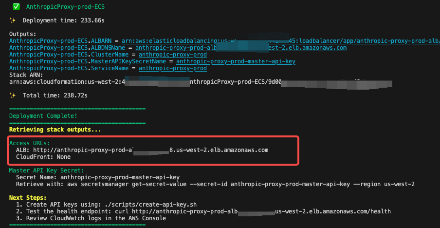

# Anthropic-Bedrock API Proxy

A production-ready FastAPI service that converts AWS Bedrock model inference API to Anthropic-compatible API format, enabling seamless use of Bedrock models with the Anthropic Python SDK.

## Features

### Core Functionality
- **Anthropic API Compatibility**: Full support for Anthropic Messages API format
- **Bidirectional Format Conversion**: Seamless conversion between Anthropic and Bedrock formats
- **Streaming Support**: Server-Sent Events (SSE) for real-time streaming responses
- **Non-Streaming Support**: Traditional request-response pattern

### Advanced Features
- **Tool Use (Function Calling)**: Convert and execute tool definitions
- **Extended Thinking**: Support for thinking blocks in responses
- **Multi-Modal Content**: Text, images, and document support
- **System Messages**: Custom system prompts and instructions
- **Stop Sequences**: Custom stop conditions
- **Prompt Caching**: Map cache control hints (where supported)

### Infrastructure
- **Authentication**: API key-based authentication with DynamoDB storage
- **Rate Limiting**: Token bucket algorithm per API key
- **Usage Tracking**: Comprehensive analytics and token usage tracking
- **Caching**: Optional response caching with TTL
- **Logging**: Structured logging with correlation IDs
- **Metrics**: Prometheus-compatible metrics export
- **Health Checks**: Kubernetes/ECS-ready health endpoints

### Supported Models
- Claude 4.5/5 Sonnet
- Claude 4.5 Haiku
- Qwen3-coder-480b
- Qwen3-235b-instruct
- Any other Bedrock models supporting Converse API

## Architecture

```
+----------------------------------------------------------+
|              Client Application                          |
|           (Anthropic Python SDK)                         |
+---------------------------+------------------------------+
                            |
                            | HTTP/HTTPS (Anthropic Format)
                            |
                            v
+----------------------------------------------------------+
|          FastAPI API Proxy Service                       |
|                                                           |
|  +----------+  +-----------+  +----------------+         |
|  |   Auth   |  |   Rate    |  |   Format       |         |
|  |Middleware|->| Limiting  |->|  Conversion    |         |
|  +----------+  +-----------+  +----------------+         |
+-------+---------------+---------------+------------------+
        |               |               |
        v               v               v
  +----------+    +----------+    +----------+
  | DynamoDB |    |   AWS    |    |CloudWatch|
  |          |    | Bedrock  |    |   Logs/  |
  | API Keys |    | Runtime  |    | Metrics  |
  |  Usage   |    | Converse |    |          |
  |  Cache   |    |          |    |          |
  +----------+    +----------+    +----------+
```

### Component Overview

- **FastAPI Application**: Async web framework with automatic OpenAPI docs
- **Format Converters**: Bidirectional conversion between Anthropic and Bedrock formats
- **Authentication Middleware**: API key validation using DynamoDB
- **Rate Limiting Middleware**: Token bucket algorithm with configurable limits
- **Bedrock Service**: Interface to AWS Bedrock Converse/ConverseStream APIs
- **DynamoDB Storage**: API keys, usage tracking, caching, model mappings
- **Metrics Collection**: Prometheus-compatible metrics for monitoring

## Quick Start

### Prerequisites

- Python 3.12+
- AWS Account with Bedrock access
- AWS credentials configured
- DynamoDB access (or local DynamoDB for development)

### Installation

1. **Clone the repository**:
```bash
git clone <repository-url>
cd anthropic_api_proxy
```

2. **Install dependencies using uv**:
```bash
# Install uv if not already installed
pip install uv

# Install dependencies
uv sync
```

3. **Configure environment**:
```bash
cp .env.example .env
# Edit .env with your configuration
```

4. **Set up DynamoDB tables**:
```bash
uv run scripts/setup_tables.py
```

5. **Create an API key**:
```bash
uv run scripts/create_api_key.py --user-id dev-user --name "Development Key"
```

6. **Run the service**:
```bash
uv run uvicorn app.main:app --reload  --port 8000
```

The service will be available at `http://localhost:8000`.

### Using Docker Compose

For a complete local development environment with DynamoDB Local:

```bash
docker-compose up -d
```

This starts:
- API Proxy Service (port 8000)
- DynamoDB Local (port 8001)
- DynamoDB Admin UI (port 8002)
- Prometheus (port 9090)
- Grafana (port 3000)

## Configuration

### Environment Variables

Configuration is managed through environment variables. See `.env.example` for all options.

#### Application Settings
```bash
APP_NAME=Anthropic-Bedrock API Proxy
ENVIRONMENT=development  # development, staging, production
LOG_LEVEL=INFO
```

#### AWS Settings
```bash
AWS_REGION=us-east-1
AWS_ACCESS_KEY_ID=your-access-key
AWS_SECRET_ACCESS_KEY=your-secret-key
```

#### Authentication
```bash
REQUIRE_API_KEY=True
MASTER_API_KEY=sk-your-master-key
API_KEY_HEADER=x-api-key
```

#### Rate Limiting
```bash
RATE_LIMIT_ENABLED=True
RATE_LIMIT_REQUESTS=1000  # requests per window
RATE_LIMIT_WINDOW=60     # window in seconds
```

#### Feature Flags
```bash
ENABLE_TOOL_USE=True
ENABLE_EXTENDED_THINKING=True
ENABLE_DOCUMENT_SUPPORT=True
PROMPT_CACHING_ENABLED=False
```

## API Documentation

### Endpoints

#### POST /v1/messages

Create a message (Anthropic-compatible).
**Request Body**:
```bash
curl http://localhost:8000/v1/messages \
  -H "Content-Type: application/json" \
  -H "x-api-key: sk-xxx" \
  -d '{
    "model": "gqwen.qwen3-coder-480b-a35b-v1:00",
    "max_tokens": 1024,
    "messages": [
      {"role": "user", "content": "Hello!"}
    ]
  }'
```

```bash
curl http://localhost:8000/v1/messages \
  -H "Content-Type: application/json" \
  -H "x-api-key: sk-xxx" \
  -d '{
    "model": "claude-sonnet-4-5-20250929",
    "max_tokens": 1024,
    "stream":true,
    "messages": [
      {"role": "user", "content": "Write a sonnet about Summer"}
    ]
  }'
```

#### GET /v1/models

List available Bedrock models.

**Request**:
```bash
curl http://localhost:8000/v1/models \
  -H "x-api-key: sk-xxxx"
```


### Using with Anthropic SDK

```python
from anthropic import Anthropic

# Initialize client with custom base URL
client = Anthropic(
    api_key="sk-your-api-key",
    base_url="http://localhost:8000"
)

# Use as normal
message = client.messages.create(
    model="qwen.qwen3-coder-480b-a35b-v1:0",
    max_tokens=1024,
    messages=[
        {"role": "user", "content": "Hello, Claude!"}
    ]
)

print(message.content[0].text)
```

### Streaming Example

```python
with client.messages.stream(
    model="qwen.qwen3-coder-480b-a35b-v1:0",
    max_tokens=1024,
    messages=[
        {"role": "user", "content": "Tell me a story"}
    ]
) as stream:
    for text in stream.text_stream:
        print(text, end="", flush=True)
```

### Tool Use Example

```python
message = client.messages.create(
    model="qwen.qwen3-coder-480b-a35b-v1:0",
    max_tokens=1024,
    tools=[
        {
            "name": "get_weather",
            "description": "Get weather for a location",
            "input_schema": {
                "type": "object",
                "properties": {
                    "location": {"type": "string"}
                },
                "required": ["location"]
            }
        }
    ],
    messages=[
        {"role": "user", "content": "What's the weather in SF?"}
    ]
)
```

## Deployment

### Docker Deployment

Build and run with Docker:

```bash
# Build image
docker build -t anthropic-bedrock-proxy:latest .

# Run container
docker run -d \
  -p 8000:8000 \
  -e AWS_REGION=us-east-1 \
  -e AWS_ACCESS_KEY_ID=your-key \
  -e AWS_SECRET_ACCESS_KEY=your-secret \
  -e MASTER_API_KEY=your-master-key \
  --name api-proxy \
  anthropic-bedrock-proxy:latest
```

### AWS ECS Deployment (Quick Start)

#### More detail in [CDK Deployment](cdk/DEPLOYMENT.md)

#### 1. Install Dependencies

```bash
cd cdk
npm install
```

#### 2. Deploy to Development

```bash
./scripts/deploy.sh -e dev -r us-west-2 -p arm64
```

This will deploy:
- DynamoDB tables
- VPC with NAT gateways
- ECS Fargate cluster and service
- Application Load Balancer

Deployment takes approximately **15-20 minutes**.
#### 3. You can find endpoint URL of ALB.


```text
Master API Key Secret:  
  Secret Name: anthropic-proxy-prod-master-api-key
  Retrieve with: aws secretsmanager get-secret-value --secret-id anthropic-proxy-prod-master-api-key --region us-west-2

Next Steps:
  1. Create API keys using: ./scripts/create-api-key.sh
```

## Security

### Best Practices

1. **API Key Management**:
   - Never commit API keys to version control
   - Use environment variables or secret managers
   - Rotate keys regularly
   - Use separate keys for different environments

2. **AWS Credentials**:
   - Use IAM roles when running on AWS (ECS, Lambda)
   - Apply least privilege principle
   - Enable CloudTrail logging

3. **Network Security**:
   - Use HTTPS in production
   - Configure CORS appropriately
   - Use VPC endpoints for AWS services
   - Implement WAF rules

4. **Rate Limiting**:
   - Configure appropriate limits per API key
   - Monitor for abuse patterns
   - Implement exponential backoff

### Required IAM Permissions

```json
{
  "Version": "2012-10-17",
  "Statement": [
    {
      "Effect": "Allow",
      "Action": [
        "bedrock:InvokeModel",
        "bedrock:InvokeModelWithResponseStream",
        "bedrock:ListFoundationModels",
        "bedrock:GetFoundationModel"
      ],
      "Resource": "*"
    },
    {
      "Effect": "Allow",
      "Action": [
        "dynamodb:PutItem",
        "dynamodb:GetItem",
        "dynamodb:UpdateItem",
        "dynamodb:Query",
        "dynamodb:Scan",
        "dynamodb:DeleteItem"
      ],
      "Resource": [
        "arn:aws:dynamodb:*:*:table/anthropic-proxy-*"
      ]
    }
  ]
}
```

## Monitoring

### Metrics

The service exposes Prometheus metrics at `/metrics`:

- **Request metrics**: Total requests, duration, status codes
- **Bedrock metrics**: API calls, latency, errors
- **Token usage**: Input/output/cached tokens per model
- **Rate limiting**: Rejected requests per API key
- **Authentication**: Failed auth attempts

### Logging

Structured logs include:
- Request ID for correlation
- API key (masked)
- Model used
- Token usage
- Latency
- Errors with stack traces

### Alerts

Recommended alerts:
- High error rate (>5%)
- Slow response time (p95 > 10s)
- Rate limit exceeded frequency
- Authentication failures spike
- AWS service errors

## Development

### Project Structure

```
anthropic_api_proxy/
 app/
    api/              # API route handlers
       health.py     # Health check endpoints
       messages.py   # Messages API
       models.py     # Models API
    converters/       # Format converters
       anthropic_to_bedrock.py
       bedrock_to_anthropic.py
    core/             # Core functionality
       config.py     # Configuration management
       logging.py    # Logging setup
       metrics.py    # Metrics collection
    db/               # Database clients
       dynamodb.py   # DynamoDB operations
    middleware/       # Middleware components
       auth.py       # Authentication
       rate_limit.py # Rate limiting
    schemas/          # Pydantic models
       anthropic.py  # Anthropic API schemas
       bedrock.py    # Bedrock API schemas
    services/         # Business logic
       bedrock_service.py
    main.py           # Application entry point
 tests/
    unit/             # Unit tests
    integration/      # Integration tests
 scripts/              # Utility scripts
 config/               # Configuration files
 Dockerfile            # Docker image definition
 docker-compose.yml    # Local development stack
 pyproject.toml        # Project dependencies
 README.md             # This file
```

### Running Tests

```bash
# Run all tests
pytest

# Run with coverage
pytest --cov=app --cov-report=html

# Run specific test file
pytest tests/unit/test_converters.py

# Run with verbose output
pytest -v
```

### Code Quality

```bash
# Format code
black app tests

# Lint code
ruff check app tests

# Type checking
mypy app
```

## Testing

### Manual Testing

```bash
# Health check
curl http://localhost:8000/health

# List models
curl http://localhost:8000/v1/models \
  -H "x-api-key: sk-your-api-key"

# Create message
curl http://localhost:8000/v1/messages \
  -H "Content-Type: application/json" \
  -H "x-api-key: sk-your-api-key" \
  -d '{
    "model": "claude-3-5-sonnet-20241022",
    "max_tokens": 1024,
    "messages": [
      {"role": "user", "content": "Hello!"}
    ]
  }'

# Streaming message
curl http://localhost:8000/v1/messages \
  -H "Content-Type: application/json" \
  -H "x-api-key: sk-your-api-key" \
  -d '{
    "model": "claude-3-5-sonnet-20241022",
    "max_tokens": 1024,
    "stream": true,
    "messages": [
      {"role": "user", "content": "Count to 10"}
    ]
  }'
```

## Contributing

Contributions are welcome! Please:

1. Fork the repository
2. Create a feature branch
3. Make your changes
4. Add tests
5. Submit a pull request

## License

[Your License Here]

## Support

For issues and questions:
- GitHub Issues: [repository-url]/issues
- Documentation: [docs-url]
- Email: [support-email]

## Acknowledgments

Built with:
- [FastAPI](https://fastapi.tiangolo.com/)
- [AWS Bedrock](https://aws.amazon.com/bedrock/)
- [Anthropic API](https://docs.anthropic.com/)
