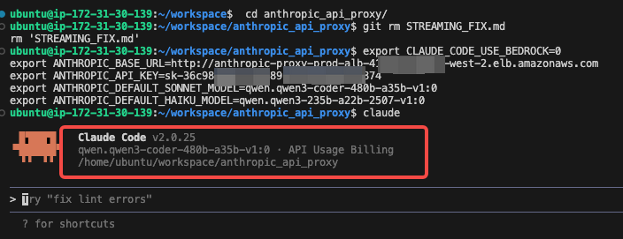
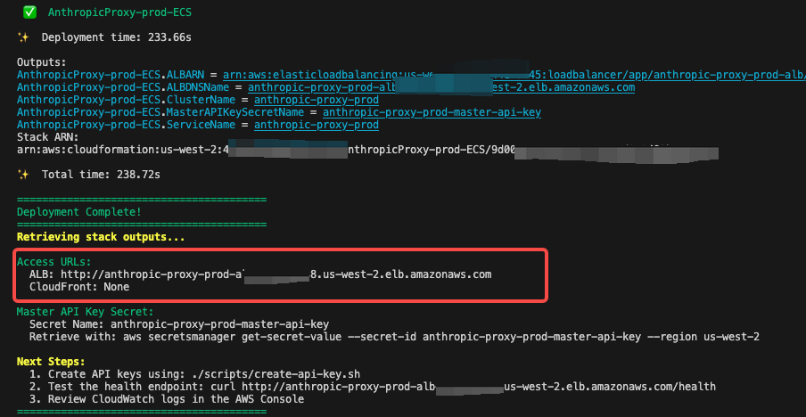

# Anthropic-Bedrock API Converter[English](./README_EN.md)

## 项目简介

这是一个轻量级的 API 转换服务，让你无需修改代码即可在 Anthropic SDK 中使用 AWS Bedrock 上的各种大语言模型。通过简单的环境变量配置，即可在 Claude Code、Claude Agent SDK 等工具中切换使用 Qwen3、DeepSeek 等不同模型。

**核心优势：**
- 🔄 **零代码迁移** - 完全兼容 Anthropic API，无需修改现有代码
- 🚀 **开箱即用** - 支持流式/非流式响应、工具调用、多模态等所有高级特性
- 💰 **成本优化** - 灵活使用 Bedrock 上的开源模型，显著降低推理成本
- 🔐 **企业级** - 内置 API 密钥管理、速率限制、使用追踪和监控指标
- ☁️ **云原生** - 一键部署到 AWS ECS，自动扩展，高可用架构
- 🎯 **场景广泛** - 适用于开发工具代理、应用集成、模型评测等多种场景

**典型应用：** 在**Claude Code** 中使用Bedrock 托管的 Qwen3-Coder-480B 进行代码生成，或在使用**Claude Agent SDK**构建生产应用中混合使用不同模型以平衡性能和成本。

## 功能特性

### 核心功能
- **Anthropic API 兼容性**：完全支持 Anthropic Messages API 格式
- **双向格式转换**：在 Anthropic 和 Bedrock 格式之间无缝转换
- **流式传输支持**：支持服务器发送事件 (SSE) 实时流式响应
- **非流式支持**：传统的请求-响应模式

### 高级功能
- **工具使用（函数调用）**：转换并执行工具定义
- **扩展思考**：支持响应中的思考块
- **多模态内容**：支持文本、图像和文档
- **提示词缓存**：映射缓存控制提示（在支持的情况下）

### 基础设施
- **身份验证**：基于 API 密钥的身份验证，使用 DynamoDB 存储
- **速率限制**：每个 API 密钥的令牌桶算法
- **使用跟踪**：全面的分析和令牌使用跟踪

### 支持的模型
- Claude 4.5/5 Sonnet
- Claude 4.5 Haiku
- Qwen3-coder-480b
- Qwen3-235b-instruct
- 任何其他支持 Converse API 的 Bedrock 模型

## 使用场景

### 作为 Claude Code 的模型代理
* 例如，您可以在启动 `claude` 之前设置以下环境变量，然后就可以在 `claude code` 中使用 Bedrock 中的任何模型（如 `qwen3-coder`）
```bash
export CLAUDE_CODE_USE_BEDROCK=0
export ANTHROPIC_BASE_URL=http://anthropic-proxy-prod-alb-xxxx.elb.amazonaws.com
export ANTHROPIC_API_KEY=sk-xxxx
export ANTHROPIC_DEFAULT_SONNET_MODEL=qwen.qwen3-coder-480b-a35b-v1:0
export ANTHROPIC_DEFAULT_HAIKU_MODEL=qwen.qwen3-235b-a22b-2507-v1:0
```


* 如果您**不设置** `ANTHROPIC_DEFAULT_SONNET_MODEL` 和 `ANTHROPIC_DEFAULT_HAIKU_MODEL`，那么代理将默认使用自动映射Claude sonnet 4.5 和 haiku 4.5/3.5 Model ID到Bedrock中对应的Model ID.
```bash
export CLAUDE_CODE_USE_BEDROCK=0
export ANTHROPIC_BASE_URL=http://anthropic-proxy-prod-alb-xxxx.elb.amazonaws.com
export ANTHROPIC_API_KEY=sk-xxxx
```

### 作为 Claude Agent SDK 的模型代理
- 相同的设置也适用于 Claude Agent SDK
例如在AgentCore Runtime中使用在Dockerfile，[参考项目链接](https://github.com/xiehust/agentcore_demo/tree/main/00-claudecode_agent). 

```Dockerfile
FROM --platform=linux/arm64 ghcr.io/astral-sh/uv:python3.13-bookworm-slim

WORKDIR /app

# Install system dependencies including Node.js for playwright-mcp
RUN apt-get update && apt-get install -y \
    git \
    curl \
    && curl -fsSL https://deb.nodesource.com/setup_22.x | bash - \
    && apt-get install -y nodejs zip \
    && rm -rf /var/lib/apt/lists/*
RUN npm install -g @anthropic-ai/claude-code
# Copy entire project (respecting .dockerignore)
COPY . .
RUN mkdir -p workspace
RUN uv sync 

# Signal that this is running in Docker for host binding logic
ENV DOCKER_CONTAINER=1
ENV CLAUDE_CODE_USE_BEDROCK=0
ENV ANTHROPIC_BASE_URL=http://anthropic-proxy-prod-alb-xxxx.elb.amazonaws.com
ENV export ANTHROPIC_API_KEY=sk-xxxx

EXPOSE 8080

CMD [".venv/bin/python3", "claude_code_agent.py"]
```


## 架构

```
+----------------------------------------------------------+
|              客户端应用程序                               |
|           (Anthropic Python SDK)                         |
+---------------------------+------------------------------+
                            |
                            | HTTP/HTTPS (Anthropic 格式)
                            |
                            v
+----------------------------------------------------------+
|          FastAPI API 代理服务                             |
|                                                           |
|  +----------+  +-----------+  +----------------+         |
|  |   认证   |  |   速率    |  |   格式         |         |
|  |  中间件  |->|   限制    |->|   转换         |         |
|  +----------+  +-----------+  +----------------+         |
+-------+---------------+---------------+------------------+
        |               |               |
        v               v               v
  +----------+    +----------+    +----------+
  | DynamoDB |    |   AWS    |    |CloudWatch|
  |          |    | Bedrock  |    |   日志/  |
  | API 密钥 |    | Runtime  |    |   指标   |
  |  使用量  |    | Converse |    |          |
  |  缓存    |    |          |    |          |
  +----------+    +----------+    +----------+
```

### 组件概述

- **FastAPI 应用程序**：异步 Web 框架，自动生成 OpenAPI 文档
- **格式转换器**：在 Anthropic 和 Bedrock 格式之间进行双向转换
- **身份验证中间件**：使用 DynamoDB 进行 API 密钥验证
- **速率限制中间件**：令牌桶算法，可配置限制
- **Bedrock 服务**：AWS Bedrock Converse/ConverseStream API 接口
- **DynamoDB 存储**：API 密钥、使用跟踪、缓存、模型映射
- **指标收集**：Prometheus 兼容的监控指标

## 部署选项快速入门

### 克隆仓库：
```bash
git clone <repository-url>
cd anthropic_api_converter
```

### 选项 1. AWS ECS 部署（推荐）

#### 1. 安装依赖

```bash
cd cdk
npm install
```

#### 2. 部署到生产环境
**⚠️⚠️⚠️注意-p 参数需要根据当前的编译平台更改成amd64或者arm64， 如使用x86芯片的开发平台编译，则改成-p amd64**
```bash
./scripts/deploy.sh -e prod -r us-west-2 -p arm64
```

这将部署：
- DynamoDB 表
- 带有 NAT 网关的 VPC
- ECS Fargate 集群和服务
- 应用程序负载均衡器

部署大约需要 **15-20 分钟**。

#### 3. 您可以找到 ALB 的端点 URL。


```text
主 API 密钥密钥：
  密钥名称：anthropic-proxy-prod-master-api-key
  检索命令：aws secretsmanager get-secret-value --secret-id anthropic-proxy-prod-master-api-key --region us-west-2

后续步骤：
  1. 使用以下命令创建 API 密钥：./scripts/create-api-key.sh
```

#### 更多详情请参见 [CDK 部署文档](cdk/DEPLOYMENT.md)

### 选项 2. 运行 Docker

使用 Docker 构建并运行：

```bash
# 构建镜像
docker build -t anthropic-bedrock-proxy:latest .

# 运行容器
docker run -d \
  -p 8000:8000 \
  -e AWS_REGION=us-east-1 \
  -e AWS_ACCESS_KEY_ID=your-key \
  -e AWS_SECRET_ACCESS_KEY=your-secret \
  -e MASTER_API_KEY=your-master-key \
  --name api-proxy \
  anthropic-bedrock-proxy:latest
```

## 选项 3. 本地启动

### 前置要求

- Python 3.12+
- 具有 Bedrock 访问权限的 AWS 账户
- 配置好的 AWS 凭证
- DynamoDB 访问权限

### 安装

1. **使用 uv 安装依赖**：
```bash
# 如果尚未安装 uv，请先安装
pip install uv

# 安装依赖
uv sync
```

2. **配置环境**：
```bash
cp .env.example .env
# 编辑 .env 文件配置您的设置
```

3. **设置 DynamoDB 表**：
```bash
uv run scripts/setup_tables.py
```

4. **创建 API 密钥**：
```bash
# 创建基本 API 密钥（使用默认服务层级）
uv run python scripts/create_api_key.py --user-id dev-user --name "Development Key"

# 创建带有 flex 服务层级的 API 密钥（适用于 Qwen、DeepSeek 等非 Claude 模型）
uv run python scripts/create_api_key.py --user-id dev-user --name "Flex Key" --service-tier flex

# 创建带有自定义速率限制的 API 密钥
uv run python scripts/create_api_key.py --user-id dev-user --name "Limited Key" --rate-limit 100

# 查看所有选项
uv run python scripts/create_api_key.py --help
```

**服务层级选项：**
| 层级 | 说明 | 支持的模型 |
|------|------|-----------|
| `default` | 标准服务层级（默认） | 所有模型 |
| `flex` | 更低成本，更高延迟 | Qwen、DeepSeek、Nova（不支持 Claude） |
| `priority` | 更低延迟，更高成本 | 大部分模型 |
| `reserved` | 预留容量 | Claude 及大部分模型 |

**注意：** Claude 模型仅支持 `default` 和 `reserved` 层级。如果对 Claude 使用 `flex`，系统会自动回退到 `default`。

5. **运行服务**：
```bash
uv run uvicorn app.main:app --reload --port 8000
```

服务将在 `http://localhost:8000` 上可用。

## 配置

### 环境变量

配置通过环境变量管理。所有选项请参见 `.env.example`。

#### 应用程序设置
```bash
APP_NAME=Anthropic-Bedrock API Proxy
ENVIRONMENT=development  # development, staging, production
LOG_LEVEL=INFO
```

#### AWS 设置
```bash
AWS_REGION=us-east-1
AWS_ACCESS_KEY_ID=your-access-key
AWS_SECRET_ACCESS_KEY=your-secret-key
```

#### 身份验证
```bash
REQUIRE_API_KEY=True
MASTER_API_KEY=sk-your-master-key
API_KEY_HEADER=x-api-key
```

#### 速率限制
```bash
RATE_LIMIT_ENABLED=True
RATE_LIMIT_REQUESTS=1000  # 每个时间窗口的请求数
RATE_LIMIT_WINDOW=60     # 时间窗口（秒）
```

#### 功能开关
```bash
ENABLE_TOOL_USE=True
ENABLE_EXTENDED_THINKING=True
ENABLE_DOCUMENT_SUPPORT=True
PROMPT_CACHING_ENABLED=False
```

#### Bedrock 服务层级（Service Tier）
```bash
# 默认服务层级：'default', 'flex', 'priority', 'reserved'
DEFAULT_SERVICE_TIER=default
```

**服务层级说明：**
- `default` - 标准服务层级（默认）
- `flex` - Flex 层级，提供更优惠的价格，但可能有更高的延迟
- `priority` - 优先级层级，提供更低的延迟
- `reserved` - 预留容量层级

**注意事项：**
- Claude 模型**仅支持** `default` 和 `reserved` 层级，**不支持** `flex` 层级
- 如果指定的服务层级不被模型支持，系统会自动回退到 `default` 层级
- 可以在创建 API 密钥时为每个密钥单独配置服务层级

## API 文档

### 端点

#### POST /v1/messages

创建消息（Anthropic 兼容）。

**请求体**：
```bash
curl http://localhost:8000/v1/messages \
  -H "Content-Type: application/json" \
  -H "x-api-key: sk-xxx" \
  -d '{
    "model": "qwen.qwen3-coder-480b-a35b-v1:0",
    "max_tokens": 1024,
    "messages": [
      {"role": "user", "content": "你好！"}
    ]
  }'
```

```bash
curl http://localhost:8000/v1/messages \
  -H "Content-Type: application/json" \
  -H "x-api-key: sk-xxx" \
  -d '{
    "model": "claude-sonnet-4-5-20250929",
    "max_tokens": 1024,
    "stream": true,
    "messages": [
      {"role": "user", "content": "写一首关于夏天的十四行诗"}
    ]
  }'
```

#### GET /v1/models

列出可用的 Bedrock 模型。

**请求**：
```bash
curl http://localhost:8000/v1/models \
  -H "x-api-key: sk-xxxx"
```

### 使用 Anthropic SDK

```python
from anthropic import Anthropic

# 使用自定义基础 URL 初始化客户端
client = Anthropic(
    api_key="sk-your-api-key",
    base_url="http://localhost:8000"
)

# 正常使用
message = client.messages.create(
    model="qwen.qwen3-coder-480b-a35b-v1:0",
    max_tokens=1024,
    messages=[
        {"role": "user", "content": "你好，Claude！"}
    ]
)

print(message.content[0].text)
```

### 流式传输示例

```python
with client.messages.stream(
    model="qwen.qwen3-coder-480b-a35b-v1:0",
    max_tokens=1024,
    messages=[
        {"role": "user", "content": "给我讲个故事"}
    ]
) as stream:
    for text in stream.text_stream:
        print(text, end="", flush=True)
```

### 工具使用示例

```python
message = client.messages.create(
    model="qwen.qwen3-coder-480b-a35b-v1:0",
    max_tokens=1024,
    tools=[
        {
            "name": "get_weather",
            "description": "获取某个位置的天气",
            "input_schema": {
                "type": "object",
                "properties": {
                    "location": {"type": "string"}
                },
                "required": ["location"]
            }
        }
    ],
    messages=[
        {"role": "user", "content": "旧金山的天气怎么样？"}
    ]
)
```

## 安全

### 最佳实践

1. **API 密钥管理**：
   - 永远不要将 API 密钥提交到版本控制
   - 使用环境变量或密钥管理器
   - 定期轮换密钥
   - 为不同环境使用单独的密钥

2. **AWS 凭证**：
   - 在 AWS 上运行时使用 IAM 角色（ECS、Lambda）
   - 应用最小权限原则
   - 启用 CloudTrail 日志记录

3. **网络安全**：
   - 在生产环境中使用 HTTPS
   - 适当配置 CORS
   - 为 AWS 服务使用 VPC 端点
   - 实施 WAF 规则

4. **速率限制**：
   - 为每个 API 密钥配置适当的限制
   - 监控滥用模式
   - 实施指数退避

### 所需的 IAM 权限

```json
{
  "Version": "2012-10-17",
  "Statement": [
    {
      "Effect": "Allow",
      "Action": [
        "bedrock:InvokeModel",
        "bedrock:InvokeModelWithResponseStream",
        "bedrock:ListFoundationModels",
        "bedrock:GetFoundationModel"
      ],
      "Resource": "*"
    },
    {
      "Effect": "Allow",
      "Action": [
        "dynamodb:PutItem",
        "dynamodb:GetItem",
        "dynamodb:UpdateItem",
        "dynamodb:Query",
        "dynamodb:Scan",
        "dynamodb:DeleteItem"
      ],
      "Resource": [
        "arn:aws:dynamodb:*:*:table/anthropic-proxy-*"
      ]
    }
  ]
}
```

## 开发

### 项目结构

```
anthropic_api_proxy/
├── app/
│   ├── api/              # API 路由处理器
│   │   ├── health.py     # 健康检查端点
│   │   ├── messages.py   # 消息 API
│   │   └── models.py     # 模型 API
│   ├── converters/       # 格式转换器
│   │   ├── anthropic_to_bedrock.py
│   │   └── bedrock_to_anthropic.py
│   ├── core/             # 核心功能
│   │   ├── config.py     # 配置管理
│   │   ├── logging.py    # 日志设置
│   │   └── metrics.py    # 指标收集
│   ├── db/               # 数据库客户端
│   │   └── dynamodb.py   # DynamoDB 操作
│   ├── middleware/       # 中间件组件
│   │   ├── auth.py       # 身份验证
│   │   └── rate_limit.py # 速率限制
│   ├── schemas/          # Pydantic 模型
│   │   ├── anthropic.py  # Anthropic API 模式
│   │   └── bedrock.py    # Bedrock API 模式
│   ├── services/         # 业务逻辑
│   │   └── bedrock_service.py
│   └── main.py           # 应用程序入口点
├── tests/
│   ├── unit/             # 单元测试
│   └── integration/      # 集成测试
├── scripts/              # 实用脚本
├── config/               # 配置文件
├── Dockerfile            # Docker 镜像定义
├── docker-compose.yml    # 本地开发堆栈
├── pyproject.toml        # 项目依赖
└── README.md             # 此文件
```

### 运行测试

```bash
# 运行所有测试
pytest

# 带覆盖率运行
pytest --cov=app --cov-report=html

# 运行特定测试文件
pytest tests/unit/test_converters.py

# 带详细输出运行
pytest -v
```

### 代码质量

```bash
# 格式化代码
black app tests

# 检查代码
ruff check app tests

# 类型检查
mypy app
```

## 测试

### 手动测试

```bash
# 健康检查
curl http://localhost:8000/health

# 列出模型
curl http://localhost:8000/v1/models \
  -H "x-api-key: sk-your-api-key"

# 创建消息
curl http://localhost:8000/v1/messages \
  -H "Content-Type: application/json" \
  -H "x-api-key: sk-your-api-key" \
  -d '{
    "model": "claude-sonnet-4-5-20250929",
    "max_tokens": 1024,
    "messages": [
      {"role": "user", "content": "你好！"}
    ]
  }'

# 流式消息
curl http://localhost:8000/v1/messages \
  -H "Content-Type: application/json" \
  -H "x-api-key: sk-your-api-key" \
  -d '{
    "model": "claude-sonnet-4-5-20250929",
    "max_tokens": 1024,
    "stream": true,
    "messages": [
      {"role": "user", "content": "数到 10"}
    ]
  }'
```

## 贡献

欢迎贡献！请：

1. Fork 仓库
2. 创建功能分支
3. 进行更改
4. 添加测试
5. 提交拉取请求

## 许可证

MIT-0
