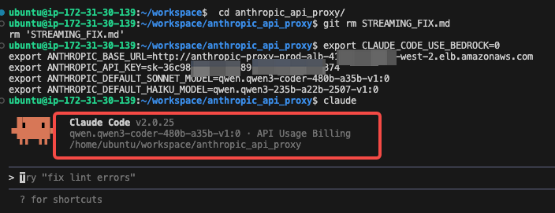
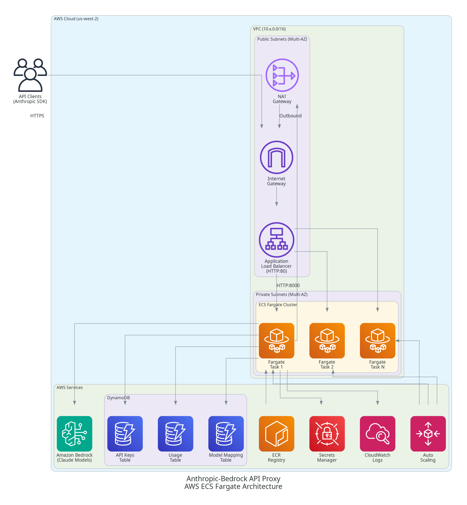
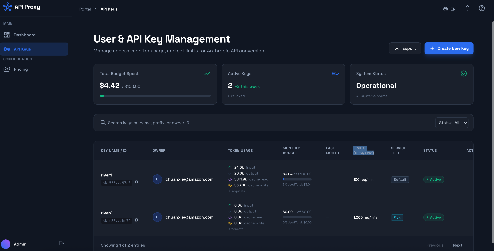

<div align="center">

# 🔄 Anthropic-Bedrock API Proxy

**Zero-Code Migration: Seamlessly Connect Anthropic SDK with AWS Bedrock**

[](LICENSE)
[](https://python.org)
[](https://fastapi.tiangolo.com)
[](https://aws.amazon.com/bedrock/)

<p>
  <a href="./README.md"></a>
  <a href="./README_EN.md"></a>
  <a href=”https://mp.weixin.qq.com/s/mW1RNem5zbAlyvLixSFWOw”></a>
  <a href=”https://aws.amazon.com/cn/blogs/china/programmatic-tool-calling-agent-using-bedrock-and-ecs-docker-sandbox/”></a>
  <a href=”./cdk/DEPLOYMENT.md”></a>
</p>

---

</div>

## Overview

This lightweight API convertion service enables you to use various large language models on AWS Bedrock with the Anthropic SDK without any code changes. Through simple environment variable configuration, you can seamlessly switch between different models like Qwen, DeepSeek, and others in tools such as Claude Code and Claude Agent SDK.

> 📝 **AWS Blog**: [Programmatic Tool Calling Agent Using Amazon Bedrock and ECS Docker Sandbox](https://aws.amazon.com/cn/blogs/china/programmatic-tool-calling-agent-using-bedrock-and-ecs-docker-sandbox/)

**Key Advantages:**
- 🔄 **Zero Code Migration** - Fully compatible with Anthropic API, no code changes required
- 🚀 **Ready to Use** - Supports all advanced features including streaming/non-streaming, tool calling, and multi-modal content
- 🤖 **Programmatic Tool Calling** - First proxy service to implement Anthropic-compatible PTC API on Bedrock
- 🔍 **Dynamic Web Search** - Supports Anthropic `web_search_20250305` / `web_search_20260209` with Claude dynamically writing code to filter search results
- 🌐 **Web Fetch** - Supports Anthropic `web_fetch_20250910` / `web_fetch_20260209`, fetches web pages and PDFs with no extra API key required
- 💰 **Cost Optimization** - Flexibly use open-source models on Bedrock to significantly reduce inference costs
- 🔐 **Enterprise-Grade** - Built-in API key management, rate limiting, usage tracking, and monitoring metrics
- ☁️ **Cloud-Native** - One-click deployment to AWS ECS with auto-scaling and high availability
- 🎯 **Versatile** - Suitable for development tools, application integration, model evaluation, and more

**Typical Use Cases:** Use **Qwen3-Coder-480B** for code generation in Claude Code, or mix different models in production applications build with **Claude Agent SDK** to balance performance and cost.

## Features
### Claude Code/Agent SDK Disguise Adaptation

- **Claude Code/Agent SDK** will detect whether it's directly connected to Bedrock, and will discard many beta headers, causing the behavior and output to potentially differ from using Anthropic's official API. For example, issues such as [max token auto-truncation](https://github.com/anthropics/claude-code/issues/8756) may occur.

### Core Functionality
- **Anthropic API Compatibility**: Full support for Anthropic Messages API format
- **Bidirectional Format Conversion**: Seamless conversion between Anthropic and Bedrock formats
- **Streaming Support**: Server-Sent Events (SSE) for real-time streaming responses
- **Non-Streaming Support**: Traditional request-response pattern

### Advanced Features
- **Tool Use (Function Calling)**: Convert and execute tool definitions
- **Programmatic Tool Calling (PTC)**: Full implementation of Anthropic PTC API, enabling Claude to generate and execute Python code for tool calling
  - Fully compatible PTC interface with Anthropic API (`anthropic-beta: advanced-tool-use-2025-11-20`)
  - Secure Docker Sandbox code execution environment
  - Client-side tool execution mode (tools executed by client, results returned to proxy)
  - Support for multi-round code execution and tool calling
  - Support for `asyncio.gather` parallel tool calls
  - Session management with container reuse for improved performance
- **Extended Thinking**: Support for thinking blocks in responses
- **Multi-Modal Content**: Text, images, and document support
- **Prompt Caching with 1-Hour TTL**: Support for Anthropic `cache_control` prompt caching with configurable TTL (`5m` / `1h`)
  - 1-hour cache TTL (`ttl: "1h"`) to reduce costs for frequently repeated requests
  - Three-level priority: API key forced override > client request > proxy default (`DEFAULT_CACHE_TTL`)
  - Per-API-key `cache_ttl` configuration, manageable via Admin Portal
  - TTL-aware billing: 5m writes at 1.25x input price, 1h writes at 2x input price
- **Beta Header Mapping**: Automatically map Anthropic beta headers to Bedrock beta headers (e.g., `advanced-tool-use-2025-11-20` → `tool-examples-2025-10-29`)
- **Tool Input Examples**: Support for `input_examples` parameter to provide example inputs for tools, helping models better understand tool usage
- **Web Search Tool**: Support for Anthropic's `web_search_20250305` and `web_search_20260209` tool types
  - Proxy-side server tool implementation (Bedrock doesn't natively support web search, so the proxy intercepts and executes searches)
  - Pluggable search providers: Tavily (recommended, AI-optimized) and Brave Search
  - Domain filtering: `allowed_domains` and `blocked_domains` support
  - Search limit: Control max searches per request via `max_uses`
  - User location: Localized search results based on geography
  - Dynamic filtering (`web_search_20260209`): Claude can write code to filter search results (requires Docker sandbox, **ECS deployment needs EC2 launch type**)
  - Supports both streaming and non-streaming responses
- **Web Fetch Tool**: Support for Anthropic's `web_fetch_20250910` and `web_fetch_20260209` tool types
  - Proxy-side server tool implementation (Bedrock doesn't natively support web fetch, so the proxy intercepts and fetches URLs)
  - Default provider uses httpx for direct HTTP fetch (**no API key required**), with built-in HTML-to-text conversion
  - PDF document support (base64 passthrough)
  - Domain filtering: `allowed_domains` and `blocked_domains` support
  - Fetch limit via `max_uses`; content length limit via `max_content_tokens`
  - Dynamic filtering (`web_fetch_20260209`): Claude can write code to process fetched content (requires Docker sandbox, **ECS deployment needs EC2 launch type**)
  - Supports both streaming and non-streaming responses
- **OpenAI-Compatible API (Bedrock Mantle)**: Non-Claude models can optionally use Bedrock's OpenAI Chat Completions API via bedrock-mantle endpoint instead of Converse API
  - Controlled by `ENABLE_OPENAI_COMPAT` environment variable (disabled by default)
  - Requires `OPENAI_API_KEY` (Bedrock API Key) and `OPENAI_BASE_URL` (e.g., `https://bedrock-mantle.us-east-1.api.aws/v1`)
  - Automatically maps Anthropic `thinking` to OpenAI `reasoning` (`budget_tokens` → `effort: high/medium/low`)
  - Supports streaming and non-streaming responses, tool calling, multimodal content
  - Claude models remain unaffected, still using InvokeModel API

### Infrastructure
- **Authentication**: API key-based authentication with DynamoDB storage
- **Rate Limiting**: Token bucket algorithm per API key
- **Usage Tracking**: Comprehensive analytics and token usage tracking
- **Service Tiers**: Bedrock Service Tier configuration for cost/latency optimization
- **OpenTelemetry Distributed Tracing**: Export LLM call traces to any OTEL-compatible backend (Langfuse, Jaeger, Grafana Tempo, etc.)
  - Follows [OTEL GenAI Semantic Conventions](https://opentelemetry.io/docs/specs/semconv/gen-ai/) for model, token usage, and latency
  - Turn-based agent loop tracing with structured trace hierarchy
  - Session-level trace correlation via `x-session-id` header
  - Full token statistics for both streaming and non-streaming responses
  - Zero-overhead design: all tracing functions are no-ops when disabled
- **Admin Portal**: Web-based management interface for API key management, usage monitoring, and budget control
  - Cognito authentication with USER_PASSWORD_AUTH and SRP flows
  - Real-time API key usage statistics (input/output/cache tokens)
  - Model pricing configuration and cost tracking
  - Budget limits with automatic key deactivation

### Supported Models
- Claude 4.5/4.6
- Claude 4.5 Haiku
- Qwen3-coder-480b
- Qwen3-235b-instruct
- Kimi 2.5
- minimax2.1
- Any other Bedrock model supporting the Converse API or OpenAI Chat Completions API

## Usage Cases

### Model Proxy for Claude Code
* For example, you can setup below environment variables before start the `claude`, then you can use any models such as `qwen3-coder` in Bedrock for your `claude code`
```bash
export CLAUDE_CODE_USE_BEDROCK=0
export ANTHROPIC_BASE_URL=http://anthropic-proxy-prod-alb-xxxx.elb.amazonaws.com
export ANTHROPIC_API_KEY=sk-xxxx
export ANTHROPIC_DEFAULT_SONNET_MODEL=qwen.qwen3-coder-480b-a35b-v1:0
export ANTHROPIC_DEFAULT_HAIKU_MODEL=qwen.qwen3-235b-a22b-2507-v1:0
```


* If you **DON'T** set `ANTHROPIC_DEFAULT_SONNET_MODEL` and `ANTHROPIC_DEFAULT_HAIKU_MODEL` as below, then the proxy will map the IDs of Claude sonnet 4.5 and haiku 4.5/3.5 to the model IDs in Bedrock by default.
```bash
export CLAUDE_CODE_USE_BEDROCK=0
export ANTHROPIC_BASE_URL=http://anthropic-proxy-prod-alb-xxxx.elb.amazonaws.com
export ANTHROPIC_API_KEY=sk-xxxx
```

###  Model Proxy Claude Agent SDK
- The same settings also applicable for Claude Agent SDK
Eg., Dockerfile used for AgentCore Runtime [Reference Project](https://github.com/xiehust/agentcore_demo/tree/main/00-claudecode_agent) 

```Dockerfile
FROM --platform=linux/arm64 ghcr.io/astral-sh/uv:python3.13-bookworm-slim

WORKDIR /app

# Install system dependencies including Node.js for playwright-mcp
RUN apt-get update && apt-get install -y \
    git \
    curl \
    && curl -fsSL https://deb.nodesource.com/setup_22.x | bash - \
    && apt-get install -y nodejs zip \
    && rm -rf /var/lib/apt/lists/*
RUN npm install -g @anthropic-ai/claude-code
# Copy entire project (respecting .dockerignore)
COPY . .
RUN mkdir -p workspace
RUN uv sync 

# Signal that this is running in Docker for host binding logic
ENV DOCKER_CONTAINER=1
ENV CLAUDE_CODE_USE_BEDROCK=0
ENV ANTHROPIC_BASE_URL=http://anthropic-proxy-prod-alb-xxxx.elb.amazonaws.com
ENV export ANTHROPIC_API_KEY=sk-xxxx

EXPOSE 8080

CMD [".venv/bin/python3", "claude_code_agent.py"]
```

## Service Tier

The Bedrock Service Tier feature allows you to balance between cost and latency. This proxy service fully supports this feature with flexible configuration options.

### Available Tiers

| Tier | Description | Latency | Cost | Claude Support |
|------|-------------|---------|------|----------------|
| `default` | Standard service tier | Standard | Standard | ✅ |
| `flex` | Flexible tier for batch processing | Higher (up to 24h) | Lower | ❌ |
| `priority` | Priority tier for real-time apps | Lower | Higher | ❌ |
| `reserved` | Reserved capacity tier | Stable | Prepaid | ✅ |

### Configuration Methods

#### 1. Per API Key Configuration

System default is `default`. You can create API keys with different service tiers for different users or purposes:

```bash
# Create an API key with flex tier (for non-real-time batch processing)
./scripts/create-api-key.sh -u batch-user -n "Batch Processing Key" -t flex

# Create an API key with priority tier (for real-time applications)
./scripts/create-api-key.sh -u realtime-user -n "Realtime App Key" -t priority
```

#### 2. Priority Rules

Service tier is determined by the following priority:
1. **API Key Configuration** (highest priority) - if the API key has a specified service tier
2. **System Default** - `default`

### Automatic Fallback Mechanism

When the specified service tier is not supported by the target model, the proxy service will **automatically fall back** to `default` tier and retry the request:

```
Request (flex tier) → Claude model → flex not supported → Auto fallback to default → Success
```

This ensures that requests will not fail even if an incompatible service tier is configured.

### Usage Recommendations

| Scenario | Recommended Tier | Description |
|----------|-----------------|-------------|
| Real-time chat/conversation | `default` or `priority` | Requires low latency response |
| Batch data processing | `flex` | Can tolerate higher latency, saves cost |
| Code generation/dev tools | `default` | Balance between latency and cost |
| Production critical apps | `reserved` | Requires stable capacity guarantee |

### Model Compatibility

| Model | default | flex | priority | reserved |
|-------|---------|------|----------|----------|
| Claude Series | ✅ | ❌ | ❌ | ✅ |
| Qwen Series | ✅ | ✅ | ✅ | ✅ |
| DeepSeek Series | ✅ | ✅ | ✅ | ✅ |
| Nova Series | ✅ | ✅ | ✅ | ✅ |
| MiniMax Series | ✅ | ✅ | ✅ | ✅ |

> **Note**: Specific model support for service tiers may change with AWS Bedrock updates. Please refer to the [AWS Official Documentation](https://docs.aws.amazon.com/bedrock/latest/userguide/inference-service-tiers.html) for the latest information.

## Beta Header Mapping & Tool Input Examples

### Beta Header Mapping

The proxy supports automatic mapping of Anthropic beta headers to Bedrock beta headers, enabling access to Anthropic beta features when using Bedrock.

**Default Mapping:**

| Anthropic Beta Header | Bedrock Beta Headers |
|----------------------|---------------------|
| `advanced-tool-use-2025-11-20` | `tool-examples-2025-10-29`, `tool-search-tool-2025-10-19` |

**Supported Models:**
- Claude Opus 4.5 (`claude-opus-4-5-20251101`)

**Usage Example:**

```python
from anthropic import Anthropic

client = Anthropic(
    api_key="sk-your-api-key",
    base_url="http://localhost:8000"
)

# Use beta header
message = client.beta.messages.create(
    model="claude-opus-4-5-20251101",
    max_tokens=1024,
    betas=["advanced-tool-use-2025-11-20"],
    messages=[{"role": "user", "content": "Hello!"}]
)
```

### Tool Input Examples (input_examples)

The `input_examples` parameter allows providing example inputs for tool definitions to help the model better understand tool usage.

```python
message = client.messages.create(
    model="claude-opus-4-5-20251101",
    max_tokens=1024,
    tools=[
        {
            "name": "get_weather",
            "description": "Get weather for a given location",
            "input_schema": {
                "type": "object",
                "properties": {
                    "location": {"type": "string", "description": "City name"},
                    "unit": {"type": "string", "enum": ["celsius", "fahrenheit"]}
                },
                "required": ["location"]
            },
            "input_examples": [
                {"location": "San Francisco, CA", "unit": "fahrenheit"},
                {"location": "Tokyo, Japan", "unit": "celsius"},
                {"location": "New York, NY"}  # unit is optional
            ]
        }
    ],
    messages=[{"role": "user", "content": "What's the weather in Tokyo?"}]
)
```

### Configuration Extension

**Add new beta header mappings:**
Modify `BETA_HEADER_MAPPING` in `.env` or `app/core/config.py`.

**Enable beta header mapping for more models:**
Add model IDs to the `BETA_HEADER_SUPPORTED_MODELS` list.

## Prompt Cache TTL (1-Hour Caching)

The proxy supports Anthropic's `cache_control` prompt caching and extends it with configurable TTL (Time-To-Live). Claude models on Bedrock default to 5-minute cache TTL — this proxy supports extending it to **1 hour**, significantly reducing costs for high-frequency repeated requests.

### TTL Priority

| Priority | Source | Description |
|----------|--------|-------------|
| 1 (Highest) | API Key `cache_ttl` | Forced override configured in DynamoDB, rewrites ALL `cache_control` blocks |
| 2 | Client request `cache_control.ttl` | TTL specified by client in request, preserved when no API key override |
| 3 | `DEFAULT_CACHE_TTL` env var | Proxy-level default, fills blocks with `cache_control` but no TTL |
| 4 (Lowest) | No TTL | Uses Anthropic/Bedrock default (5 minutes) |

### Usage Example

```python
from anthropic import Anthropic

client = Anthropic(
    api_key="sk-your-api-key",
    base_url="http://localhost:8000"
)

# Client specifies 1-hour cache TTL
message = client.messages.create(
    model="claude-sonnet-4-5-20250929",
    max_tokens=1024,
    system=[
        {
            "type": "text",
            "text": "You are a professional software engineer...",  # Long system prompt
            "cache_control": {"type": "ephemeral", "ttl": "1h"}
        }
    ],
    messages=[{"role": "user", "content": "Hello!"}]
)
```

### Configuration

```bash
# Proxy-level default cache TTL (optional, defaults to Anthropic's 5m if not set)
DEFAULT_CACHE_TTL=1h

# Per-API-key cache_ttl can be configured in Admin Portal or DynamoDB
# Values: '5m' or '1h' — when set, forcefully overrides all request cache TTLs
```

### Billing

Cache write pricing varies by TTL duration:

| TTL | Cache Write Price | Description |
|-----|------------------|-------------|
| 5m (default) | 1.25x input price | Standard cache write rate |
| 1h | 2.0x input price | Extended caching requires higher write cost |

The system automatically calculates the correct cache write cost based on each request's actual TTL.

## OpenTelemetry Distributed Tracing (LLM Observability)

The proxy has built-in OpenTelemetry tracing support, exporting detailed LLM call information to any OTEL-compatible observability backend for:

- **Token Usage Tracking**: Input/output/cache token statistics per request
- **Latency Analysis**: End-to-end latency, Bedrock API call latency, streaming response duration
- **Session Correlation**: Correlate multiple requests in the same conversation via `x-session-id` header
- **Tool Call Tracing**: Record each tool call's name and ID
- **PTC Code Execution Tracing**: Track Programmatic Tool Calling execution flow
- **Error Diagnostics**: Automatic exception recording and error status

### Trace Hierarchy (Turn-Based Agent Loop)

```
Trace "chat claude-sonnet-4-5-20250929"
  ├── Turn 1 (input=user_msg, output=assistant_response)
  │     ├── gen_ai.chat (model, tokens, usage)
  │     ├── Tool: Read (input=tool_input)
  │     └── Tool: Edit (input=tool_input)
  ├── Turn 2
  │     ├── gen_ai.chat
  │     └── Tool: Bash
  └── Turn 3
        └── gen_ai.chat (final text response, no tools)
```

Each HTTP request in an agent loop maps to a **Turn** span containing:
- A `gen_ai.chat` generation span with model, token usage, and latency
- Tool spans for each tool_use block in the response
- Structured input/output attributes for Langfuse rendering

### Key Attributes

| Attribute | Description | Example |
|-----------|-------------|---------|
| `gen_ai.request.model` | Request model | `claude-sonnet-4-5-20250929` |
| `gen_ai.usage.input_tokens` | Input tokens | `1500` |
| `gen_ai.usage.output_tokens` | Output tokens | `350` |
| `gen_ai.response.finish_reasons` | Stop reason | `["end_turn"]` |
| `gen_ai.conversation.id` | Session ID | `session-abc123` |
| `langfuse.observation.usage_details` | Full usage JSON with cache tokens | `{"input":1500,"output":350,"cache_read_input_tokens":800}` |
| `proxy.api_key_hash` | API key hash (privacy-safe) | `a1b2c3d4...` |

### Connecting to Langfuse Cloud

[Langfuse](https://langfuse.com) is an open-source LLM observability platform with native OTEL support.

**1. Get Langfuse Credentials**

Log in to [Langfuse Cloud](https://us.cloud.langfuse.com), go to project Settings → API Keys to get your Public Key and Secret Key.

**2. Generate Base64 Auth String**

```bash
echo -n "your-public-key:your-secret-key" | base64
```

**3. Configure Environment Variables**

```bash
ENABLE_TRACING=true
OTEL_EXPORTER_OTLP_ENDPOINT=https://us.cloud.langfuse.com/api/public/otel
OTEL_EXPORTER_OTLP_PROTOCOL=http/protobuf
OTEL_EXPORTER_OTLP_HEADERS=Authorization=Basic <base64-string-from-step-2>
OTEL_SERVICE_NAME=anthropic-bedrock-proxy
OTEL_TRACE_CONTENT=true
```

**4. Start Service and Send Requests**

```bash
# Start service
uv run uvicorn app.main:app --reload

# Send request (with session ID for trace correlation)
curl http://localhost:8000/v1/messages \
  -H "Content-Type: application/json" \
  -H "x-api-key: sk-your-key" \
  -H "x-session-id: my-test-session" \
  -d '{
    "model": "claude-sonnet-4-5-20250929",
    "max_tokens": 1024,
    "messages": [{"role": "user", "content": "Hello!"}]
  }'
```

**5. View Traces in Langfuse**

Log in to Langfuse Cloud and navigate to the Traces page to see:
- Complete span hierarchy and timeline
- Token usage and cache hit statistics
- Conversations grouped by Session ID
- Model, latency, and cost metrics

### Connecting to Other OTEL Backends

**Jaeger (Local Debugging):**

```bash
# Start Jaeger
docker run -d -p 4318:4318 -p 16686:16686 jaegertracing/all-in-one

# Configure proxy
ENABLE_TRACING=true
OTEL_EXPORTER_OTLP_ENDPOINT=http://localhost:4318
OTEL_EXPORTER_OTLP_PROTOCOL=http/protobuf
OTEL_SERVICE_NAME=anthropic-bedrock-proxy

# View traces: http://localhost:16686
```

**Grafana Tempo:**

```bash
ENABLE_TRACING=true
OTEL_EXPORTER_OTLP_ENDPOINT=https://your-tempo-endpoint
OTEL_EXPORTER_OTLP_PROTOCOL=grpc
OTEL_EXPORTER_OTLP_HEADERS=Authorization=Basic <credentials>
```

### Content Tracing (Optional)

By default, tracing **does not record** actual request and response content (as it may contain sensitive information). To enable content tracing for debugging:

```bash
# Enable content tracing (records prompt and completion content, beware of PII risks)
OTEL_TRACE_CONTENT=true
```

When enabled, trace data will include:
- Structured trace input as JSON (system prompt, tools with schemas, user message)
- Current turn's messages only (not full history) in gen_ai.chat spans
- Response text and tool call details

### CDK Deployment with Tracing

When deploying to ECS via CDK, you can enable tracing via environment variables at deploy time — **no code changes required**:

```bash
# Example with Langfuse
ENABLE_TRACING=true \
OTEL_EXPORTER_OTLP_ENDPOINT=https://us.cloud.langfuse.com/api/public/otel \
OTEL_EXPORTER_OTLP_PROTOCOL=http/protobuf \
OTEL_EXPORTER_OTLP_HEADERS="Authorization=Basic $(echo -n 'pk-xxx:sk-xxx' | base64)" \
OTEL_SERVICE_NAME=anthropic-bedrock-proxy-prod \
OTEL_TRACE_CONTENT=true \
OTEL_TRACE_SAMPLING_RATIO=1.0 \
./scripts/deploy.sh -e prod -r us-west-2 -p arm64 -l ec2
```

| Environment Variable | Description | Default |
|---------------------|-------------|---------|
| `ENABLE_TRACING` | Enable tracing | `false` |
| `OTEL_EXPORTER_OTLP_ENDPOINT` | OTLP export endpoint | none |
| `OTEL_EXPORTER_OTLP_PROTOCOL` | Protocol (`http/protobuf` / `grpc`) | `http/protobuf` |
| `OTEL_EXPORTER_OTLP_HEADERS` | Auth headers | none |
| `OTEL_SERVICE_NAME` | Service name | none |
| `OTEL_TRACE_CONTENT` | Record prompt/completion content | `false` |
| `OTEL_TRACE_SAMPLING_RATIO` | Sampling ratio (0.0-1.0) | `1.0` |

> **Priority**: Environment variables > `cdk/config/config.ts` settings > defaults

### Sampling Configuration

For high-traffic scenarios, control trace data volume with sampling:

```bash
# 50% sampling (sample 1 out of every 2 requests)
OTEL_TRACE_SAMPLING_RATIO=0.5

# 10% sampling (for high-traffic production)
OTEL_TRACE_SAMPLING_RATIO=0.1

# Full sampling (default, for development and low-traffic environments)
OTEL_TRACE_SAMPLING_RATIO=1.0
```

## Architecture

```
+----------------------------------------------------------+
|              Client Application                          |
|           (Anthropic Python SDK)                         |
+---------------------------+------------------------------+
                            |
                            | HTTP/HTTPS (Anthropic Format)
                            |
                            v
+----------------------------------------------------------+
|          FastAPI API Proxy Service                       |
|                                                           |
|  +----------+  +-----------+  +----------------+         |
|  |   Auth   |  |   Rate    |  |   Format       |         |
|  |Middleware|->| Limiting  |->|  Conversion    |         |
|  +----------+  +-----------+  +----------------+         |
+-------+---------------+---------------+------------------+
        |               |               |
        v               v               v
  +----------+    +----------+    +----------+
  | DynamoDB |    |   AWS    |    |CloudWatch|
  |          |    | Bedrock  |    |   Logs/  |
  | API Keys |    | Runtime  |    | Metrics  |
  |  Usage   |    | Converse |    |          |
  |  Cache   |    |          |    |          |
  +----------+    +----------+    +----------+
```

### Component Overview

- **FastAPI Application**: Async web framework with automatic OpenAPI docs
- **Format Converters**: Bidirectional conversion between Anthropic and Bedrock formats
- **Authentication Middleware**: API key validation using DynamoDB
- **Rate Limiting Middleware**: Token bucket algorithm with configurable limits
- **Bedrock Service**: Interface to AWS Bedrock Converse/ConverseStream APIs
- **DynamoDB Storage**: API keys, usage tracking, caching, model mappings
- **Metrics Collection**: Prometheus-compatible metrics for monitoring

### AWS ECS Fargate Production Architecture



**Architecture Details:**

| Component | Description |
|-----------|-------------|
| **VPC** | Multi-AZ deployment with public/private subnets, CIDR: 10.x.0.0/16 |
| **Application Load Balancer** | Located in public subnets, receives external HTTP/HTTPS traffic |
| **ECS Fargate Cluster** | Located in private subnets, runs containerized proxy service |
| **NAT Gateway** | Provides outbound internet access for private subnets (1 for dev, multi-AZ for prod) |
| **VPC Endpoints** | Production environment configures private endpoints for Bedrock, DynamoDB, ECR, CloudWatch to optimize cost and security |
| **Auto Scaling** | Automatically scales based on CPU/memory utilization and request count (min 2, max 10) |
| **DynamoDB Tables** | API Keys, Usage, Model Mapping tables with PAY_PER_REQUEST billing |
| **Secrets Manager** | Securely stores Master API Key |
| **CloudWatch Logs** | Centralized logging, Container Insights enabled in production |

## Deployment Options Quick Start

### Clone the repository:
```bash
git clone <repository-url>
cd anthropic_api_converter
```


### Option 1. AWS ECS Deployment (Recommend)

#### Launch Type Selection

| Feature | Fargate (Default) | EC2 |
|---------|-------------------|-----|
| **PTC Support** | No | Yes |
| **Management** | Zero (Serverless) | Requires ASG management |
| **Cost Model** | Pay per use | Per instance |
| **Scaling Speed** | Fast (seconds) | Slower (minutes) |
| **Docker Access** | No | Yes (socket mount) |
| **Recommended For** | Standard API proxy | PTC-enabled deployments |

#### 1. Install Dependencies

```bash
cd cdk
npm install
```

#### 2. Deploy to Prod

**Fargate Deployment (Default, for scenarios not requiring PTC):**

```bash
# ⚠️ -p parameter must be adjusted based on your compilation platform
# ARM64 (AWS Graviton, Apple Silicon)
./scripts/deploy.sh -e prod -r us-west-2 -p arm64

# AMD64 (Intel/AMD servers)
./scripts/deploy.sh -e prod -r us-west-2 -p amd64
```

**EC2 Deployment (Enables PTC feature):**

```bash
# Use -l ec2 parameter to enable EC2 launch type, automatically enables PTC
./scripts/deploy.sh -e prod -r us-west-2 -p arm64 -l ec2

# Dev environment (uses Spot instances for cost savings)
./scripts/deploy.sh -e dev -r us-west-2 -p arm64 -l ec2
```

**EC2 Launch Type Configuration:**

| Environment | Instance Type | Spot Instances | Docker Socket |
|-------------|---------------|----------------|---------------|
| dev + ARM64 | t4g.medium | Yes | Mounted |
| dev + AMD64 | t3.medium | Yes | Mounted |
| prod + ARM64 | t4g.large | No | Mounted |
| prod + AMD64 | t3.large | No | Mounted |

**Enable Web Search and Cache TTL (via environment variables):**

```bash
# Fargate mode with Web Search (supports web_search_20250305 only)
ENABLE_WEB_SEARCH=true \
WEB_SEARCH_PROVIDER=tavily \
WEB_SEARCH_API_KEY=tvly-your-api-key \
./scripts/deploy.sh -e prod -r us-west-2 -p arm64

# Enable web_search_20260209 dynamic filtering (requires EC2 launch type for Docker code execution)
ENABLE_WEB_SEARCH=true \
WEB_SEARCH_PROVIDER=tavily \
WEB_SEARCH_API_KEY=tvly-your-api-key \
./scripts/deploy.sh -e prod -r us-west-2 -p arm64 -l ec2

# Web Fetch is enabled by default, no additional API key required (uses httpx direct fetch)
# To disable: ENABLE_WEB_FETCH=false
```

This will deploy:
- DynamoDB tables
- VPC with NAT gateways
- ECS Fargate/EC2 cluster and service
- Application Load Balancer
- (EC2 mode) Auto Scaling Group and Capacity Provider

Deployment takes approximately **15-20 minutes**.

#### 3. Deployment Output

After deployment completes, you will see the following output:

```text
Access URLs:
  API Proxy: http://anthropic-proxy-prod-alb-xxxx.us-west-2.elb.amazonaws.com
  Admin Portal: http://anthropic-proxy-prod-alb-xxxx.us-west-2.elb.amazonaws.com/admin/

Cognito (Admin Portal Authentication):
  User Pool ID: us-west-2_xxxxxxxxx
  Client ID: xxxxxxxxxxxxxxxxxxxxxxxxxx
  Region: us-west-2

Master API Key Secret:
  Secret Name: anthropic-proxy-prod-master-api-key
  Retrieve with: aws secretsmanager get-secret-value --secret-id anthropic-proxy-prod-master-api-key --region us-west-2

Next Steps:
  1. Create API keys using: ./scripts/create-api-key.sh
  2. Test the health endpoint: curl http://<alb-dns>/health
  3. Create admin user: ./scripts/create-admin-user.sh -e prod -r us-west-2 --email <admin@example.com>
```

#### 4. Create an Admin Portal login account and temporary password
- In the `cdk/` directory:
```shell
./scripts/create-admin-user.sh -e prod -r us-west-2 --email <admin@example.com>
```

#### 5. Access the Admin Portal using the username and temporary password above
Upon first login, you will be prompted to change your password.
Admin Portal: http://anthropic-proxy-prod-alb-xxxx.us-west-2.elb.amazonaws.com/admin/

#### 6. Create API keys, set pricing, budget, and other settings via the interface


**Create API Key Examples:**

```bash
# Navigate to CDK directory
cd cdk

# Basic usage - create default API key
./scripts/create-api-key.sh -u user123 -n "My API Key"

# Specify service tier - use flex tier (lower cost, higher latency)
./scripts/create-api-key.sh -u user123 -n "Flex Key" -t flex

# Specify service tier - use priority tier (lower latency, higher cost)
./scripts/create-api-key.sh -u user123 -n "Priority Key" -t priority

# Set both custom rate limit and service tier
./scripts/create-api-key.sh -u user123 -n "Custom Key" -r 500 -t reserved

# View help
./scripts/create-api-key.sh -h
```

> **Note**: Claude models only support `default` and `reserved` service tiers, not `flex`. If you use `flex` tier with Claude models, the proxy will automatically fall back to `default`.

#### More detail in [CDK Deployment](cdk/DEPLOYMENT.md)


### Option 2. Run Docker

#### 2.1 Build Main Proxy Service Image

```bash
# Basic build (uses current platform architecture)
docker build -t anthropic-bedrock-proxy:latest .

# Platform-specific builds (for cross-platform deployment)
# ARM64 architecture (e.g., AWS Graviton, Apple Silicon)
docker build --platform linux/arm64 -t anthropic-bedrock-proxy:arm64 .

# AMD64 architecture (e.g., Intel/AMD servers)
docker build --platform linux/amd64 -t anthropic-bedrock-proxy:amd64 .
```

#### 2.2 Build PTC Sandbox Image (Optional)

If you need data analysis packages (pandas, numpy, scipy, etc.) in PTC, build a custom sandbox image:

```bash
cd docker/ptc-sandbox

# Build data science version (includes pandas, numpy, scipy, matplotlib, scikit-learn)
./build.sh

# Or build minimal version (only pandas, numpy, smaller image)
./build.sh minimal

# Build all versions
./build.sh all
```

**Image Comparison:**

| Image | Size | Included Packages |
|-------|------|-------------------|
| `python:3.11-slim` (default) | ~50MB | Python standard library only |
| `ptc-sandbox:minimal` | ~200MB | numpy, pandas, requests, httpx |
| `ptc-sandbox:datascience` | ~800MB | numpy, pandas, scipy, matplotlib, scikit-learn, statsmodels |

See [PTC Sandbox Custom Image Documentation](docker/ptc-sandbox/README.md) for details.

#### 2.3 Run Container

```bash
# Basic run (without PTC support)
docker run -d \
  -p 8000:8000 \
  -e AWS_REGION=us-east-1 \
  -e AWS_ACCESS_KEY_ID=your-key \
  -e AWS_SECRET_ACCESS_KEY=your-secret \
  -e MASTER_API_KEY=your-master-key \
  --name api-proxy \
  anthropic-bedrock-proxy:latest

# With PTC support (requires Docker socket mount)
docker run -d \
  -p 8000:8000 \
  -e AWS_REGION=us-east-1 \
  -e AWS_ACCESS_KEY_ID=your-key \
  -e AWS_SECRET_ACCESS_KEY=your-secret \
  -e MASTER_API_KEY=your-master-key \
  -e ENABLE_PROGRAMMATIC_TOOL_CALLING=true \
  -e PTC_SANDBOX_IMAGE=ptc-sandbox:datascience \
  -v /var/run/docker.sock:/var/run/docker.sock \
  --name api-proxy \
  anthropic-bedrock-proxy:latest
```

#### 2.4 Using Docker Compose (Recommended for Local Development)

```bash
# Start all services (includes DynamoDB Local, Prometheus, Grafana)
docker-compose up -d

# View logs
docker-compose logs -f api-proxy

# Stop services
docker-compose down
```

## Option 3. Local start

### Prerequisites

- Python 3.12+
- AWS Account with Bedrock access
- AWS credentials configured
- DynamoDB access
- **Docker** (required only for PTC) - If you need Programmatic Tool Calling feature

### Installation

1. **Install dependencies using uv**:
```bash
# Install uv if not already installed
pip install uv

# Install dependencies
uv sync
```

2. **Configure environment**:
```bash
cp .env.example .env
# Edit .env with your configuration
```

3. **Set up DynamoDB tables**:
```bash
uv run scripts/setup_tables.py
```

4. **Create an API key**:
```bash
uv run scripts/create_api_key.py --user-id dev-user --name "Development Key"
```

5. **(Optional) Setup PTC Docker Sandbox**:

If you need to use the Programmatic Tool Calling (PTC) feature, prepare the Docker environment:

```bash
# 1. Ensure Docker is installed and running
docker --version
docker ps

# 2. Pre-pull the sandbox image (optional, will auto-pull on first use)
docker pull python:3.11-slim

# 3. Verify PTC is ready
# After starting the service, check PTC health status
curl http://localhost:8000/health/ptc
# Expected response: {"status": "healthy", "docker": "connected", ...}
```

**Notes:**
- PTC sandbox uses the standard Docker Hub image `python:3.11-slim`, **no build required**
- The image (~50MB) will be automatically pulled on first PTC use; pre-pulling avoids initial request delay
- To use a custom image, set the environment variable `PTC_SANDBOX_IMAGE=your-image:tag`
- Docker daemon must be running; user needs Docker socket access permission

**Custom Sandbox Image (with data analysis packages):**

If you need pandas, numpy, scipy, etc. in the sandbox, build a custom image:

```bash
# Navigate to sandbox image directory
cd docker/ptc-sandbox

# Build data science image (pandas, numpy, scipy, matplotlib, scikit-learn)
./build.sh

# Or build minimal version (only pandas, numpy)
./build.sh minimal

# Configure to use custom image
echo "PTC_SANDBOX_IMAGE=ptc-sandbox:datascience" >> .env
```

See [PTC Sandbox Custom Image Documentation](docker/ptc-sandbox/README.md) for details

6. **Run the service**:
```bash
uv run uvicorn app.main:app --reload  --port 8000
```

The service will be available at `http://localhost:8000`.


## Configuration

### Environment Variables

Configuration is managed through environment variables. See `.env.example` for all options.

#### Application Settings
```bash
APP_NAME=Anthropic-Bedrock API Proxy
ENVIRONMENT=development  # development, staging, production
LOG_LEVEL=INFO
```

#### AWS Settings
```bash
AWS_REGION=us-east-1
AWS_ACCESS_KEY_ID=your-access-key
AWS_SECRET_ACCESS_KEY=your-secret-key
```

#### Authentication
```bash
REQUIRE_API_KEY=True
MASTER_API_KEY=sk-your-master-key
API_KEY_HEADER=x-api-key
```

#### Rate Limiting
```bash
RATE_LIMIT_ENABLED=True
RATE_LIMIT_REQUESTS=1000  # requests per window
RATE_LIMIT_WINDOW=60     # window in seconds
```

#### Feature Flags
```bash
ENABLE_TOOL_USE=True
ENABLE_EXTENDED_THINKING=True
ENABLE_DOCUMENT_SUPPORT=True
PROMPT_CACHING_ENABLED=False
ENABLE_PROGRAMMATIC_TOOL_CALLING=True  # Requires Docker
ENABLE_WEB_SEARCH=True                # Requires search provider API key
ENABLE_OPENAI_COMPAT=False           # Use OpenAI Chat Completions API (non-Claude models)
DEFAULT_CACHE_TTL=1h                  # Proxy default cache TTL (optional: '5m' or '1h')
```

#### OpenAI-Compatible API Configuration
```bash
# Enable OpenAI-compatible API (only affects non-Claude models)
ENABLE_OPENAI_COMPAT=False

# Bedrock Mantle API Key
OPENAI_API_KEY=your-bedrock-api-key

# Bedrock Mantle endpoint URL
OPENAI_BASE_URL=https://bedrock-mantle.us-east-1.api.aws/v1

# thinking → reasoning mapping thresholds
OPENAI_COMPAT_THINKING_HIGH_THRESHOLD=10000    # budget_tokens >= this → effort=high
OPENAI_COMPAT_THINKING_MEDIUM_THRESHOLD=4000   # budget_tokens >= this → effort=medium
```

#### Web Search Configuration
```bash
# Web search feature toggle
ENABLE_WEB_SEARCH=True

# Search provider: 'tavily' (recommended) or 'brave'
WEB_SEARCH_PROVIDER=tavily

# Search provider API key (Tavily or Brave)
WEB_SEARCH_API_KEY=tvly-your-api-key

# Max results per search query (default: 5)
WEB_SEARCH_MAX_RESULTS=5

# Default max searches per request (default: 10)
WEB_SEARCH_DEFAULT_MAX_USES=10
```

**Usage Example:**

```python
from anthropic import Anthropic

client = Anthropic(
    api_key="sk-your-api-key",
    base_url="http://localhost:8000"
)

# Use web_search tool
message = client.messages.create(
    model="claude-sonnet-4-5-20250929",
    max_tokens=4096,
    tools=[
        {
            "type": "web_search_20250305",
            "name": "web_search",
            "max_uses": 5,
            "allowed_domains": ["python.org", "docs.python.org"],
        }
    ],
    messages=[{"role": "user", "content": "What are the new features in Python 3.13?"}]
)
```

**Search Provider Comparison:**

| Provider | Features | API Key |
|----------|----------|---------|
| **Tavily** (recommended) | AI-optimized, returns structured content | [tavily.com](https://tavily.com) |
| **Brave Search** | General-purpose search API | [brave.com/search/api](https://brave.com/search/api/) |

**Tool Type Comparison:**

| Tool Type | Description | Requires Docker |
|-----------|-------------|----------------|
| `web_search_20250305` | Basic web search | No |
| `web_search_20260209` | Dynamic filtering (Claude can write code to filter search results) | **Yes** (requires Docker sandbox for code execution, ECS needs EC2 launch type) |

**Health Check:**
```bash
curl http://localhost:8000/health/web-search
# Returns: {"status": "healthy", "provider": "tavily", "enabled": true, ...}
```

#### Web Fetch Configuration

The Web Fetch tool allows Claude to fetch the full content of a specific URL (unlike Web Search which searches by keywords).

```bash
# Web Fetch is enabled by default, uses httpx direct fetch (no API key needed)
ENABLE_WEB_FETCH=True

# Default max fetches per request (default: 20)
WEB_FETCH_DEFAULT_MAX_USES=20

# Default max content tokens per fetch (default: 100000)
WEB_FETCH_DEFAULT_MAX_CONTENT_TOKENS=100000
```

**Usage Example:**

```python
from anthropic import Anthropic

client = Anthropic(
    api_key="sk-your-api-key",
    base_url="http://localhost:8000"
)

# Use web_fetch tool
message = client.messages.create(
    model="claude-sonnet-4-5-20250929",
    max_tokens=4096,
    tools=[
        {
            "type": "web_fetch_20250910",
            "name": "web_fetch",
            "max_uses": 5,
            "max_content_tokens": 50000,
        }
    ],
    messages=[{"role": "user", "content": "Fetch https://docs.python.org/3/whatsnew/3.13.html and summarize the key new features"}],
    extra_headers={"anthropic-beta": "web-fetch-2025-09-10"},
)
```

**Web Search vs Web Fetch:**

| Dimension | Web Search | Web Fetch |
|-----------|-----------|-----------|
| **Input** | Search keywords (`query`) | Specific URL (`url`) |
| **Output** | Multiple search result snippets | Full page content of a single URL |
| **Provider** | Tavily / Brave (API key required) | httpx direct fetch (default, **no key needed**) |
| **PDF Support** | No | Yes (base64 passthrough) |
| **Default max_uses** | 10 | 20 |

**Tool Type Comparison:**

| Tool Type | Description | Requires Docker |
|-----------|-------------|----------------|
| `web_fetch_20250910` | Basic URL fetching | No |
| `web_fetch_20260209` | Dynamic filtering (Claude can write code to process fetched content) | **Yes** (requires Docker sandbox, ECS needs EC2 launch type) |

#### Programmatic Tool Calling (PTC) Configuration
```bash
# Enable PTC feature (requires Docker)
ENABLE_PROGRAMMATIC_TOOL_CALLING=True

# Docker sandbox image (uses official Python image, no build required)
PTC_SANDBOX_IMAGE=python:3.11-slim

# Session timeout in seconds (default: 270 = 4.5 minutes)
PTC_SESSION_TIMEOUT=270

# Code execution timeout in seconds
PTC_EXECUTION_TIMEOUT=60

# Container memory limit
PTC_MEMORY_LIMIT=256m

# Disable network access in container (security, default: true)
PTC_NETWORK_DISABLED=True
```

#### OpenTelemetry Distributed Tracing
```bash
# Enable tracing (default: disabled)
ENABLE_TRACING=true

# OTLP export endpoint
OTEL_EXPORTER_OTLP_ENDPOINT=https://your-otel-endpoint

# Export protocol: http/protobuf (default) or grpc
OTEL_EXPORTER_OTLP_PROTOCOL=http/protobuf

# Export auth headers (format: key1=value1,key2=value2)
OTEL_EXPORTER_OTLP_HEADERS=Authorization=Basic xxxxx

# Service name (to distinguish trace data from different environments)
OTEL_SERVICE_NAME=anthropic-bedrock-proxy

# Record request/response content (contains PII, default: disabled)
OTEL_TRACE_CONTENT=false

# Sampling ratio (0.0-1.0, default: 1.0 = full sampling)
OTEL_TRACE_SAMPLING_RATIO=1.0
```

#### Bedrock Service Tier
```bash
# Default service tier: 'default', 'flex', 'priority', 'reserved'
DEFAULT_SERVICE_TIER=default
```

**Service Tier Options:**
- `default` - Standard service tier (default)
- `flex` - Flex tier with lower prices but potentially higher latency
- `priority` - Priority tier with lower latency
- `reserved` - Reserved capacity tier

**Important Notes:**
- Claude models **only support** `default` and `reserved` tiers, **not** `flex` tier
- If the specified service tier is not supported by the model, the system automatically falls back to `default`
- You can configure a custom service tier for each API key when creating it

## API Documentation

### Endpoints

#### POST /v1/messages

Create a message (Anthropic-compatible).
**Request Body**:
```bash
curl http://localhost:8000/v1/messages \
  -H "Content-Type: application/json" \
  -H "x-api-key: sk-xxx" \
  -d '{
    "model": "qwen.qwen3-coder-480b-a35b-v1:0",
    "max_tokens": 1024,
    "messages": [
      {"role": "user", "content": "Hello!"}
    ]
  }'
```

```bash
curl http://localhost:8000/v1/messages \
  -H "Content-Type: application/json" \
  -H "x-api-key: sk-xxx" \
  -d '{
    "model": "claude-sonnet-4-5-20250929",
    "max_tokens": 1024,
    "stream":true,
    "messages": [
      {"role": "user", "content": "Write a sonnet about Summer"}
    ]
  }'
```

#### GET /v1/models

List available Bedrock models.

**Request**:
```bash
curl http://localhost:8000/v1/models \
  -H "x-api-key: sk-xxxx"
```


### Using with Anthropic SDK

```python
from anthropic import Anthropic

# Initialize client with custom base URL
client = Anthropic(
    api_key="sk-your-api-key",
    base_url="http://localhost:8000"
)

# Use as normal
message = client.messages.create(
    model="qwen.qwen3-coder-480b-a35b-v1:0",
    max_tokens=1024,
    messages=[
        {"role": "user", "content": "Hello, Claude!"}
    ]
)

print(message.content[0].text)
```

### Streaming Example

```python
with client.messages.stream(
    model="qwen.qwen3-coder-480b-a35b-v1:0",
    max_tokens=1024,
    messages=[
        {"role": "user", "content": "Tell me a story"}
    ]
) as stream:
    for text in stream.text_stream:
        print(text, end="", flush=True)
```

### Tool Use Example

```python
message = client.messages.create(
    model="qwen.qwen3-coder-480b-a35b-v1:0",
    max_tokens=1024,
    tools=[
        {
            "name": "get_weather",
            "description": "Get weather for a location",
            "input_schema": {
                "type": "object",
                "properties": {
                    "location": {"type": "string"}
                },
                "required": ["location"]
            }
        }
    ],
    messages=[
        {"role": "user", "content": "What's the weather in SF?"}
    ]
)
```

## Security

### Best Practices

1. **API Key Management**:
   - Never commit API keys to version control
   - Use environment variables or secret managers
   - Rotate keys regularly
   - Use separate keys for different environments

2. **AWS Credentials**:
   - Use IAM roles when running on AWS (ECS, Lambda)
   - Apply least privilege principle
   - Enable CloudTrail logging

3. **Network Security**:
   - Use HTTPS in production
   - Configure CORS appropriately
   - Use VPC endpoints for AWS services
   - Implement WAF rules

4. **Rate Limiting**:
   - Configure appropriate limits per API key
   - Monitor for abuse patterns
   - Implement exponential backoff

### Required IAM Permissions

```json
{
  "Version": "2012-10-17",
  "Statement": [
    {
      "Effect": "Allow",
      "Action": [
        "bedrock:InvokeModel",
        "bedrock:InvokeModelWithResponseStream",
        "bedrock:ListFoundationModels",
        "bedrock:GetFoundationModel"
      ],
      "Resource": "*"
    },
    {
      "Effect": "Allow",
      "Action": [
        "dynamodb:PutItem",
        "dynamodb:GetItem",
        "dynamodb:UpdateItem",
        "dynamodb:Query",
        "dynamodb:Scan",
        "dynamodb:DeleteItem"
      ],
      "Resource": [
        "arn:aws:dynamodb:*:*:table/anthropic-proxy-*"
      ]
    }
  ]
}
```

## Development

### Project Structure

```
anthropic_api_proxy/
--- app/
   --- api/              # API route handlers
       --- health.py     # Health check endpoints
       --- messages.py   # Messages API
       --- models.py     # Models API
   --- converters/       # Format converters
       --- anthropic_to_bedrock.py   # Anthropic → Bedrock Converse
       --- bedrock_to_anthropic.py   # Bedrock Converse → Anthropic
       --- anthropic_to_openai.py    # Anthropic → OpenAI Chat Completions
       --- openai_to_anthropic.py    # OpenAI Chat Completions → Anthropic
   --- core/             # Core functionality
       --- config.py     # Configuration management
       --- logging.py    # Logging setup
       --- metrics.py    # Metrics collection
   --- db/               # Database clients
       --- dynamodb.py   # DynamoDB operations
   --- middleware/       # Middleware components
       --- auth.py       # Authentication
       --- rate_limit.py # Rate limiting
   --- schemas/          # Pydantic models
       --- anthropic.py  # Anthropic API schemas
       --- bedrock.py    # Bedrock API schemas
       --- web_search.py # Web search tool models
       --- web_fetch.py  # Web fetch tool models
   --- services/         # Business logic
       --- bedrock_service.py
       --- openai_compat_service.py  # OpenAI-compatible API service (Bedrock Mantle)
       --- web_search_service.py  # Web search orchestration service
       --- web_search/            # Search provider module
           --- providers.py       # Tavily/Brave search implementations
           --- domain_filter.py   # Domain filtering
       --- web_fetch_service.py   # Web fetch orchestration service
       --- web_fetch/             # Fetch provider module
           --- providers.py       # Httpx/Tavily fetch implementations
   --- tracing/          # OpenTelemetry distributed tracing
       --- provider.py   # TracerProvider initialization and exporter config
       --- middleware.py  # Turn-based request tracing middleware
       --- spans.py      # Span creation helpers
       --- streaming.py  # Streaming response token accumulator
       --- attributes.py # OTEL GenAI semantic convention constants
       --- context.py    # Session ID extraction and thread context propagation
       --- session_store.py # In-memory session-to-trace mapping
   --- main.py           # Application entry point
--- tests/
   --- unit/             # Unit tests
   --- integration/      # Integration tests
--- scripts/              # Utility scripts
--- config/               # Configuration files
--- Dockerfile            # Docker image definition
--- docker-compose.yml    # Local development stack
--- pyproject.toml        # Project dependencies
--- README.md             # This file
```

### Running Tests

```bash
# Run all tests
pytest

# Run with coverage
pytest --cov=app --cov-report=html

# Run specific test file
pytest tests/unit/test_converters.py

# Run with verbose output
pytest -v
```

### Code Quality

```bash
# Format code
black app tests

# Lint code
ruff check app tests

# Type checking
mypy app
```

## Testing

### Manual Testing

```bash
# Health check
curl http://localhost:8000/health

# List models
curl http://localhost:8000/v1/models \
  -H "x-api-key: sk-your-api-key"

# Create message
curl http://localhost:8000/v1/messages \
  -H "Content-Type: application/json" \
  -H "x-api-key: sk-your-api-key" \
  -d '{
    "model": "claude-sonnet-4-5-20250929",
    "max_tokens": 1024,
    "messages": [
      {"role": "user", "content": "Hello!"}
    ]
  }'

# Streaming message
curl http://localhost:8000/v1/messages \
  -H "Content-Type: application/json" \
  -H "x-api-key: sk-your-api-key" \
  -d '{
    "model": "claude-sonnet-4-5-20250929",
    "max_tokens": 1024,
    "stream": true,
    "messages": [
      {"role": "user", "content": "Count to 10"}
    ]
  }'
```

## Contributing

Contributions are welcome! Please:

1. Fork the repository
2. Create a feature branch
3. Make your changes
4. Add tests
5. Submit a pull request

## License

MIT-0


