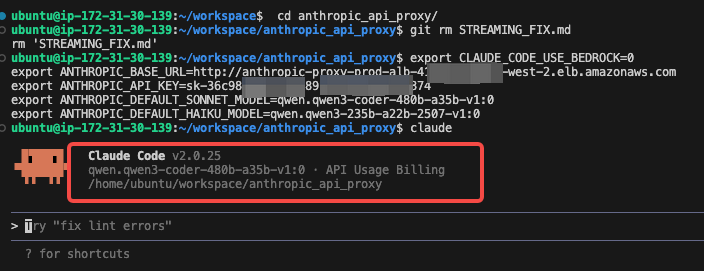
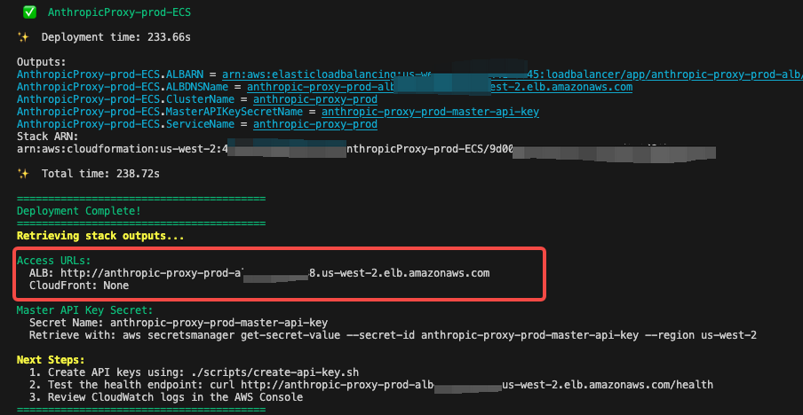

<div align="center">

# 🔄 Anthropic-Bedrock API Proxy

**Zero-Code Migration: Seamlessly Connect Anthropic SDK with AWS Bedrock**

[](LICENSE)
[](https://python.org)
[](https://fastapi.tiangolo.com)
[](https://aws.amazon.com/bedrock/)

<p>
  <a href="./README.md"></a>
  <a href="./README_EN.md"></a>
  <a href="./blog_article.md"></a>
  <a href="./cdk/DEPLOYMENT.md"></a>
</p>

---

</div>

## Overview

This lightweight API convertion service enables you to use various large language models on AWS Bedrock with the Anthropic SDK without any code changes. Through simple environment variable configuration, you can seamlessly switch between different models like Qwen, DeepSeek, and others in tools such as Claude Code and Claude Agent SDK.

**Key Advantages:**
- 🔄 **Zero Code Migration** - Fully compatible with Anthropic API, no code changes required
- 🚀 **Ready to Use** - Supports all advanced features including streaming/non-streaming, tool calling, and multi-modal content
- 💰 **Cost Optimization** - Flexibly use open-source models on Bedrock to significantly reduce inference costs
- 🔐 **Enterprise-Grade** - Built-in API key management, rate limiting, usage tracking, and monitoring metrics
- ☁️ **Cloud-Native** - One-click deployment to AWS ECS with auto-scaling and high availability
- 🎯 **Versatile** - Suitable for development tools, application integration, model evaluation, and more

**Typical Use Cases:** Use **Qwen3-Coder-480B** for code generation in Claude Code, or mix different models in production applications build with **Claude Agent SDK** to balance performance and cost.

## Features

### Core Functionality
- **Anthropic API Compatibility**: Full support for Anthropic Messages API format
- **Bidirectional Format Conversion**: Seamless conversion between Anthropic and Bedrock formats
- **Streaming Support**: Server-Sent Events (SSE) for real-time streaming responses
- **Non-Streaming Support**: Traditional request-response pattern

### Advanced Features
- **Tool Use (Function Calling)**: Convert and execute tool definitions
- **Extended Thinking**: Support for thinking blocks in responses
- **Multi-Modal Content**: Text, images, and document support
- **Prompt Caching**: Map cache control hints (where supported)

### Infrastructure
- **Authentication**: API key-based authentication with DynamoDB storage
- **Rate Limiting**: Token bucket algorithm per API key
- **Usage Tracking**: Comprehensive analytics and token usage tracking
- **Service Tiers**: Bedrock Service Tier configuration for cost/latency optimization

### Supported Models
- Claude 4.5/5 Sonnet
- Claude 4.5 Haiku
- Qwen3-coder-480b
- Qwen3-235b-instruct
- Any other Bedrock models supporting Converse API

## Usage Cases

### Model Proxy for Claude Code
* For example, you can setup below environment variables before start the `claude`, then you can use any models such as `qwen3-coder` in Bedrock for your `claude code`
```bash
export CLAUDE_CODE_USE_BEDROCK=0
export ANTHROPIC_BASE_URL=http://anthropic-proxy-prod-alb-xxxx.elb.amazonaws.com
export ANTHROPIC_API_KEY=sk-xxxx
export ANTHROPIC_DEFAULT_SONNET_MODEL=qwen.qwen3-coder-480b-a35b-v1:0
export ANTHROPIC_DEFAULT_HAIKU_MODEL=qwen.qwen3-235b-a22b-2507-v1:0
```


* If you **DON'T** set `ANTHROPIC_DEFAULT_SONNET_MODEL` and `ANTHROPIC_DEFAULT_HAIKU_MODEL` as below, then the proxy will map the IDs of Claude sonnet 4.5 and haiku 4.5/3.5 to the model IDs in Bedrock by default.
```bash
export CLAUDE_CODE_USE_BEDROCK=0
export ANTHROPIC_BASE_URL=http://anthropic-proxy-prod-alb-xxxx.elb.amazonaws.com
export ANTHROPIC_API_KEY=sk-xxxx
```

###  Model Proxy Claude Agent SDK
- The same settings also applicable for Claude Agent SDK
Eg., Dockerfile used for AgentCore Runtime [Reference Project](https://github.com/xiehust/agentcore_demo/tree/main/00-claudecode_agent) 

```Dockerfile
FROM --platform=linux/arm64 ghcr.io/astral-sh/uv:python3.13-bookworm-slim

WORKDIR /app

# Install system dependencies including Node.js for playwright-mcp
RUN apt-get update && apt-get install -y \
    git \
    curl \
    && curl -fsSL https://deb.nodesource.com/setup_22.x | bash - \
    && apt-get install -y nodejs zip \
    && rm -rf /var/lib/apt/lists/*
RUN npm install -g @anthropic-ai/claude-code
# Copy entire project (respecting .dockerignore)
COPY . .
RUN mkdir -p workspace
RUN uv sync 

# Signal that this is running in Docker for host binding logic
ENV DOCKER_CONTAINER=1
ENV CLAUDE_CODE_USE_BEDROCK=0
ENV ANTHROPIC_BASE_URL=http://anthropic-proxy-prod-alb-xxxx.elb.amazonaws.com
ENV export ANTHROPIC_API_KEY=sk-xxxx

EXPOSE 8080

CMD [".venv/bin/python3", "claude_code_agent.py"]
```

## Service Tier

The Bedrock Service Tier feature allows you to balance between cost and latency. This proxy service fully supports this feature with flexible configuration options.

### Available Tiers

| Tier | Description | Latency | Cost | Claude Support |
|------|-------------|---------|------|----------------|
| `default` | Standard service tier | Standard | Standard | ✅ |
| `flex` | Flexible tier for batch processing | Higher (up to 24h) | Lower | ❌ |
| `priority` | Priority tier for real-time apps | Lower | Higher | ❌ |
| `reserved` | Reserved capacity tier | Stable | Prepaid | ✅ |

### Configuration Methods

#### 1. Per API Key Configuration

System default is `default`. You can create API keys with different service tiers for different users or purposes:

```bash
# Create an API key with flex tier (for non-real-time batch processing)
./scripts/create-api-key.sh -u batch-user -n "Batch Processing Key" -t flex

# Create an API key with priority tier (for real-time applications)
./scripts/create-api-key.sh -u realtime-user -n "Realtime App Key" -t priority
```

#### 2. Priority Rules

Service tier is determined by the following priority:
1. **API Key Configuration** (highest priority) - if the API key has a specified service tier
2. **System Default** - `default`

### Automatic Fallback Mechanism

When the specified service tier is not supported by the target model, the proxy service will **automatically fall back** to `default` tier and retry the request:

```
Request (flex tier) → Claude model → flex not supported → Auto fallback to default → Success
```

This ensures that requests will not fail even if an incompatible service tier is configured.

### Usage Recommendations

| Scenario | Recommended Tier | Description |
|----------|-----------------|-------------|
| Real-time chat/conversation | `default` or `priority` | Requires low latency response |
| Batch data processing | `flex` | Can tolerate higher latency, saves cost |
| Code generation/dev tools | `default` | Balance between latency and cost |
| Production critical apps | `reserved` | Requires stable capacity guarantee |

### Model Compatibility

| Model | default | flex | priority | reserved |
|-------|---------|------|----------|----------|
| Claude Series | ✅ | ❌ | ❌ | ✅ |
| Qwen Series | ✅ | ✅ | ✅ | ✅ |
| DeepSeek Series | ✅ | ✅ | ✅ | ✅ |
| Nova Series | ✅ | ✅ | ✅ | ✅ |
| MiniMax Series | ✅ | ✅ | ✅ | ✅ |

> **Note**: Specific model support for service tiers may change with AWS Bedrock updates. Please refer to the [AWS Official Documentation](https://docs.aws.amazon.com/bedrock/latest/userguide/inference-service-tiers.html) for the latest information.

## Architecture

```
+----------------------------------------------------------+
|              Client Application                          |
|           (Anthropic Python SDK)                         |
+---------------------------+------------------------------+
                            |
                            | HTTP/HTTPS (Anthropic Format)
                            |
                            v
+----------------------------------------------------------+
|          FastAPI API Proxy Service                       |
|                                                           |
|  +----------+  +-----------+  +----------------+         |
|  |   Auth   |  |   Rate    |  |   Format       |         |
|  |Middleware|->| Limiting  |->|  Conversion    |         |
|  +----------+  +-----------+  +----------------+         |
+-------+---------------+---------------+------------------+
        |               |               |
        v               v               v
  +----------+    +----------+    +----------+
  | DynamoDB |    |   AWS    |    |CloudWatch|
  |          |    | Bedrock  |    |   Logs/  |
  | API Keys |    | Runtime  |    | Metrics  |
  |  Usage   |    | Converse |    |          |
  |  Cache   |    |          |    |          |
  +----------+    +----------+    +----------+
```

### Component Overview

- **FastAPI Application**: Async web framework with automatic OpenAPI docs
- **Format Converters**: Bidirectional conversion between Anthropic and Bedrock formats
- **Authentication Middleware**: API key validation using DynamoDB
- **Rate Limiting Middleware**: Token bucket algorithm with configurable limits
- **Bedrock Service**: Interface to AWS Bedrock Converse/ConverseStream APIs
- **DynamoDB Storage**: API keys, usage tracking, caching, model mappings
- **Metrics Collection**: Prometheus-compatible metrics for monitoring

### AWS ECS Fargate Production Architecture


**Architecture Details:**

| Component | Description |
|-----------|-------------|
| **VPC** | Multi-AZ deployment with public/private subnets, CIDR: 10.x.0.0/16 |
| **Application Load Balancer** | Located in public subnets, receives external HTTP/HTTPS traffic |
| **ECS Fargate Cluster** | Located in private subnets, runs containerized proxy service |
| **NAT Gateway** | Provides outbound internet access for private subnets (1 for dev, multi-AZ for prod) |
| **VPC Endpoints** | Production environment configures private endpoints for Bedrock, DynamoDB, ECR, CloudWatch to optimize cost and security |
| **Auto Scaling** | Automatically scales based on CPU/memory utilization and request count (min 2, max 10) |
| **DynamoDB Tables** | API Keys, Usage, Model Mapping tables with PAY_PER_REQUEST billing |
| **Secrets Manager** | Securely stores Master API Key |
| **CloudWatch Logs** | Centralized logging, Container Insights enabled in production |

## Deployment Options Quick Start

### Clone the repository:
```bash
git clone <repository-url>
cd anthropic_api_converter
```


### Option 1. AWS ECS Deployment (Recommend)


#### 1. Install Dependencies

```bash
cd cdk
npm install
```

#### 2. Deploy to Prod
**⚠️⚠️⚠️Note that the -p parameter must be adjusted to either amd64 or arm64 based on your current compilation platform. For instance, when compiling on an x86-powered development platform, modify it to -p amd64.**
```bash
./scripts/deploy.sh -e prod -r us-west-2 -p arm64
```

This will deploy:
- DynamoDB tables
- VPC with NAT gateways
- ECS Fargate cluster and service
- Application Load Balancer

Deployment takes approximately **15-20 minutes**.
#### 3. You can find endpoint URL of ALB.


```text
Master API Key Secret:
  Secret Name: anthropic-proxy-prod-master-api-key
  Retrieve with: aws secretsmanager get-secret-value --secret-id anthropic-proxy-prod-master-api-key --region us-west-2

Next Steps:
  1. Create API keys using: ./scripts/create-api-key.sh
```

**Create API Key Examples:**

```bash
# Navigate to CDK directory
cd cdk

# Basic usage - create default API key
./scripts/create-api-key.sh -u user123 -n "My API Key"

# Specify service tier - use flex tier (lower cost, higher latency)
./scripts/create-api-key.sh -u user123 -n "Flex Key" -t flex

# Specify service tier - use priority tier (lower latency, higher cost)
./scripts/create-api-key.sh -u user123 -n "Priority Key" -t priority

# Set both custom rate limit and service tier
./scripts/create-api-key.sh -u user123 -n "Custom Key" -r 500 -t reserved

# View help
./scripts/create-api-key.sh -h
```

> **Note**: Claude models only support `default` and `reserved` service tiers, not `flex`. If you use `flex` tier with Claude models, the proxy will automatically fall back to `default`.

#### More detail in [CDK Deployment](cdk/DEPLOYMENT.md)


### Option 2. Run Docker 

Build and run with Docker:

```bash
# Build image
docker build -t anthropic-bedrock-proxy:latest .

# Run container
docker run -d \
  -p 8000:8000 \
  -e AWS_REGION=us-east-1 \
  -e AWS_ACCESS_KEY_ID=your-key \
  -e AWS_SECRET_ACCESS_KEY=your-secret \
  -e MASTER_API_KEY=your-master-key \
  --name api-proxy \
  anthropic-bedrock-proxy:latest
```

## Option 3. Local start

### Prerequisites

- Python 3.12+
- AWS Account with Bedrock access
- AWS credentials configured
- DynamoDB access

### Installation

1. **Install dependencies using uv**:
```bash
# Install uv if not already installed
pip install uv

# Install dependencies
uv sync
```

2. **Configure environment**:
```bash
cp .env.example .env
# Edit .env with your configuration
```

3. **Set up DynamoDB tables**:
```bash
uv run scripts/setup_tables.py
```

4. **Create an API key**:
```bash
uv run scripts/create_api_key.py --user-id dev-user --name "Development Key"
```

5. **Run the service**:
```bash
uv run uvicorn app.main:app --reload  --port 8000
```

The service will be available at `http://localhost:8000`.


## Configuration

### Environment Variables

Configuration is managed through environment variables. See `.env.example` for all options.

#### Application Settings
```bash
APP_NAME=Anthropic-Bedrock API Proxy
ENVIRONMENT=development  # development, staging, production
LOG_LEVEL=INFO
```

#### AWS Settings
```bash
AWS_REGION=us-east-1
AWS_ACCESS_KEY_ID=your-access-key
AWS_SECRET_ACCESS_KEY=your-secret-key
```

#### Authentication
```bash
REQUIRE_API_KEY=True
MASTER_API_KEY=sk-your-master-key
API_KEY_HEADER=x-api-key
```

#### Rate Limiting
```bash
RATE_LIMIT_ENABLED=True
RATE_LIMIT_REQUESTS=1000  # requests per window
RATE_LIMIT_WINDOW=60     # window in seconds
```

#### Feature Flags
```bash
ENABLE_TOOL_USE=True
ENABLE_EXTENDED_THINKING=True
ENABLE_DOCUMENT_SUPPORT=True
PROMPT_CACHING_ENABLED=False
```

#### Bedrock Service Tier
```bash
# Default service tier: 'default', 'flex', 'priority', 'reserved'
DEFAULT_SERVICE_TIER=default
```

**Service Tier Options:**
- `default` - Standard service tier (default)
- `flex` - Flex tier with lower prices but potentially higher latency
- `priority` - Priority tier with lower latency
- `reserved` - Reserved capacity tier

**Important Notes:**
- Claude models **only support** `default` and `reserved` tiers, **not** `flex` tier
- If the specified service tier is not supported by the model, the system automatically falls back to `default`
- You can configure a custom service tier for each API key when creating it

## API Documentation

### Endpoints

#### POST /v1/messages

Create a message (Anthropic-compatible).
**Request Body**:
```bash
curl http://localhost:8000/v1/messages \
  -H "Content-Type: application/json" \
  -H "x-api-key: sk-xxx" \
  -d '{
    "model": "qwen.qwen3-coder-480b-a35b-v1:0",
    "max_tokens": 1024,
    "messages": [
      {"role": "user", "content": "Hello!"}
    ]
  }'
```

```bash
curl http://localhost:8000/v1/messages \
  -H "Content-Type: application/json" \
  -H "x-api-key: sk-xxx" \
  -d '{
    "model": "claude-sonnet-4-5-20250929",
    "max_tokens": 1024,
    "stream":true,
    "messages": [
      {"role": "user", "content": "Write a sonnet about Summer"}
    ]
  }'
```

#### GET /v1/models

List available Bedrock models.

**Request**:
```bash
curl http://localhost:8000/v1/models \
  -H "x-api-key: sk-xxxx"
```


### Using with Anthropic SDK

```python
from anthropic import Anthropic

# Initialize client with custom base URL
client = Anthropic(
    api_key="sk-your-api-key",
    base_url="http://localhost:8000"
)

# Use as normal
message = client.messages.create(
    model="qwen.qwen3-coder-480b-a35b-v1:0",
    max_tokens=1024,
    messages=[
        {"role": "user", "content": "Hello, Claude!"}
    ]
)

print(message.content[0].text)
```

### Streaming Example

```python
with client.messages.stream(
    model="qwen.qwen3-coder-480b-a35b-v1:0",
    max_tokens=1024,
    messages=[
        {"role": "user", "content": "Tell me a story"}
    ]
) as stream:
    for text in stream.text_stream:
        print(text, end="", flush=True)
```

### Tool Use Example

```python
message = client.messages.create(
    model="qwen.qwen3-coder-480b-a35b-v1:0",
    max_tokens=1024,
    tools=[
        {
            "name": "get_weather",
            "description": "Get weather for a location",
            "input_schema": {
                "type": "object",
                "properties": {
                    "location": {"type": "string"}
                },
                "required": ["location"]
            }
        }
    ],
    messages=[
        {"role": "user", "content": "What's the weather in SF?"}
    ]
)
```

## Security

### Best Practices

1. **API Key Management**:
   - Never commit API keys to version control
   - Use environment variables or secret managers
   - Rotate keys regularly
   - Use separate keys for different environments

2. **AWS Credentials**:
   - Use IAM roles when running on AWS (ECS, Lambda)
   - Apply least privilege principle
   - Enable CloudTrail logging

3. **Network Security**:
   - Use HTTPS in production
   - Configure CORS appropriately
   - Use VPC endpoints for AWS services
   - Implement WAF rules

4. **Rate Limiting**:
   - Configure appropriate limits per API key
   - Monitor for abuse patterns
   - Implement exponential backoff

### Required IAM Permissions

```json
{
  "Version": "2012-10-17",
  "Statement": [
    {
      "Effect": "Allow",
      "Action": [
        "bedrock:InvokeModel",
        "bedrock:InvokeModelWithResponseStream",
        "bedrock:ListFoundationModels",
        "bedrock:GetFoundationModel"
      ],
      "Resource": "*"
    },
    {
      "Effect": "Allow",
      "Action": [
        "dynamodb:PutItem",
        "dynamodb:GetItem",
        "dynamodb:UpdateItem",
        "dynamodb:Query",
        "dynamodb:Scan",
        "dynamodb:DeleteItem"
      ],
      "Resource": [
        "arn:aws:dynamodb:*:*:table/anthropic-proxy-*"
      ]
    }
  ]
}
```

## Development

### Project Structure

```
anthropic_api_proxy/
--- app/
   --- api/              # API route handlers
       --- health.py     # Health check endpoints
       --- messages.py   # Messages API
       --- models.py     # Models API
   --- converters/       # Format converters
       --- anthropic_to_bedrock.py
       --- bedrock_to_anthropic.py
   --- core/             # Core functionality
       --- config.py     # Configuration management
       --- logging.py    # Logging setup
       --- metrics.py    # Metrics collection
   --- db/               # Database clients
       --- dynamodb.py   # DynamoDB operations
   --- middleware/       # Middleware components
       --- auth.py       # Authentication
       --- rate_limit.py # Rate limiting
   --- schemas/          # Pydantic models
       --- anthropic.py  # Anthropic API schemas
       --- bedrock.py    # Bedrock API schemas
   --- services/         # Business logic
       --- bedrock_service.py
   --- main.py           # Application entry point
--- tests/
   --- unit/             # Unit tests
   --- integration/      # Integration tests
--- scripts/              # Utility scripts
--- config/               # Configuration files
--- Dockerfile            # Docker image definition
--- docker-compose.yml    # Local development stack
--- pyproject.toml        # Project dependencies
--- README.md             # This file
```

### Running Tests

```bash
# Run all tests
pytest

# Run with coverage
pytest --cov=app --cov-report=html

# Run specific test file
pytest tests/unit/test_converters.py

# Run with verbose output
pytest -v
```

### Code Quality

```bash
# Format code
black app tests

# Lint code
ruff check app tests

# Type checking
mypy app
```

## Testing

### Manual Testing

```bash
# Health check
curl http://localhost:8000/health

# List models
curl http://localhost:8000/v1/models \
  -H "x-api-key: sk-your-api-key"

# Create message
curl http://localhost:8000/v1/messages \
  -H "Content-Type: application/json" \
  -H "x-api-key: sk-your-api-key" \
  -d '{
    "model": "claude-sonnet-4-5-20250929",
    "max_tokens": 1024,
    "messages": [
      {"role": "user", "content": "Hello!"}
    ]
  }'

# Streaming message
curl http://localhost:8000/v1/messages \
  -H "Content-Type: application/json" \
  -H "x-api-key: sk-your-api-key" \
  -d '{
    "model": "claude-sonnet-4-5-20250929",
    "max_tokens": 1024,
    "stream": true,
    "messages": [
      {"role": "user", "content": "Count to 10"}
    ]
  }'
```

## Contributing

Contributions are welcome! Please:

1. Fork the repository
2. Create a feature branch
3. Make your changes
4. Add tests
5. Submit a pull request

## License

MIT-0


