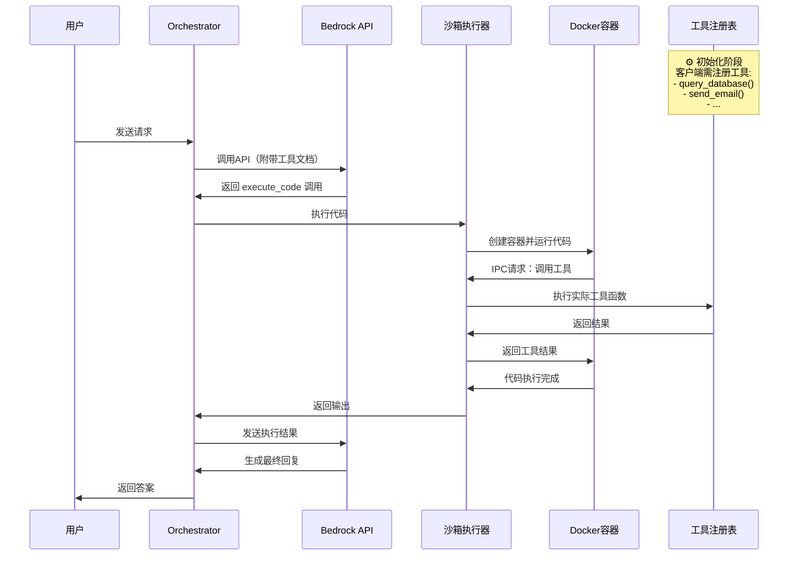
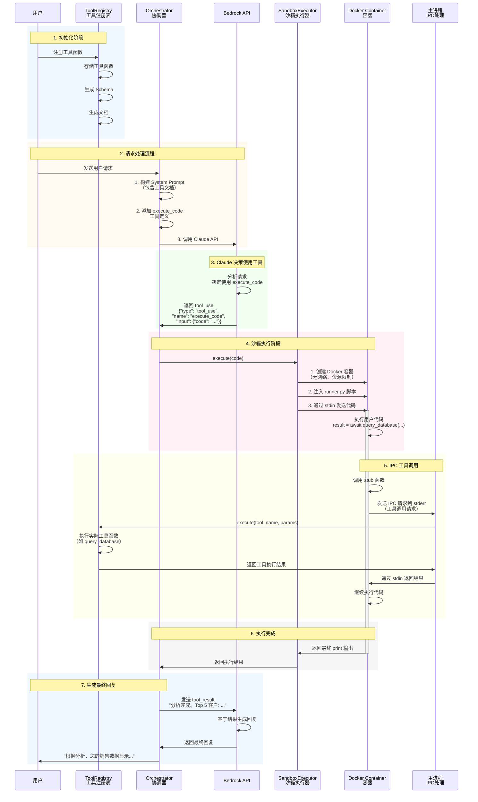

# Sandbox Runner 代码详解

这是一个**沙箱代码执行器**，用于在隔离环境中安全执行用户代码，同时支持通过 IPC（进程间通信）调用外部工具。

---

## 架构概览

```
┌─────────────────────────────────────────────────────────────┐
│                      主进程 (Host)                           │
│  - 启动沙箱子进程                                            │
│  - 通过 stdin 发送代码和工具调用结果                          │
│  - 通过 stdout/stderr 接收执行结果和工具调用请求               │
└─────────────────────────────────────────────────────────────┘
                            │
            ┌───────────────┼───────────────┐
            │ stdin         │ stdout        │ stderr
            ▼               ▼               ▼
┌─────────────────────────────────────────────────────────────┐
│                    沙箱子进程 (本代码)                        │
│  - 接收并执行用户代码                                        │
│  - 拦截工具调用，转发给主进程                                 │
│  - 返回执行结果                                              │
└─────────────────────────────────────────────────────────────┘
```

---

## 1. IPC 协议标记

```python
IPC_TOOL_CALL_START = "{IPC_TOOL_CALL_START}"
IPC_TOOL_CALL_END = "{IPC_TOOL_CALL_END}"
IPC_TOOL_RESULT_START = "{IPC_TOOL_RESULT_START}"
IPC_TOOL_RESULT_END = "{IPC_TOOL_RESULT_END}"
IPC_CODE_OUTPUT_START = "{IPC_CODE_OUTPUT_START}"
IPC_CODE_OUTPUT_END = "{IPC_CODE_OUTPUT_END}"
```

这些是**消息边界标记**，用于在文本流中分隔不同类型的消息：

| 标记 | 用途 | 方向 |
|------|------|------|
| `TOOL_CALL` | 沙箱请求调用工具 | 沙箱 → 主进程 (stderr) |
| `TOOL_RESULT` | 主进程返回工具结果 | 主进程 → 沙箱 (stdin) |
| `CODE_OUTPUT` | 代码执行最终结果 | 沙箱 → 主进程 (stdout) |

---

## 2. 工具调用机制

### 2.1 发送工具调用请求

```python
def _send_tool_call(tool_name: str, arguments: dict) -> str:
    """发送工具调用请求到主进程"""
    call_id = str(uuid.uuid4())  # 生成唯一ID用于匹配请求/响应
    request = {
        "call_id": call_id,
        "tool_name": tool_name,
        "arguments": arguments
    }
    # 发送到 stderr（避免与 print 输出混淆）
    message = f"{IPC_TOOL_CALL_START}{json.dumps(request)}{IPC_TOOL_CALL_END}"
    print(message, file=sys.stderr, flush=True)
    return call_id
```

**为什么用 stderr？**
- stdout 用于用户代码的 `print()` 输出
- stderr 专门用于系统级 IPC 通信，避免混淆

### 2.2 接收工具调用结果

```python
def _receive_tool_result(call_id: str, timeout: float = 30.0) -> Any:
    """从主进程接收工具调用结果"""
    while True:
        line = sys.stdin.readline()  # 阻塞读取
        if not line:
            raise RuntimeError(f"EOF while waiting for tool result: {call_id}")
      
        line = line.strip()
        if IPC_TOOL_RESULT_START in line and IPC_TOOL_RESULT_END in line:
            # 解析消息
            start = line.find(IPC_TOOL_RESULT_START) + len(IPC_TOOL_RESULT_START)
            end = line.find(IPC_TOOL_RESULT_END)
            result_json = line[start:end]
            result = json.loads(result_json)
          
            # 检查 call_id 匹配
            if result.get("call_id") == call_id:
                if result.get("error"):
                    raise RuntimeError(f"Tool error: {result['error']}")
                return result.get("result")
```

---

## 3. 动态创建工具函数

```python
def _create_tool_function(tool_name: str):
    """创建工具调用函数"""
    async def tool_func(**kwargs) -> Any:
        # 1. 发送调用请求
        call_id = _send_tool_call(tool_name, kwargs)
      
        # 2. 在线程池中等待结果（避免阻塞事件循环）
        loop = asyncio.get_event_loop()
        result = await loop.run_in_executor(
            None,  # 使用默认线程池
            lambda: _receive_tool_result(call_id)
        )
        return result
  
    return tool_func

# 根据 TOOLS_INFO 动态生成所有工具函数
_tool_functions = {}
for tool_info in TOOLS_INFO:
    tool_name = tool_info["name"]
    _tool_functions[tool_name] = _create_tool_function(tool_name)
```

**关键点：**
- 使用闭包捕获 `tool_name`
- `run_in_executor` 将阻塞的 stdin 读取放到线程池，避免阻塞 asyncio 事件循环

---

## 4. 输出捕获

```python
class OutputCapture:
    """捕获 print 输出"""
    def __init__(self):
        self.outputs = []
        self._original_stdout = sys.stdout
  
    def write(self, text):
        if text.strip():  # 忽略空行
            self.outputs.append(text)
  
    def flush(self):
        pass
  
    def get_output(self) -> str:
        return "".join(self.outputs)
```

这个类模拟 `sys.stdout` 接口，收集所有输出到内存中。

---

## 5. 用户代码执行核心

```python
async def execute_user_code(code: str) -> dict:
    """执行用户代码"""
  
    # 1. 准备执行环境（沙箱 globals）
    exec_globals = {
        "__builtins__": __builtins__,
        "asyncio": asyncio,
        "json": json,
    }
  
    # 2. 注入工具函数（如 web_search, read_file 等）
    for name, func in _tool_functions.items():
        exec_globals[name] = func
  
    # 3. 替换 print 函数，捕获输出
    output_capture = OutputCapture()
    exec_globals["print"] = lambda *args, **kwargs: output_capture.write(
        " ".join(str(a) for a in args) + kwargs.get("end", "\n")
    )
  
    # 4. 包装用户代码为异步函数
    indented_code = "\n".join("    " + line for line in code.split("\n"))
    wrapped_code = f"""
async def __user_main__():
{indented_code}
"""
  
    # 5. 执行
    try:
        exec(compile(wrapped_code, "<user_code>", "exec"), exec_globals)
        await exec_globals["__user_main__"]()
        return {
            "success": True,
            "output": output_capture.get_output(),
            "error": None
        }
    except Exception as e:
        return {
            "success": False,
            "output": output_capture.get_output(),
            "error": str(e)
        }
```

### 代码包装示例

用户代码：
```python
result = await web_search(query="Python")
print(result)
```

包装后：
```python
async def __user_main__():
    result = await web_search(query="Python")
    print(result)
```

---

## 6. 主入口

```python
def main():
    # 1. 从 stdin 读取用户代码（带边界标记）
    code_lines = []
    reading_code = False
  
    for line in sys.stdin:
        line = line.rstrip("\n")
        if line == "__CODE_START__":
            reading_code = True
            continue
        elif line == "__CODE_END__":
            break
        elif reading_code:
            code_lines.append(line)
  
    # 2. 执行代码
    code = "\n".join(code_lines)
    result = asyncio.run(execute_user_code(code))
  
    # 3. 输出结果（带 IPC 标记）
    print(f"{IPC_CODE_OUTPUT_START}{json.dumps(result)}{IPC_CODE_OUTPUT_END}", flush=True)
```

---

## 7. 完整通信流程示例

```
时间线：

主进程                              沙箱子进程
   │                                    │
   │──── stdin: __CODE_START__ ────────▶│
   │──── stdin: result = await ... ────▶│
   │──── stdin: __CODE_END__ ──────────▶│
   │                                    │
   │                                    │ (执行代码，遇到工具调用)
   │                                    │
   │◀── stderr: {IPC_TOOL_CALL_START}  │
   │    {"call_id":"xxx",               │
   │     "tool_name":"web_search",...}  │
   │    {IPC_TOOL_CALL_END} ───────────│
   │                                    │
   │ (主进程执行真正的工具)              │ (沙箱阻塞等待)
   │                                    │
   │──── stdin: {IPC_TOOL_RESULT_START}▶│
   │    {"call_id":"xxx",               │
   │     "result":"..."}                │
   │    {IPC_TOOL_RESULT_END} ─────────▶│
   │                                    │
   │                                    │ (继续执行)
   │                                    │
   │◀── stdout: {IPC_CODE_OUTPUT_START} │
   │    {"success":true,                │
   │     "output":"..."}                │
   │    {IPC_CODE_OUTPUT_END} ─────────│
   │                                    │
```

---

## 8. 安全考虑

| 安全特性 | 实现方式 |
|---------|---------|
| 代码隔离 | 在子进程中执行，与主进程内存隔离 |
| 输出隔离 | 替换 print 函数，捕获所有输出 |
| 工具控制 | 工具调用必须通过 IPC，由主进程审核执行 |
| 超时控制 | 可在主进程端实现进程级超时 |

**注意：** 这个沙箱仍然不是完全安全的（比如没有限制 `__builtins__`），生产环境需要配合 Docker/gVisor 等容器技术。

---

## 9. 模板变量

代码中有一个占位符：
```python
TOOLS_INFO = {tools_info}
```

这说明这是一个**模板文件**，实际使用时主进程会将 `{tools_info}` 替换为真正的工具定义 JSON，例如：

```python
TOOLS_INFO = [
    {"name": "web_search", "description": "搜索网页"},
    {"name": "read_file", "description": "读取文件"}
]
```

## 10. 示意流程


## 11. 详细流程
