<div align="center">

<p>
  <a href="./README.md"></a>
  <a href="./README_EN.md"></a>
  <a href="./blog_article.md"></a>
  <a href="./cdk/DEPLOYMENT.md"></a>
</p>

</div>

# Anthropic-Bedrock API Proxy 深度解析：零代码迁移，让 Claude Code 用上 Bedrock 全家桶

> **本文深入剖析 Anthropic-Bedrock API Proxy 的架构设计、核心转换逻辑和实际应用场景，帮助你理解如何构建一个生产级的 API 代理服务。**

## 一、引言：当 Anthropic SDK 遇上 AWS Bedrock

如果你正在使用 Claude Code 或 Claude Agent SDK 进行开发，是否想过让这些工具无缝切换到 AWS Bedrock 上的其他大模型？比如用 Qwen3-Coder-480B 来完成代码生成任务，或者混合使用不同模型来平衡成本和性能？

传统方案需要修改代码、适配不同的 API 格式——这既繁琐又容易出错。**Anthropic-Bedrock API Proxy** 正是为解决这个痛点而生：它是一个轻量级的 API 转换服务，充当 Anthropic Messages API 和 AWS Bedrock Converse API 之间的翻译层，让你**无需修改任何代码**，只需配置几个环境变量，就能在 Anthropic SDK 中调用 Bedrock 上的任意模型。

**最新特性亮点**：
- 🧠 **扩展思考（Extended Thinking）支持**：完整支持 Claude 和 Amazon Nova 2 模型的思考模式
- ⚡ **服务层级（Service Tier）配置**：支持 flex/priority/reserved 等不同服务级别
- 💾 **Prompt 缓存**：利用 Bedrock 原生 cachePoint 减少延迟和成本
- 🔧 **Anthropic Beta 特性**：支持 fine-grained-tool-streaming 和 interleaved-thinking

## 二、技术背景：为什么需要 API 转换层？

### 2.1 两种 API 的差异

Anthropic 和 AWS Bedrock 虽然都能调用 Claude 模型，但它们的 API 设计存在显著差异：

| 维度 | Anthropic Messages API | AWS Bedrock Converse API |
|------|----------------------|-------------------------|
| **请求格式** | `{"role": "user", "content": "..."}` | `{"role": "user", "content": [{"text": "..."}]}` |
| **模型标识** | `claude-sonnet-4-5-20250929` | `anthropic.claude-3-5-sonnet-20241022-v2:0` |
| **流式协议** | Server-Sent Events (SSE) | Bedrock EventStream |
| **工具调用** | `tool_use` content block | `toolUse` 嵌套结构 |
| **思考模式** | `thinking` content block | `reasoningContent` 结构 |
| **认证方式** | API Key (`x-api-key`) | AWS IAM / SigV4 |

### 2.2 代理服务的核心价值

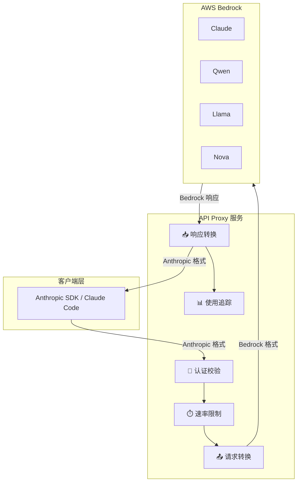

**核心优势**：
- **零代码迁移**：现有 Anthropic SDK 代码无需任何修改
- **多模型支持**：可以访问 Bedrock 上的所有支持 Converse API 的模型
- **企业级特性**：内置认证、限流、监控、使用追踪
- **高级功能支持**：扩展思考、服务层级、Prompt 缓存等

## 三、核心架构设计

### 3.1 整体架构

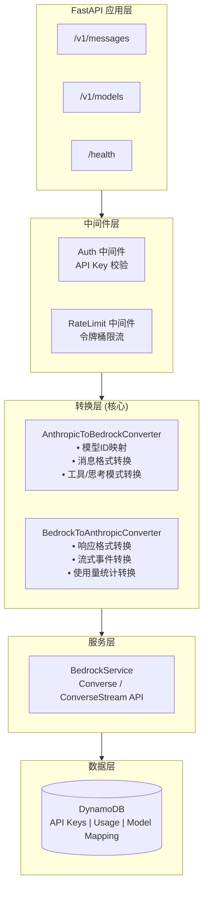

### 3.2 请求处理流程

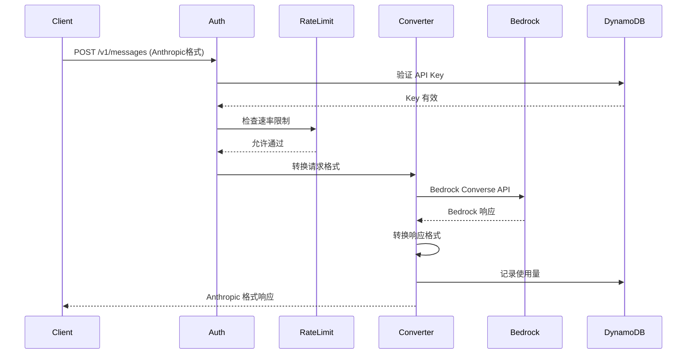

### 3.3 关键模块说明

**转换层** 是项目的核心，负责双向格式转换：

| 转换方向 | 主要转换内容 |
|---------|------------|
| **Anthropic → Bedrock** | 模型ID映射、消息结构、工具定义、系统提示、推理参数、思考配置 |
| **Bedrock → Anthropic** | 响应内容、流式事件、使用量统计、停止原因、思考内容块 |

## 四、核心转换逻辑

### 4.1 内容块转换映射

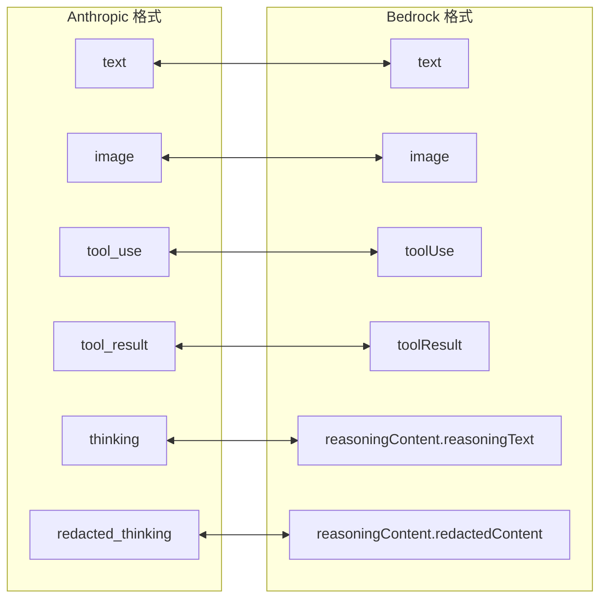

**转换示例**：

| Anthropic 格式 | Bedrock 格式 |
|---------------|-------------|
| `{"type": "text", "text": "Hello"}` | `{"text": "Hello"}` |
| `{"type": "image", "source": {"data": "base64..."}}` | `{"image": {"source": {"bytes": ...}}}` |
| `{"type": "tool_use", "id": "x", "name": "fn"}` | `{"toolUse": {"toolUseId": "x", "name": "fn"}}` |
| `{"type": "thinking", "thinking": "..."}` | `{"reasoningContent": {"reasoningText": {"text": "..."}}}` |

### 4.2 流式事件转换

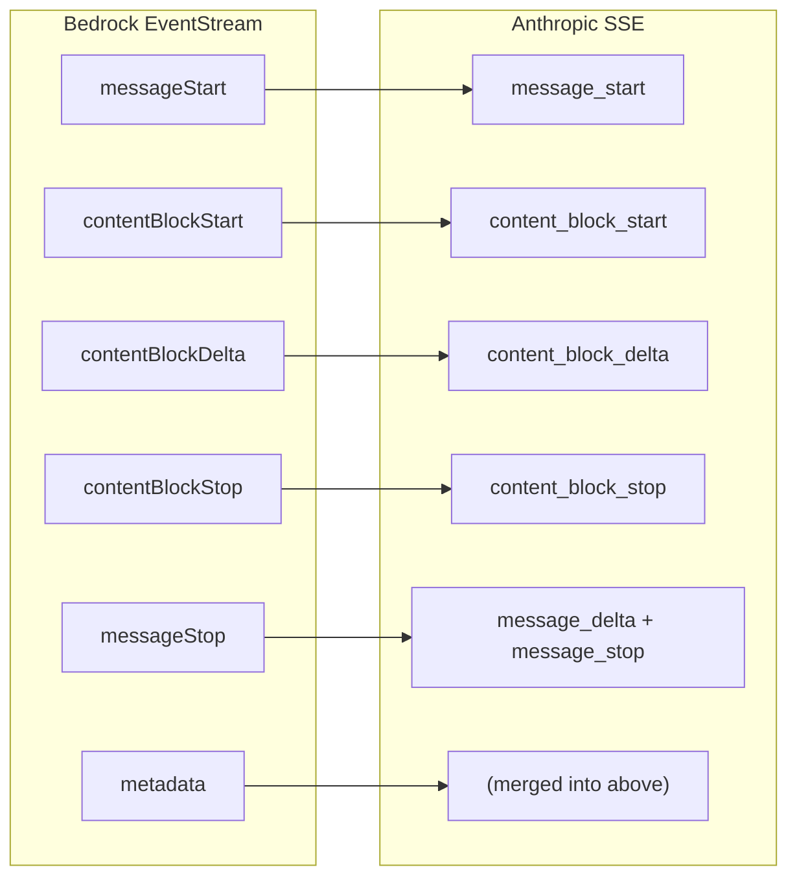

**SSE 格式输出**：`event: {type}\ndata: {json}\n\n`

### 4.3 扩展思考支持

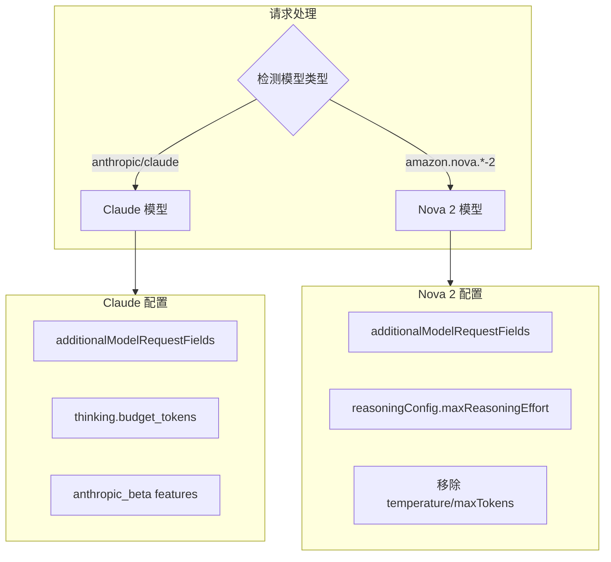

**Nova 2 思考预算映射**：

| budget_tokens | maxReasoningEffort |
|--------------|-------------------|
| < 1000 | `low` |
| 1000 - 10000 | `medium` |
| > 10000 | `high` |

**多轮对话支持**：思考内容块包含 `signature` 字段，用于保持上下文连续性。

### 4.4 服务层级支持

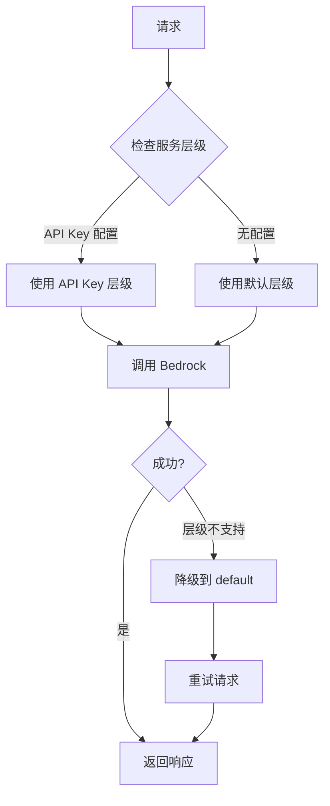

**可用层级**：

| 层级 | 描述 | Claude 支持 |
|------|------|------------|
| `default` | 标准服务层级 | ✅ |
| `flex` | 更低成本，更高延迟 | ❌ |
| `priority` | 更低延迟，更高成本 | ❌ |
| `reserved` | 预留容量层级 | ✅ |

### 4.5 Prompt 缓存

当请求包含 `cache_control` 字段时，代理服务在对应位置插入 Bedrock `cachePoint`：

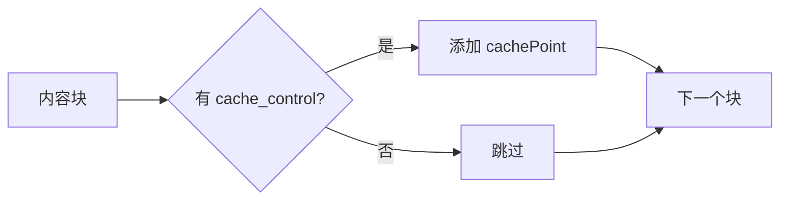

**支持缓存的位置**：文本、图像、文档、系统提示、工具定义

**限制**：仅 Claude 模型支持

## 五、实际应用场景

### 5.1 在 Claude Code 中使用 Bedrock 模型

```bash
# 配置环境变量
export CLAUDE_CODE_USE_BEDROCK=0
export ANTHROPIC_BASE_URL=http://your-proxy-endpoint:8000
export ANTHROPIC_API_KEY=sk-your-proxy-api-key

# 使用 Qwen3-Coder 替代默认模型
export ANTHROPIC_DEFAULT_SONNET_MODEL=qwen.qwen3-coder-480b-a35b-v1:0

# 启动 Claude Code
claude
```

### 5.2 混合使用不同模型

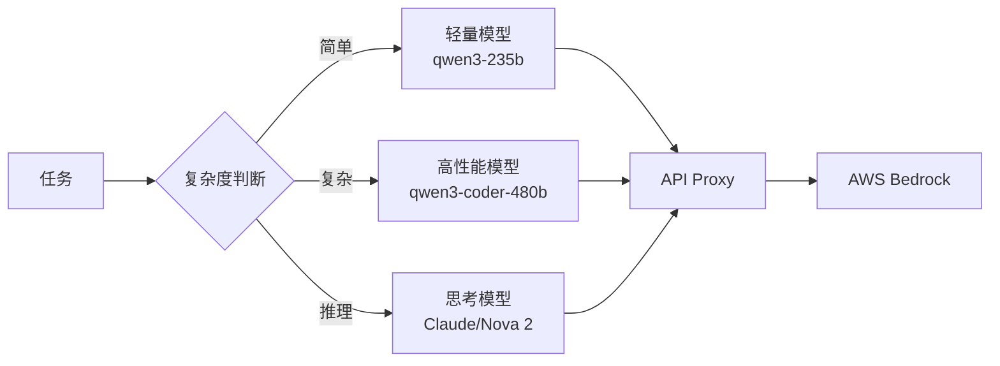

### 5.3 扩展思考使用示例

```python
# 启用扩展思考
response = client.messages.create(
    model="claude-sonnet-4-5-20250929",
    max_tokens=16000,
    thinking={"type": "enabled", "budget_tokens": 10000},
    messages=[{"role": "user", "content": "分析这个算法的复杂度..."}]
)

# 响应包含 thinking 和 text 内容块
```

## 六、部署与运维

### 6.1 部署架构

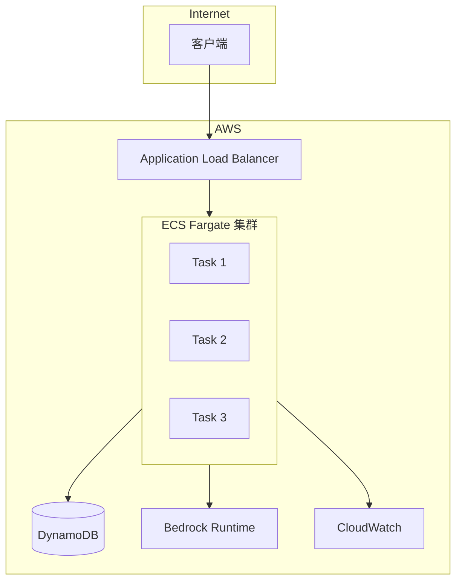

**一键部署**：
```bash
cd cdk && npm install
./scripts/deploy.sh -e prod -r us-west-2 -p arm64
```

### 6.2 性能指标

| 指标 | 目标值 | 说明 |
|------|--------|------|
| 转换延迟 | < 50ms | 格式转换开销 |
| P50 总延迟 | < 500ms | 非流式请求 |
| P95 总延迟 | < 2s | 非流式请求 |
| 首 Token 时间 | < 500ms | 流式请求 |
| 吞吐量 | > 100 req/s | 单实例 |

### 6.3 监控指标

| 指标名 | 类型 | 描述 |
|-------|------|------|
| `api_requests_total` | Counter | 请求总数 |
| `api_request_duration_seconds` | Histogram | 请求延迟 |
| `bedrock_requests_total` | Counter | Bedrock 调用次数 |
| `input_tokens_total` | Counter | 输入 Token 数 |
| `output_tokens_total` | Counter | 输出 Token 数 |
| `rate_limit_exceeded_total` | Counter | 限流触发次数 |

## 七、技术亮点与设计决策

### 7.1 架构决策

| 决策 | 选择 | 原因 |
|------|------|------|
| HTTP 客户端 | 同步 boto3 | DynamoDB 延迟低（ms级），异步复杂度不值得 |
| 限流算法 | 令牌桶 | 允许突发流量，更符合实际使用模式 |
| 状态存储 | DynamoDB | 持久化、无服务器友好、AWS 原生集成 |
| 部署平台 | ECS Fargate | 无需管理服务器，自动扩展 |

### 7.2 模型特定处理

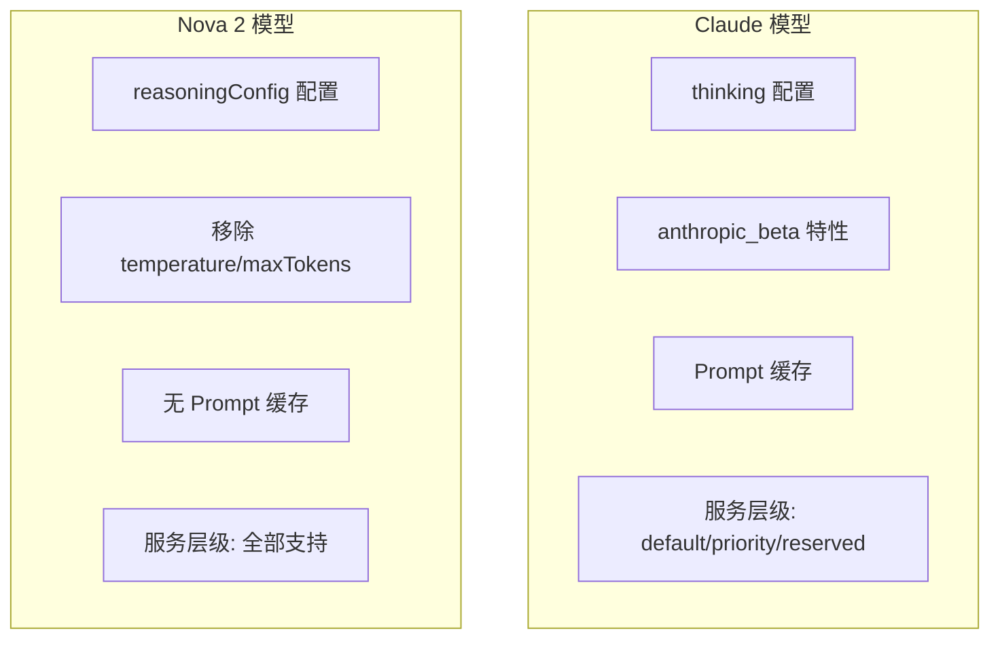

### 7.3 流式响应容错

代理服务自动处理 Bedrock 流式响应的边界情况：
- **自动注入缺失事件**：某些模型不发送 `contentBlockStart`，代理自动补充
- **服务层级降级**：不支持的层级自动降级到 `default`
- **错误事件转换**：Bedrock 错误转换为 Anthropic 格式的 error 事件

## 八、总结

Anthropic-Bedrock API Proxy 通过精巧的双向格式转换，实现了 Anthropic SDK 与 AWS Bedrock 的无缝对接。

**核心价值**：

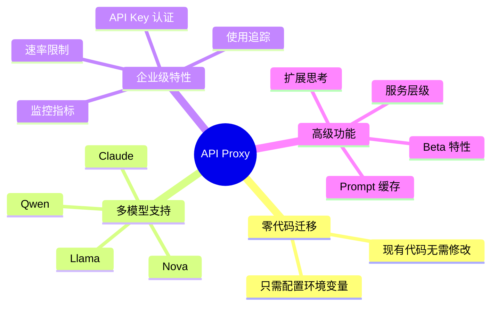

**特性支持矩阵**：

| 特性 | Claude | Nova 2 | 其他模型 |
|------|--------|--------|---------|
| 扩展思考 | ✅ | ✅ | - |
| 多轮思考 | ✅ | - | - |
| Prompt 缓存 | ✅ | - | - |
| 服务层级 | 部分 | 全部 | 全部 |
| 工具调用 | ✅ | ✅ | ✅ |
| 流式响应 | ✅ | ✅ | ✅ |

## 附录：配置参考

### 特性开关

| 环境变量 | 默认值 | 描述 |
|---------|--------|------|
| `ENABLE_TOOL_USE` | `True` | 启用工具调用 |
| `ENABLE_EXTENDED_THINKING` | `True` | 启用扩展思考 |
| `ENABLE_DOCUMENT_SUPPORT` | `True` | 启用文档支持 |
| `PROMPT_CACHING_ENABLED` | `True` | 启用 Prompt 缓存 |
| `FINE_GRAINED_TOOL_STREAMING_ENABLED` | `True` | 启用细粒度工具流 |
| `INTERLEAVED_THINKING_ENABLED` | `True` | 启用交错思考 |
| `DEFAULT_SERVICE_TIER` | `default` | 默认服务层级 |

### 默认模型映射

| Anthropic Model ID | Bedrock Model ID |
|-------------------|------------------|
| `claude-opus-4-5-20251101` | `global.anthropic.claude-opus-4-5-20251101-v1:0` |
| `claude-sonnet-4-5-20250929` | `global.anthropic.claude-sonnet-4-5-20250929-v1:0` |
| `claude-haiku-4-5-20251001` | `global.anthropic.claude-haiku-4-5-20251001-v1:0` |
| `claude-3-5-haiku-20241022` | `us.anthropic.claude-3-5-haiku-20241022-v1:0` |

## 参考资料

1. [项目 GitHub 仓库](https://github.com/your-repo/anthropic_api_proxy)
2. [Anthropic Messages API 文档](https://docs.anthropic.com/claude/reference/messages)
3. [AWS Bedrock Converse API 文档](https://docs.aws.amazon.com/bedrock/latest/APIReference/API_runtime_Converse.html)
4. [Claude Code 官方文档](https://docs.anthropic.com/claude-code)
5. [AWS Bedrock Service Tiers](https://docs.aws.amazon.com/bedrock/latest/userguide/inference-service-tiers.html)

---

> 本文基于 Anthropic-Bedrock API Proxy 项目撰写，如有问题欢迎在 GitHub 提交 Issue 讨论。
>
> **最后更新**：2024年12月 - 新增扩展思考、服务层级、Prompt 缓存等特性支持
