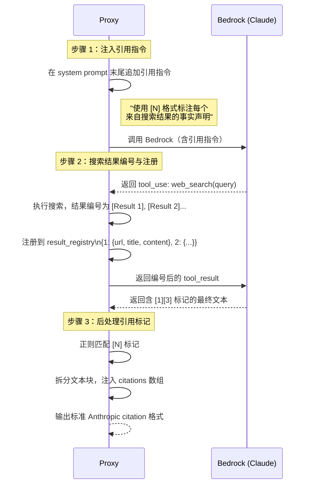

# 在 Amazon Bedrock 上实现 Anthropic Web Search 与 Web Fetch —— Server-Managed Tools 的自建 Proxy 方案

## 前言

在上一篇博客[《使用 Amazon Bedrock + 自建 ECS Docker Sandbox 实现 Agent 程序化工具调用 Programmatic Tool Calling》](https://aws.amazon.com/cn/blogs/china/programmatic-tool-calling-agent-using-bedrock-and-ecs-docker-sandbox/)中，我们介绍了如何通过自建 Docker Sandbox 在 Amazon Bedrock 上实现 Anthropic 的 Programmatic Tool Calling（PTC），让 Claude 能够生成 Python 代码来编排工具调用，从而大幅降低 Token 消耗并提升推理准确率。本篇是该系列的第二篇，聚焦另一类重要的服务端特性：**Web Search 与 Web Fetch**。

Anthropic API 近期推出的 `web_search` 和 `web_fetch` 是一种被称为 **Server-Managed Tools（服务端托管工具）** 的新能力。与传统的 Client-Side Tool（客户端工具）不同，这类工具由 Anthropic 服务端直接执行 —— 客户端只需在请求的 `tools` 列表中声明工具类型，Claude 便会在推理过程中自主调用搜索引擎或抓取网页，将实时信息融入回答。然而，AWS Bedrock 的 InvokeModel API **并不支持**这类 server-managed tool 声明。如果请求中包含 `type: "web_search_20250305"` 这样的工具定义，Bedrock 会直接返回错误。

本文将详细介绍我们如何在自建 Proxy 的中间层实现 Web Search 和 Web Fetch 这两个服务端工具，使得**客户端使用 Anthropic Python SDK 无需任何代码修改**，即可在 Bedrock 上获得与 Anthropic 官方 API 完全一致的搜索和抓取体验。文章涵盖实现原理、架构设计，以及与 Anthropic 官方 API 的详细对比验证。

---

## 一、背景

### 1.1 Web Search 简介

Anthropic 的 Web Search 工具赋予 Claude 搜索互联网、获取实时信息的能力。当开发者在请求中声明 web_search 工具后，Claude 可以在推理过程中主动发起搜索查询，获取最新的网页内容，并基于搜索结果生成带有来源引用的回答。

目前 Anthropic 提供了两个版本的 Web Search 工具：

| 版本 | 类型标识 | Beta Header | 核心特性 |
|------|---------|-------------|---------|
| 标准版 | `web_search_20250305` | `web-search-2025-03-05` | Web 搜索 + 结构化引用（citation） |
| 增强版 | `web_search_20260209` | `web-search-2026-02-09` | 标准搜索 + **Dynamic Filtering**（代码执行过滤） |

标准版提供了基础的搜索与引用能力，而增强版在此基础上加入了 Dynamic Filtering 特性，让 Claude 能够通过编写和执行代码来进一步过滤、分析搜索结果，显著提升了复杂查询场景下的回答准确率。

### 1.2 Dynamic Filtering：搜索结果的智能过滤

Dynamic Filtering 是 Anthropic 于 2026 年 2 月推出的增强搜索能力。根据 Anthropic 官方博客（[Improved Web Search with Dynamic Filtering](https://claude.com/blog/improved-web-search-with-dynamic-filtering)）公布的基准测试数据：

- **BrowseComp 基准**：Sonnet 从 33.3% 提升至 46.6%，Opus 从 45.3% 提升至 61.6%
- **平均准确率提升 11%**，**Token 效率提升 24%**

Dynamic Filtering 的核心思想是：当标准搜索返回大量结果后，Claude 不再仅凭自然语言理解来筛选信息，而是**自动编写 Python 代码来解析、过滤和交叉引用搜索结果**，只保留与问题最相关的内容，然后基于精炼后的数据生成回答。正如 Anthropic 官方博客所描述的，启用 Dynamic Filtering 后，Claude "behaves like an actual researcher, writing Python to parse, filter, and cross-reference results" —— 像一位真正的研究员那样，用代码来处理和分析数据。

这种方法在需要数值计算、数据对比或精确信息提取的场景中尤为有效。例如查询两家公司的财务指标对比时，Claude 可以编写代码从搜索结果中提取具体数字并进行计算，而非依赖模型自身的数值推理能力。

### 1.3 Web Fetch 简介

与 Web Search 搜索关键词获取多条摘要不同，Web Fetch 允许 Claude 直接抓取指定 URL 的完整页面内容。两者的对比如下：

| 对比维度 | Web Search | Web Fetch |
|---------|-----------|-----------|
| **输入** | 搜索关键词（query） | 具体 URL |
| **输出** | 多条搜索结果摘要 | 单个 URL 的完整页面内容 |
| **典型场景** | "搜索 Python 最新版本" | "读取 docs.python.org 的发布说明" |
| **内容深度** | 每条结果的部分内容 | 完整文档内容 |
| **结果数量** | 每次搜索返回 5 条（可配置） | 每次抓取 1 个 URL |

Web Fetch 同样提供标准版（`web_fetch_20250910`）和增强版（`web_fetch_20260209`，支持 Dynamic Filtering）。典型应用场景包括：读取技术文档的具体页面、获取 API 参考的详细内容、抓取特定网页进行数据提取等。

### 1.4 Bedrock 的局限

AWS Bedrock 的 InvokeModel API 在工具调用方面采用了标准的 tool definition 格式，即每个工具必须包含 `name`、`description` 和 `input_schema` 字段。对于 Anthropic 特有的 server-managed tool 声明（如 `type: "web_search_20250305"`），Bedrock **无法识别**，请求会被直接拒绝并返回验证错误。

这意味着，即使底层使用的是同一个 Claude 模型，通过 Bedrock 调用时也无法直接使用 Web Search 和 Web Fetch 这两项能力。这正是本文要解决的核心问题：**如何在 Proxy 层弥补这一差距，让 Bedrock 上的 Claude 也能具备实时搜索和网页抓取能力**。

---

## 二、整体架构概览

### 2.1 核心思路

Proxy 作为中间层，拦截包含 server-managed tool 声明的请求，将 Bedrock 无法识别的工具类型（如 `type: "web_search_20250305"`）替换为标准的 tool definition（包含 `name`、`description`、`input_schema` 字段），再通过 **Agentic Loop（代理循环）** 自行编排搜索或抓取的执行过程——包括调用 Bedrock 获取模型指令、调用外部搜索/抓取提供商获取真实数据，以及将结果注入对话上下文后继续推理——最终将整个多轮执行过程的最终结果组装为与 Anthropic 官方 API **完全一致的响应格式**，对客户端完全透明。

### 2.2 架构总览

```mermaid
flowchart TD
    A["客户端\n(Anthropic Python SDK)"] -->|"包含 web_search /\nweb_fetch 工具的请求"| B

    subgraph Proxy["Proxy 服务层"]
        B["API 路由层\napp/api/messages.py\n检测 server-managed tools"] --> C{工具类型?}

        C -->|"web_search_20250305\nweb_search_20260209"| D["WebSearchService\nAgentic Loop"]
        C -->|"web_fetch_20250910\nweb_fetch_20260209"| E["WebFetchService\nAgentic Loop"]

        subgraph SearchLoop["Web Search Agentic Loop"]
            D --> D1["调用 Bedrock InvokeModel\n(标准 tool definition)"]
            D1 --> D2{Claude 发起\n工具调用?}
            D2 -->|是| D3["调用搜索提供商\nTavily / Brave API"]
            D3 --> D4["将搜索结果注入\n对话上下文"]
            D4 --> D1
            D2 -->|否 (最终回答)| D5["组装 Anthropic\n格式响应"]
        end

        subgraph FetchLoop["Web Fetch Agentic Loop"]
            E --> E1["调用 Bedrock InvokeModel\n(标准 tool definition)"]
            E1 --> E2{Claude 发起\n工具调用?}
            E2 -->|是| E3["调用抓取提供商\nHttpx / Tavily API"]
            E3 --> E4["将抓取内容注入\n对话上下文"]
            E4 --> E1
            E2 -->|否 (最终回答)| E5["组装 Anthropic\n格式响应"]
        end
    end

    D5 -->|"SSE 流式响应\n(Anthropic 格式)"| A
    E5 -->|"SSE 流式响应\n(Anthropic 格式)"| A
```

### 2.3 关键设计决策

**1. 客户端透明**

使用 Anthropic Python SDK 的客户端无需任何代码修改。Proxy 对外暴露与 Anthropic 官方 API 完全相同的端点和响应格式，包括流式事件类型、引用（citation）字段结构以及 `stop_reason` 语义，使得现有代码可以零改动迁移至 Bedrock。

**2. 工具替换策略**

将 server-managed tool（如 `type: "web_search_20250305"`）替换为标准的 tool definition（包含 `name`、`description`、`input_schema` 三个字段），让 Bedrock InvokeModel API 能正常处理请求。Claude 模型本身理解这些工具的语义，因此仅凭标准定义即可正确生成工具调用指令，无需修改模型行为。

**3. 混合流式架构**

内部对 Bedrock 的调用始终使用**非流式模式**——这是 Agentic Loop 正确运行的前提，因为只有在获得完整响应后，才能判断 Claude 是否发起了工具调用，进而决定是执行工具并继续推理，还是返回最终结果。对外则通过 **SSE（Server-Sent Events）** 逐步向客户端发送最终结果，兼顾了内部编排的可靠性与用户的实时感知体验。

### 2.4 支持的工具版本

| 工具类型 | 类型标识 | 特性 |
|---------|---------|------|
| Web Search 标准版 | `web_search_20250305` | Web 搜索 + 引用 |
| Web Search 增强版 | `web_search_20260209` | 搜索 + Dynamic Filtering |
| Web Fetch 标准版 | `web_fetch_20250910` | URL 抓取 + 引用 |
| Web Fetch 增强版 | `web_fetch_20260209` | 抓取 + Dynamic Filtering |

### 2.5 源码目录结构

以下是与 Web Search / Web Fetch 功能相关的核心文件：

```
app/
├── api/messages.py                    # API 路由：检测并分发请求
├── converters/anthropic_to_bedrock.py # 多轮对话格式转换
├── schemas/
│   ├── web_search.py                  # Web Search 数据模型
│   └── web_fetch.py                   # Web Fetch 数据模型
└── services/
    ├── web_search_service.py          # Web Search Agentic Loop
    ├── web_fetch_service.py           # Web Fetch Agentic Loop
    ├── web_search/
    │   ├── providers.py               # 搜索提供商 (Tavily/Brave)
    │   └── domain_filter.py           # 域名过滤
    └── web_fetch/
        └── providers.py               # Fetch 提供商 (Httpx/Tavily)
```

---

## 三、Web Search 实现

本节深入剖析 Web Search 功能的实现细节，包括工具替换策略、Agentic Loop 编排逻辑、搜索提供商抽象、引用系统以及 Tool ID 转换机制。

### 3.1 工具替换

Bedrock 的 InvokeModel API 要求每个工具必须包含标准的 `name`、`description` 和 `input_schema` 字段。Anthropic 的 server-managed tool 声明（如 `type: "web_search_20250305"`）不符合这一格式，直接发送会导致验证错误。

Proxy 在每次调用 Bedrock 之前，会将请求中的 web_search 工具声明替换为标准的 tool definition，其他用户自定义工具则原样透传。

**替换前（客户端发送给 Proxy）：**

```json
{
  "type": "web_search_20250305",
  "name": "web_search",
  "max_uses": 5,
  "allowed_domains": ["example.com"]
}
```

**替换后（Proxy 发送给 Bedrock）：**

```json
{
  "name": "web_search",
  "description": "Search the web for current information. Returns search results with titles, URLs, and content snippets.",
  "input_schema": {
    "type": "object",
    "properties": {
      "query": {"type": "string", "description": "The search query"}
    },
    "required": ["query"]
  }
}
```

替换逻辑位于 `_build_tools_for_request()` 方法中：遍历原始工具列表，识别并跳过所有 `type` 为 `web_search_20250305` 或 `web_search_20260209` 的工具声明，然后在列表末尾追加标准的 web_search tool definition。对于增强版（`web_search_20260209`），还会额外追加 `bash_code_execution` 工具，用于 Dynamic Filtering 代码执行（见第五节）。

这一替换对 Claude 模型完全透明——Claude 内置了对 web_search 工具语义的理解，仅凭标准定义即可正确生成搜索调用指令，无需修改模型行为或添加额外的提示。与此同时，`max_uses`、`allowed_domains`、`blocked_domains` 等配置参数被 Proxy 保存在 `WebSearchToolDefinition` 结构中，在 Agentic Loop 执行阶段由 Proxy 负责执行这些约束，而不是传给 Bedrock。

### 3.2 Agentic Loop 核心编排

Agentic Loop 是 Web Search 功能的核心，负责在 Proxy 层完成多轮推理与工具执行的编排，对客户端完全透明。

#### 流程图


#### 核心伪代码

```python
async def handle_web_search_request():
    messages = list(request.messages)  # 当前对话历史
    search_count = 0
    result_registry = {}               # 引用注册表：编号 → {url, title, content}

    for iteration in range(MAX_ITERATIONS):  # MAX_ITERATIONS = 25，防止无限循环
        # 1. 替换工具列表，注入引用系统提示（让 Claude 输出 [N] 引用标记）
        tools = build_tools_for_request(request.tools, config)
        system = inject_citation_system_prompt(request.system)

        # 2. 调用 Bedrock（始终非流式，便于判断工具调用）
        response = await bedrock_service.invoke_model(model, messages, tools, system)

        # 3. 检查是否有 web_search 工具调用
        web_search_uses = find_web_search_tool_uses(response.content)
        if not web_search_uses or response.stop_reason != "tool_use":
            break  # Claude 给出最终回答，退出循环

        # 4. 执行搜索并注入结果
        tool_results = []
        for tool_use in web_search_uses:
            if search_count >= max_uses:
                # 已超出搜索次数上限，返回错误给 Claude，让其基于已有结果作答
                tool_results.append(build_error_result(tool_use.id, "max_uses_exceeded"))
            else:
                results = await search_provider.search(tool_use.input.query)
                tool_results.append(build_search_result(tool_use.id, results, result_registry))
                search_count += 1

        # 5. 将本轮 assistant 响应和搜索结果追加到消息历史，继续下一轮
        messages = build_continuation_messages(messages, response.content, tool_results)

    # 6. 后处理引用标记，将 [N] 转换为正式 citations 对象，组装最终响应
    content = post_process_citations(response.content, result_registry)
    return MessageResponse(content=content, usage=accumulated_usage)
```

#### 循环终止条件

| 条件 | 行为 |
|------|------|
| `stop_reason != "tool_use"` | Claude 给出最终回答，循环正常结束 |
| 达到 MAX_ITERATIONS（25） | 强制终止，使用最后一次响应，防止死循环 |
| `search_count >= max_uses` | 返回 `max_uses_exceeded` 错误给 Claude，Claude 基于已有结果作答 |

#### Token 累计

每次迭代的 `input_tokens` 和 `output_tokens` 均会累加到 `total_input_tokens` / `total_output_tokens`，确保最终响应中的 `usage` 字段反映整个多轮推理过程的实际 Token 消耗，与 Anthropic 官方 API 的计费方式保持一致。

### 3.3 搜索提供商

Proxy 通过抽象基类 `SearchProvider` 统一封装不同的搜索后端，使得上层 Agentic Loop 代码与具体搜索服务解耦。

#### 抽象接口

```python
class SearchProvider(ABC):
    @abstractmethod
    async def search(
        self,
        query: str,
        max_results: int = 5,
        allowed_domains: Optional[List[str]] = None,
        blocked_domains: Optional[List[str]] = None,
        user_location: Optional[dict] = None,
    ) -> List[SearchResult]:
        """执行搜索，返回标准化的 SearchResult 列表"""
        pass
```

`SearchResult` 是一个标准化的数据结构，包含 `url`、`title`、`content` 和可选的 `page_age` 字段，屏蔽了不同提供商之间的响应格式差异。

#### TavilySearchProvider（默认）

[Tavily](https://tavily.com/) 是专为 AI 应用场景设计的搜索引擎，返回的内容经过清洗和结构化处理，非常适合作为 Claude 的上下文输入。

核心特性：
- 使用 `tavily-python` SDK，设置 `search_depth: "advanced"` 以获取更丰富的页面内容
- 原生支持 `include_domains` 和 `exclude_domains` 参数，可直接传入域名白名单/黑名单，无需额外处理
- SDK 为同步接口，通过 `asyncio.get_running_loop().run_in_executor()` 在线程池中执行，避免阻塞事件循环

#### BraveSearchProvider（备选）

[Brave Search](https://search.brave.com/) 提供独立于 Google/Bing 的搜索索引，使用 `httpx.AsyncClient` 调用 REST API，支持原生异步。

域名过滤实现：Brave Search API 不直接支持域名过滤参数，因此 Proxy 通过在查询字符串中注入 `site:` 前缀来实现白名单过滤：

```python
if allowed_domains:
    site_filter = " OR ".join(f"site:{d}" for d in allowed_domains)
    search_query = f"({site_filter}) {query}"
```

对于黑名单过滤（`blocked_domains`），则交由后续的 `DomainFilter` 在搜索结果上进行二次过滤。

#### 二次域名过滤

无论使用哪个提供商，Proxy 在搜索结果返回后均会调用 `DomainFilter` 进行二次过滤，作为最终的安全保障。`DomainFilter` 支持子域名匹配（`docs.example.com` 可以被 `example.com` 规则匹配），确保域名过滤行为的一致性。

#### 工厂函数

`create_search_provider()` 根据环境变量 `WEB_SEARCH_PROVIDER`（默认为 `"tavily"`）选择实现：

```python
def create_search_provider() -> SearchProvider:
    if settings.web_search_provider == "brave":
        return BraveSearchProvider(api_key=settings.brave_search_api_key)
    return TavilySearchProvider(api_key=settings.tavily_api_key)
```

### 3.4 引用系统

Anthropic 官方 API 在返回 Web Search 结果时，会将 Claude 的回答拆分为多个 `text` 块，每块附带一个 `citations` 数组，精确标注回答中每句话所引用的来源 URL 和原始内容片段。Proxy 通过三步机制在 Bedrock 上还原这一行为。

#### 三步引用机制



**步骤 1：系统提示注入**

在每次 Bedrock 调用前，Proxy 向 system prompt 末尾追加引用指令，要求 Claude 在引用搜索结果时使用 `[N]` 格式标注来源编号：

> "When you use web search results to answer questions, you MUST cite sources using numbered references in square brackets. After each factual claim based on a search result, append the result number like this: 'Python 3.13 was released in October 2024 [1].'"

**步骤 2：搜索结果编号与注册**

将搜索结果传给 Claude 时，每条结果添加 `[Result N]` 前缀，并注册到 `result_registry`（一个以 1 为起始下标的字典），记录每条结果的 `url`、`title` 和 `content`。多轮搜索中，编号在整个会话内累积递增，避免引用混淆。

**步骤 3：后处理引用标记**

Claude 返回的最终文本中包含如 `[1]`、`[3]`、`[1][3]` 这样的引用标记。`_post_process_citations()` 方法通过正则表达式定位所有标记的位置，将文本拆分为多个片段，每个引用标记前的文本片段附带对应的 `citations` 数组：

```python
# 正则匹配所有引用标记组（如 "[1][3]" 整体作为一个锚点）
for match in re.finditer(r"((?:\[\d+\])+)", text):
    cited_indices = [int(m) for m in re.findall(r"\[(\d+)\]", match.group(0))]
    # 提取该标记之前的文本段落
    cited_segment = text[last_end:match.start()]
    # 为每个引用编号查找注册表，构建 citations 列表
    citations = [build_citation(result_registry[idx]) for idx in cited_indices]
    segments.append({"type": "text", "text": cited_segment, "citations": citations})
```

最终输出的 citation 格式与 Anthropic 官方 API 完全一致：

```json
{
  "type": "text",
  "text": "Python 3.13 was released in October 2024",
  "citations": [{
    "type": "web_search_result_location",
    "url": "https://docs.python.org/3/whatsnew/3.13.html",
    "title": "What's New In Python 3.13",
    "encrypted_index": "MQ==",
    "cited_text": "Python 3.13 is the latest stable release of the Python programming language, with a mix of changes to the language, the implementation..."
  }]
}
```

其中 `encrypted_index` 是对结果编号（整数）的 Base64 编码，`cited_text` 取自来源内容的前 150 个字符。

### 3.5 Tool ID 转换

Anthropic 官方 API 中，服务端托管工具（server-managed tools）在响应中以 `server_tool_use` 类型返回，其 ID 使用 `srvtoolu_` 前缀，区别于客户端工具的 `toolu_` 前缀。Bedrock 返回的工具调用均为标准 `tool_use` 类型，ID 以 `toolu_` 开头，因此 Proxy 需要在响应组装阶段进行转换。

**转换规则：**

| 方向 | 类型字段 | ID 前缀 |
|------|---------|---------|
| Bedrock 返回 | `tool_use` | `toolu_01Abc...` |
| 客户端收到 | `server_tool_use` | `srvtoolu_01Abc...` |

转换逻辑由 `_to_server_tool_id()` 和 `_convert_to_server_tool_use()` 两个方法实现：

```python
@staticmethod
def _to_server_tool_id(original_id: str) -> str:
    """将 Bedrock 返回的 toolu_ 前缀替换为 srvtoolu_ 前缀"""
    if original_id.startswith("srvtoolu_"):
        return original_id  # 已经是正确格式，幂等处理
    if original_id.startswith("toolu_"):
        return "srvtoolu_" + original_id[6:]  # 替换前缀
    return f"srvtoolu_{original_id}"           # 无前缀时直接追加
```

转换仅针对 Proxy 拦截的工具（`web_search` 和 `bash_code_execution`），用户自定义工具的 `tool_use` 块不受影响，原样透传给客户端。这确保了客户端在区分服务端托管工具与自定义工具时，能够沿用与 Anthropic 官方 API 完全一致的判断逻辑（检查 `type` 字段或 `id` 前缀）。

此外，`srvtoolu_` 前缀在客户端发回的 `tool_result` 中也必须保持一致——Proxy 在构建下一轮 Bedrock 请求时，会将 `srvtoolu_` ID 还原为 `toolu_` ID，确保 Bedrock 端的上下文连续性。
