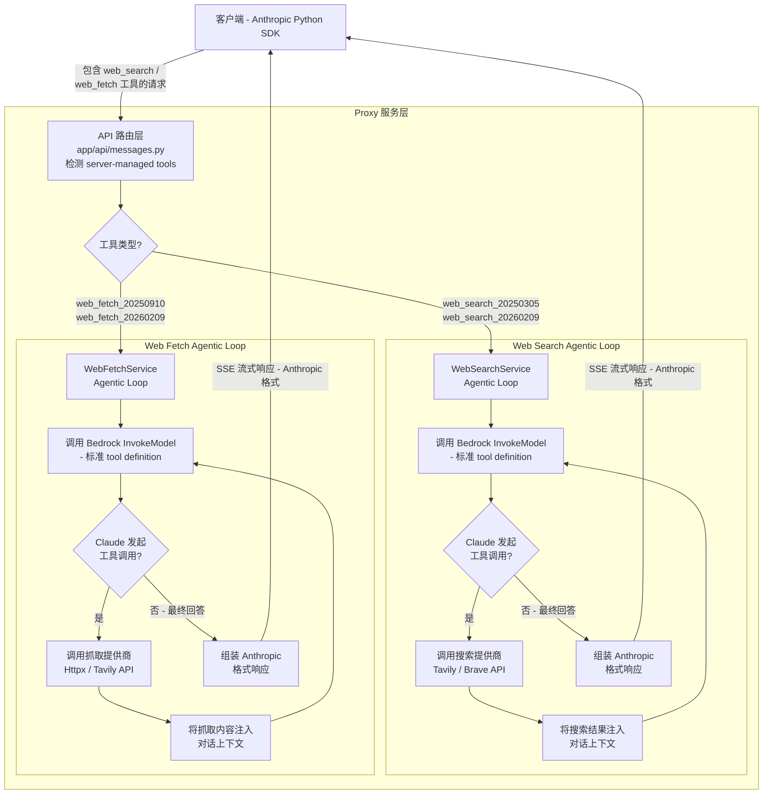
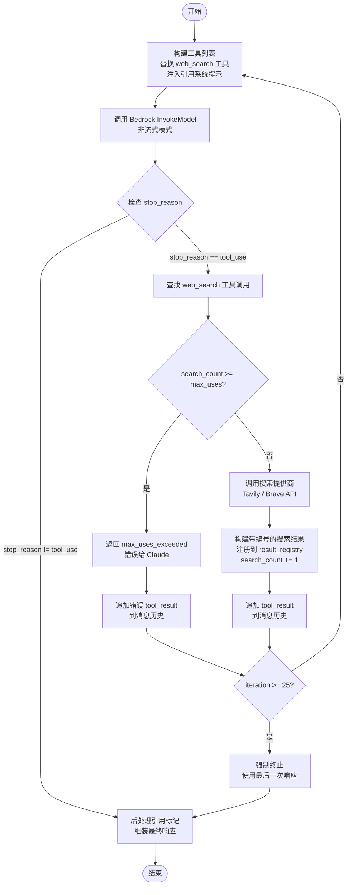
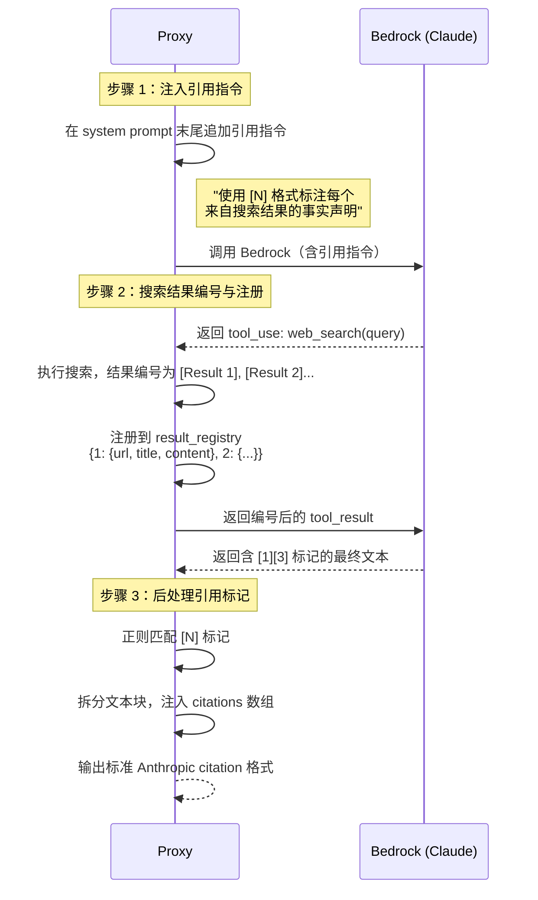
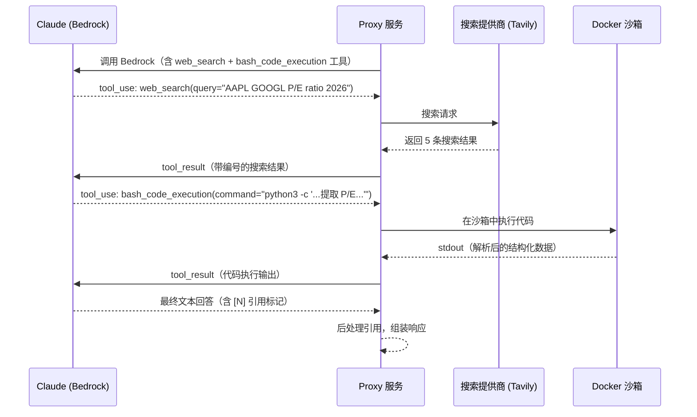

# 在 Amazon Bedrock 上实现 Anthropic Web Search 与 Web Fetch —— Server-Managed Tools 的自建 Proxy 方案

## 前言

在上一篇博客[《使用 Amazon Bedrock + 自建 ECS Docker Sandbox 实现 Agent 程序化工具调用 Programmatic Tool Calling》](https://aws.amazon.com/cn/blogs/china/programmatic-tool-calling-agent-using-bedrock-and-ecs-docker-sandbox/)中，我们介绍了如何通过自建 Docker Sandbox 在 Amazon Bedrock 上实现 Anthropic 的 Programmatic Tool Calling（PTC），让 Claude 能够生成 Python 代码来编排工具调用，从而大幅降低 Token 消耗并提升推理准确率。本篇是该系列的第二篇，聚焦另一类重要的服务端特性：**Web Search 与 Web Fetch**。

Anthropic API 近期推出的 `web_search` 和 `web_fetch` 是一种被称为 **Server-Managed Tools（服务端托管工具）** 的新能力。与传统的 Client-Side Tool（客户端工具）不同，这类工具由 Anthropic 服务端直接执行 —— 客户端只需在请求的 `tools` 列表中声明工具类型，Claude 便会在推理过程中自主调用搜索引擎或抓取网页，将实时信息融入回答。然而，AWS Bedrock 的 InvokeModel API **并不支持**这类 server-managed tool 声明。如果请求中包含 `type: "web_search_20250305"` 这样的工具定义，Bedrock 会直接返回错误。

本文将详细介绍我们如何在自建 Proxy 的中间层实现 Web Search 和 Web Fetch 这两个服务端工具，使得**客户端使用 Anthropic Python SDK 无需任何代码修改**，即可在 Bedrock 上获得与 Anthropic 官方 API 完全一致的搜索和抓取体验。文章涵盖实现原理、架构设计，以及与 Anthropic 官方 API 的详细对比验证。

---

## 一、背景

### 1.1 Web Search 简介

Anthropic 的 Web Search 工具赋予 Claude 搜索互联网、获取实时信息的能力。当开发者在请求中声明 web_search 工具后，Claude 可以在推理过程中主动发起搜索查询，获取最新的网页内容，并基于搜索结果生成带有来源引用的回答。

目前 Anthropic 提供了两个版本的 Web Search 工具：

| 版本 | 类型标识 | Beta Header | 核心特性 |
|------|---------|-------------|---------|
| 标准版 | `web_search_20250305` | `web-search-2025-03-05` | Web 搜索 + 结构化引用（citation） |
| 增强版 | `web_search_20260209` | `web-search-2026-02-09` | 标准搜索 + **Dynamic Filtering**（代码执行过滤） |

标准版提供了基础的搜索与引用能力，而增强版在此基础上加入了 Dynamic Filtering 特性，让 Claude 能够通过编写和执行代码来进一步过滤、分析搜索结果，显著提升了复杂查询场景下的回答准确率。

### 1.2 Dynamic Filtering：搜索结果的智能过滤

Dynamic Filtering 是 Anthropic 于 2026 年 2 月推出的增强搜索能力。根据 Anthropic 官方博客（[Improved Web Search with Dynamic Filtering](https://claude.com/blog/improved-web-search-with-dynamic-filtering)）公布的基准测试数据：

- **BrowseComp 基准**：Sonnet 从 33.3% 提升至 46.6%，Opus 从 45.3% 提升至 61.6%
- **平均准确率提升 11%**，**Token 效率提升 24%**

Dynamic Filtering 的核心思想是：当标准搜索返回大量结果后，Claude 不再仅凭自然语言理解来筛选信息，而是**自动编写 Python 代码来解析、过滤和交叉引用搜索结果**，只保留与问题最相关的内容，然后基于精炼后的数据生成回答。正如 Anthropic 官方博客所描述的，启用 Dynamic Filtering 后，Claude "behaves like an actual researcher, writing Python to parse, filter, and cross-reference results" —— 像一位真正的研究员那样，用代码来处理和分析数据。

这种方法在需要数值计算、数据对比或精确信息提取的场景中尤为有效。例如查询两家公司的财务指标对比时，Claude 可以编写代码从搜索结果中提取具体数字并进行计算，而非依赖模型自身的数值推理能力。

### 1.3 Web Fetch 简介

与 Web Search 搜索关键词获取多条摘要不同，Web Fetch 允许 Claude 直接抓取指定 URL 的完整页面内容。两者的对比如下：

| 对比维度 | Web Search | Web Fetch |
|---------|-----------|-----------|
| **输入** | 搜索关键词（query） | 具体 URL |
| **输出** | 多条搜索结果摘要 | 单个 URL 的完整页面内容 |
| **典型场景** | "搜索 Python 最新版本" | "读取 docs.python.org 的发布说明" |
| **内容深度** | 每条结果的部分内容 | 完整文档内容 |
| **结果数量** | 每次搜索返回 5 条（可配置） | 每次抓取 1 个 URL |

Web Fetch 同样提供标准版（`web_fetch_20250910`）和增强版（`web_fetch_20260209`，支持 Dynamic Filtering）。典型应用场景包括：读取技术文档的具体页面、获取 API 参考的详细内容、抓取特定网页进行数据提取等。

### 1.4 Bedrock 的局限

AWS Bedrock 的 InvokeModel API 在工具调用方面采用了标准的 tool definition 格式，即每个工具必须包含 `name`、`description` 和 `input_schema` 字段。对于 Anthropic 特有的 server-managed tool 声明（如 `type: "web_search_20250305"`），Bedrock **无法识别**，请求会被直接拒绝并返回验证错误。

这意味着，即使底层使用的是同一个 Claude 模型，通过 Bedrock 调用时也无法直接使用 Web Search 和 Web Fetch 这两项能力。这正是本文要解决的核心问题：**如何在 Proxy 层弥补这一差距，让 Bedrock 上的 Claude 也能具备实时搜索和网页抓取能力**。

---

## 二、整体架构概览

### 2.1 核心思路

Proxy 作为中间层，拦截包含 server-managed tool 声明的请求，将 Bedrock 无法识别的工具类型（如 `type: "web_search_20250305"`）替换为标准的 tool definition（包含 `name`、`description`、`input_schema` 字段），再通过 **Agentic Loop（代理循环）** 自行编排搜索或抓取的执行过程——包括调用 Bedrock 获取模型指令、调用外部搜索/抓取提供商获取真实数据，以及将结果注入对话上下文后继续推理——最终将整个多轮执行过程的最终结果组装为与 Anthropic 官方 API **完全一致的响应格式**，对客户端完全透明。

### 2.2 架构总览



### 2.3 关键设计决策

**1. 客户端透明**

使用 Anthropic Python SDK 的客户端无需任何代码修改。Proxy 对外暴露与 Anthropic 官方 API 完全相同的端点和响应格式，包括流式事件类型、引用（citation）字段结构以及 `stop_reason` 语义，使得现有代码可以零改动迁移至 Bedrock。

**2. 工具替换策略**

将 server-managed tool（如 `type: "web_search_20250305"`）替换为标准的 tool definition（包含 `name`、`description`、`input_schema` 三个字段），让 Bedrock InvokeModel API 能正常处理请求。Claude 模型本身理解这些工具的语义，因此仅凭标准定义即可正确生成工具调用指令，无需修改模型行为。

**3. 混合流式架构**

内部对 Bedrock 的调用始终使用**非流式模式**——这是 Agentic Loop 正确运行的前提，因为只有在获得完整响应后，才能判断 Claude 是否发起了工具调用，进而决定是执行工具并继续推理，还是返回最终结果。对外则通过 **SSE（Server-Sent Events）** 逐步向客户端发送最终结果，兼顾了内部编排的可靠性与用户的实时感知体验。

### 2.4 支持的工具版本

| 工具类型 | 类型标识 | 特性 |
|---------|---------|------|
| Web Search 标准版 | `web_search_20250305` | Web 搜索 + 引用 |
| Web Search 增强版 | `web_search_20260209` | 搜索 + Dynamic Filtering |
| Web Fetch 标准版 | `web_fetch_20250910` | URL 抓取 + 引用 |
| Web Fetch 增强版 | `web_fetch_20260209` | 抓取 + Dynamic Filtering |

### 2.5 源码目录结构

以下是与 Web Search / Web Fetch 功能相关的核心文件：

```
app/
├── api/messages.py                    # API 路由：检测并分发请求
├── converters/anthropic_to_bedrock.py # 多轮对话格式转换
├── schemas/
│   ├── web_search.py                  # Web Search 数据模型
│   └── web_fetch.py                   # Web Fetch 数据模型
└── services/
    ├── web_search_service.py          # Web Search Agentic Loop
    ├── web_fetch_service.py           # Web Fetch Agentic Loop
    ├── web_search/
    │   ├── providers.py               # 搜索提供商 (Tavily/Brave)
    │   └── domain_filter.py           # 域名过滤
    └── web_fetch/
        └── providers.py               # Fetch 提供商 (Httpx/Tavily)
```

---

## 三、Web Search 实现

本节深入剖析 Web Search 功能的实现细节，包括工具替换策略、Agentic Loop 编排逻辑、搜索提供商抽象、引用系统以及 Tool ID 转换机制。

### 3.1 工具替换

Bedrock 的 InvokeModel API 要求每个工具必须包含标准的 `name`、`description` 和 `input_schema` 字段。Anthropic 的 server-managed tool 声明（如 `type: "web_search_20250305"`）不符合这一格式，直接发送会导致验证错误。

Proxy 在每次调用 Bedrock 之前，会将请求中的 web_search 工具声明替换为标准的 tool definition，其他用户自定义工具则原样透传。

**替换前（客户端发送给 Proxy）：**

```json
{
  "type": "web_search_20250305",
  "name": "web_search",
  "max_uses": 5,
  "allowed_domains": ["example.com"]
}
```

**替换后（Proxy 发送给 Bedrock）：**

```json
{
  "name": "web_search",
  "description": "Search the web for current information. Returns search results with titles, URLs, and content snippets.",
  "input_schema": {
    "type": "object",
    "properties": {
      "query": {"type": "string", "description": "The search query"}
    },
    "required": ["query"]
  }
}
```
替换逻辑还会额外追加 `bash_code_execution` 工具，用于 Dynamic Filtering 代码执行（见第五节）。  
这一替换对客户端完全透明—-Proxy 内置了对 web_search 工具语义的理解与此同时，`max_uses`、`allowed_domains`、`blocked_domains` 等配置参数被 Proxy 保存在 `WebSearchToolDefinition` 结构中，在 Agentic Loop 执行阶段由 Proxy 负责执行这些约束，而不是传给 Bedrock。

### 3.2 Agentic Loop 核心编排

Agentic Loop 是 Web Search 功能的核心，负责在 Proxy 层完成多轮推理与工具执行的编排，对客户端完全透明。

#### 流程图



#### 核心伪代码

```python
async def handle_web_search_request():
    messages = list(request.messages)  # 当前对话历史
    search_count = 0
    result_registry = {}               # 引用注册表：编号 → {url, title, content}

    for iteration in range(MAX_ITERATIONS):  # MAX_ITERATIONS = 25，防止无限循环
        # 1. 替换工具列表，注入引用系统提示（让 Claude 输出 [N] 引用标记）
        tools = build_tools_for_request(request.tools, config)
        system = inject_citation_system_prompt(request.system)

        # 2. 调用 Bedrock（始终非流式，便于判断工具调用）
        response = await bedrock_service.invoke_model(model, messages, tools, system)

        # 3. 检查是否有 web_search 工具调用
        web_search_uses = find_web_search_tool_uses(response.content)
        if not web_search_uses or response.stop_reason != "tool_use":
            break  # Claude 给出最终回答，退出循环

        # 4. 执行搜索并注入结果
        tool_results = []
        for tool_use in web_search_uses:
            if search_count >= max_uses:
                # 已超出搜索次数上限，返回错误给 Claude，让其基于已有结果作答
                tool_results.append(build_error_result(tool_use.id, "max_uses_exceeded"))
            else:
                results = await search_provider.search(tool_use.input.query)
                tool_results.append(build_search_result(tool_use.id, results, result_registry))
                search_count += 1

        # 5. 将本轮 assistant 响应和搜索结果追加到消息历史，继续下一轮
        messages = build_continuation_messages(messages, response.content, tool_results)

    # 6. 后处理引用标记，将 [N] 转换为正式 citations 对象，组装最终响应
    content = post_process_citations(response.content, result_registry)
    return MessageResponse(content=content, usage=accumulated_usage)
```

#### 循环终止条件

| 条件 | 行为 |
|------|------|
| `stop_reason != "tool_use"` | Claude 给出最终回答，循环正常结束 |
| 达到 MAX_ITERATIONS（25） | 强制终止，使用最后一次响应，防止死循环 |
| `search_count >= max_uses` | 返回 `max_uses_exceeded` 错误给 Claude，Claude 基于已有结果作答 |

#### Token 累计

每次迭代的 `input_tokens` 和 `output_tokens` 均会累加到 `total_input_tokens` / `total_output_tokens`，确保最终响应中的 `usage` 字段反映整个多轮推理过程的实际 Token 消耗，与 Anthropic 官方 API 的计费方式保持一致。

### 3.3 搜索提供商

Proxy 通过抽象基类 `SearchProvider` 统一封装不同的搜索后端，使得上层 Agentic Loop 代码与具体搜索服务解耦。

#### 抽象接口

```python
class SearchProvider(ABC):
    @abstractmethod
    async def search(
        self,
        query: str,
        max_results: int = 5,
        allowed_domains: Optional[List[str]] = None,
        blocked_domains: Optional[List[str]] = None,
        user_location: Optional[dict] = None,
    ) -> List[SearchResult]:
        """执行搜索，返回标准化的 SearchResult 列表"""
        pass
```

`SearchResult` 是一个标准化的数据结构，包含 `url`、`title`、`content` 和可选的 `page_age` 字段，屏蔽了不同提供商之间的响应格式差异。

#### TavilySearchProvider（默认）

[Tavily](https://tavily.com/) 是专为 AI 应用场景设计的搜索引擎，返回的内容经过清洗和结构化处理，非常适合作为 Claude 的上下文输入。

核心特性：
- 使用 `tavily-python` SDK，设置 `search_depth: "advanced"` 以获取更丰富的页面内容
- 原生支持 `include_domains` 和 `exclude_domains` 参数，可直接传入域名白名单/黑名单，无需额外处理
- SDK 为同步接口，通过 `asyncio.get_running_loop().run_in_executor()` 在线程池中执行，避免阻塞事件循环

#### BraveSearchProvider（备选）

[Brave Search](https://search.brave.com/) 提供独立于 Google/Bing 的搜索索引，使用 `httpx.AsyncClient` 调用 REST API，支持原生异步。

域名过滤实现：Brave Search API 不直接支持域名过滤参数，因此 Proxy 通过在查询字符串中注入 `site:` 前缀来实现白名单过滤：

```python
if allowed_domains:
    site_filter = " OR ".join(f"site:{d}" for d in allowed_domains)
    search_query = f"({site_filter}) {query}"
```

对于黑名单过滤（`blocked_domains`），则交由后续的 `DomainFilter` 在搜索结果上进行二次过滤。

#### 二次域名过滤

无论使用哪个提供商，Proxy 在搜索结果返回后均会调用 `DomainFilter` 进行二次过滤，作为最终的安全保障。`DomainFilter` 支持子域名匹配（`docs.example.com` 可以被 `example.com` 规则匹配），确保域名过滤行为的一致性。

#### 工厂函数

`create_search_provider()` 根据环境变量 `WEB_SEARCH_PROVIDER`（默认为 `"tavily"`）选择实现：

```python
def create_search_provider() -> SearchProvider:
    if settings.web_search_provider == "brave":
        return BraveSearchProvider(api_key=settings.brave_search_api_key)
    return TavilySearchProvider(api_key=settings.tavily_api_key)
```

### 3.4 引用系统

Anthropic 官方 API 在返回 Web Search 结果时，会将 Claude 的回答拆分为多个 `text` 块，每块附带一个 `citations` 数组，精确标注回答中每句话所引用的来源 URL 和原始内容片段。Proxy 通过三步机制在 Bedrock 上还原这一行为。

#### 三步引用机制



**步骤 1：系统提示注入**

在每次 Bedrock 调用前，Proxy 向 system prompt 末尾追加引用指令，要求 Claude 在引用搜索结果时使用 `[N]` 格式标注来源编号：

> "When you use web search results to answer questions, you MUST cite sources using numbered references in square brackets. After each factual claim based on a search result, append the result number like this: 'Python 3.13 was released in October 2024 [1].'"

**步骤 2：搜索结果编号与注册**

将搜索结果传给 Claude 时，每条结果添加 `[Result N]` 前缀，并注册到 `result_registry`（一个以 1 为起始下标的字典），记录每条结果的 `url`、`title` 和 `content`。多轮搜索中，编号在整个会话内累积递增，避免引用混淆。

**步骤 3：后处理引用标记**

Claude 返回的最终文本中包含如 `[1]`、`[3]`、`[1][3]` 这样的引用标记。`_post_process_citations()` 方法通过正则表达式定位所有标记的位置，将文本拆分为多个片段，每个引用标记前的文本片段附带对应的 `citations` 数组：

```python
# 正则匹配所有引用标记组（如 "[1][3]" 整体作为一个锚点）
for match in re.finditer(r"((?:\[\d+\])+)", text):
    cited_indices = [int(m) for m in re.findall(r"\[(\d+)\]", match.group(0))]
    # 提取该标记之前的文本段落
    cited_segment = text[last_end:match.start()]
    # 为每个引用编号查找注册表，构建 citations 列表
    citations = [build_citation(result_registry[idx]) for idx in cited_indices]
    segments.append({"type": "text", "text": cited_segment, "citations": citations})
```

最终输出的 citation 格式与 Anthropic 官方 API 完全一致：

```json
{
  "type": "text",
  "text": "Python 3.13 was released in October 2024",
  "citations": [{
    "type": "web_search_result_location",
    "url": "https://docs.python.org/3/whatsnew/3.13.html",
    "title": "What's New In Python 3.13",
    "encrypted_index": "MQ==",
    "cited_text": "Python 3.13 is the latest stable release of the Python programming language, with a mix of changes to the language, the implementation..."
  }]
}
```

其中 `encrypted_index` 是对结果编号（整数）的 Base64 编码，`cited_text` 取自来源内容的前 150 个字符。

### 3.5 Tool ID 转换

Anthropic 官方 API 中，服务端托管工具（server-managed tools）在响应中以 `server_tool_use` 类型返回，其 ID 使用 `srvtoolu_` 前缀，区别于客户端工具的 `toolu_` 前缀。Bedrock 返回的工具调用均为标准 `tool_use` 类型，ID 以 `toolu_` 开头，因此 Proxy 需要在响应组装阶段进行转换。

**转换规则：**

| 方向 | 类型字段 | ID 前缀 |
|------|---------|---------|
| Bedrock 返回 | `tool_use` | `toolu_01Abc...` |
| 客户端收到 | `server_tool_use` | `srvtoolu_01Abc...` |

转换逻辑由 `_to_server_tool_id()` 和 `_convert_to_server_tool_use()` 两个方法实现：

```python
@staticmethod
def _to_server_tool_id(original_id: str) -> str:
    """将 Bedrock 返回的 toolu_ 前缀替换为 srvtoolu_ 前缀"""
    if original_id.startswith("srvtoolu_"):
        return original_id  # 已经是正确格式，幂等处理
    if original_id.startswith("toolu_"):
        return "srvtoolu_" + original_id[6:]  # 替换前缀
    return f"srvtoolu_{original_id}"           # 无前缀时直接追加
```

转换仅针对 Proxy 拦截的工具（`web_search` 和 `bash_code_execution`），用户自定义工具的 `tool_use` 块不受影响，原样透传给客户端。这确保了客户端在区分服务端托管工具与自定义工具时，能够沿用与 Anthropic 官方 API 完全一致的判断逻辑（检查 `type` 字段或 `id` 前缀）。

此外，`srvtoolu_` 前缀在客户端发回的 `tool_result` 中也必须保持一致——Proxy 在构建下一轮 Bedrock 请求时，会将 `srvtoolu_` ID 还原为 `toolu_` ID，确保 Bedrock 端的上下文连续性。

---

## 四、Web Fetch 实现

Web Fetch 的实现完全遵循 Web Search 的 Agentic Loop 模式，共享工具替换、Tool ID 转换、引用系统和 Dynamic Filtering 沙箱等核心机制——这些机制在第三节已有详细介绍，本节不再重复。

两者的 Proxy 编排逻辑在结构上高度一致：都在请求入口处将客户端声明的工具类型替换为 Bedrock 可识别的标准 tool definition，都通过相同的 Agentic Loop 驱动多轮推理，都在响应组装阶段进行 Tool ID 前缀转换和引用后处理。

本节仅聚焦 Web Fetch 与 Web Search 之间的**差异点**。核心差异体现在四个方面：替换为不同的 tool definition、使用面向单 URL 抓取的独立提供商体系、结果格式采用文档块（document block）嵌套结构，以及在执行 HTTP 请求前增加前置域名检查。

### 4.1 工具替换差异

Web Search 和 Web Fetch 的工具替换遵循相同的逻辑，但替换目标不同。Web Search 将 `type: "web_search_20250305"` 或 `type: "web_search_20260209"` 的服务端工具声明替换为接受 `query` 参数的标准 tool definition；Web Fetch 则将 `type: "web_fetch_20250910"` 或 `type: "web_fetch_20260209"` 替换为接受 `url` 参数的标准 tool definition。

**Web Search 替换后的 tool definition：**

```json
{
  "name": "web_search",
  "description": "Search the web for current information. Returns search results with titles, URLs, and content snippets.",
  "input_schema": {
    "type": "object",
    "properties": {
      "query": {"type": "string", "description": "The search query"}
    },
    "required": ["query"]
  }
}
```

**Web Fetch 替换后的 tool definition：**

```json
{
  "name": "web_fetch",
  "description": "Fetch the content of a specific URL. Returns the full page content as plain text.",
  "input_schema": {
    "type": "object",
    "properties": {
      "url": {"type": "string", "description": "The URL to fetch"}
    },
    "required": ["url"]
  }
}
```

这一差异直接决定了 Claude 生成工具调用时使用的参数字段：Web Search 的工具调用 input 中包含 `query` 字段，Web Fetch 的工具调用 input 中包含 `url` 字段。Agentic Loop 在检测工具调用时，也通过工具名称（`web_search` 或 `web_fetch`）来区分并路由到对应的执行逻辑。

### 4.2 Fetch 提供商

与 Web Search 的 `SearchProvider` 体系类似，Web Fetch 通过抽象基类 `FetchProvider` 统一封装不同的 URL 抓取后端，使 Agentic Loop 与具体抓取实现解耦。

```python
class FetchProvider(ABC):
    @abstractmethod
    async def fetch(
        self,
        url: str,
        max_content_tokens: int = 10000,
    ) -> FetchResult:
        """抓取指定 URL 的内容，返回标准化的 FetchResult"""
        pass
```

目前提供两种实现：`HttpxFetchProvider`（默认）和 `TavilyFetchProvider`。

#### HttpxFetchProvider（默认，无需 API Key）

`HttpxFetchProvider` 是 Web Fetch 功能的默认实现，**无需任何外部 API Key**，直接使用 Python 标准生态完成 URL 抓取与内容提取，是零依赖部署的首选方案。

核心处理流程分为三个阶段：

**阶段一：URL 验证**

在发出任何网络请求前，首先对目标 URL 进行格式检查：必须以 `http://` 或 `https://` 开头，且总长度不超过 250 个字符。不合法的 URL 在此阶段即被拒绝，避免无效的网络请求。

**阶段二：HTTP 请求**

使用 `httpx.AsyncClient` 发起 GET 请求，配置 `follow_redirects=True` 以自动处理 301/302 等跳转，并设置合理的超时时间。响应的 `Content-Type` 头部决定后续的内容处理策略。

**阶段三：内容处理（按 Content-Type 分支）**

| Content-Type | 处理策略 |
|-------------|---------|
| `text/html` | 完整 HTML 解析管道（见下文） |
| `application/pdf` | base64 编码后作为二进制数据返回 |
| `text/*`、`application/json`、`text/csv` | 直接返回原始文本 |

针对 HTML 页面，Proxy 执行以下清洗管道，将 HTML 转换为适合 Claude 阅读的纯文本：

1. 提取 `<title>` 标签内容，作为文档标题
2. 移除所有 `<script>` 和 `<style>` 标签及其内容（避免代码噪音）
3. 移除 HTML 注释（`<!-- ... -->`）
4. 将块级元素（`<p>`、`<br>`、`<div>`、`<h1>`–`<h6>`、`<li>`）转换为换行符，保留文档的段落结构
5. 移除所有剩余 HTML 标签
6. 解码 HTML 实体（`&amp;` → `&`、`&lt;` → `<` 等）
7. 压缩连续空白（多个空行合并为单个空行）

清洗后的纯文本按 `max_content_tokens` 参数进行截断，确保内容长度不超过 Claude 的上下文窗口限制，避免单次抓取消耗过多 Token。

`HttpxFetchProvider` 的核心优势在于**零外部依赖**——整个抓取和清洗流程仅依赖 Python 标准库和 `httpx`，无需注册任何第三方服务或配置 API Key，部署门槛极低。

#### TavilyFetchProvider（可选，需付费 API Key）

`TavilyFetchProvider` 调用 Tavily 的 Extract API（`/extract` 端点），由 Tavily 服务端负责完整的网页内容提取。与 `HttpxFetchProvider` 相比，Tavily 对 JavaScript 渲染页面和反爬机制有更好的兼容性，适用于需要处理动态内容的场景。但该方案需要 Tavily 的付费 API Key，且引入了外部服务依赖。

#### 工厂函数

`create_fetch_provider()` 根据环境变量选择具体实现，默认使用 `HttpxFetchProvider`，当环境变量 `WEB_FETCH_PROVIDER` 设置为 `"tavily"` 时切换为 `TavilyFetchProvider`：

```python
def create_fetch_provider() -> FetchProvider:
    if settings.web_fetch_provider == "tavily":
        return TavilyFetchProvider(api_key=settings.tavily_api_key)
    return HttpxFetchProvider()  # 默认：无需 API Key
```

### 4.3 结果格式差异

Web Search 和 Web Fetch 向 Claude 注入的工具结果（`tool_result`）在结构上存在显著差异，这是由两者截然不同的数据特性决定的：Web Search 返回多条摘要，Web Fetch 返回单个 URL 的完整内容。

#### 格式对比

| 特性 | Web Search | Web Fetch |
|------|-----------|-----------|
| `content` 类型 | `List[web_search_result]`（数组，每条结果对应一个对象） | 单个 `web_fetch_result` 对象 |
| 内容字段 | `encrypted_content`（Base64 编码的加密内容） | `source.data`（纯文本或 Base64 编码的 PDF） |
| 额外元数据 | `page_age`（页面发布时间估计） | `retrieved_at`（实际抓取时间戳）、`source.media_type` |
| 文档结构 | 扁平结构，每条结果直接包含内容字段 | 嵌套结构：`content.source`（document block） |

Web Fetch 的结果采用 Anthropic document block 格式，将页面内容包裹在 `content.source` 层级中，与 Anthropic 官方 API 的 `web_fetch_tool_result` 类型完全对应。以下是一个完整的结果示例：

```json
{
  "type": "web_fetch_tool_result",
  "tool_use_id": "srvtoolu_01Abc...",
  "content": {
    "type": "web_fetch_result",
    "url": "https://docs.python.org/3/whatsnew/3.13.html",
    "retrieved_at": "2026-03-03T08:30:00Z",
    "content": {
      "type": "document",
      "source": {
        "type": "text",
        "media_type": "text/plain",
        "data": "What's New In Python 3.13\n..."
      },
      "title": "What's New in Python 3.13"
    }
  }
}
```

对于 PDF 内容，`source.type` 变为 `"base64"`，`media_type` 为 `"application/pdf"`，`data` 字段包含 base64 编码后的 PDF 二进制数据，Claude 可直接解析 PDF 文档内容。

### 4.4 域名检查差异

Web Search 和 Web Fetch 在域名过滤的时机和方式上存在重要区别，这一差异源于两者访问网络的方式不同。

**Web Search 的域名过滤**发生在搜索完成之后：Proxy 将 `allowed_domains` 和 `blocked_domains` 配置传入搜索提供商（如 Tavily 原生支持域名参数），搜索完成后再通过 `DomainFilter` 对返回的结果列表进行二次过滤，剔除不符合域名规则的条目。整个过滤过程属于**后处理**——网络请求已经发出，只是对结果做筛选。

**Web Fetch 增加了前置域名检查**：在执行 HTTP 请求之前，Proxy 首先解析目标 URL 的域名，并与 `allowed_domains` 和 `blocked_domains` 规则进行比对。如果目标域名不在白名单内（或在黑名单中），请求将被立即拒绝，**不会发出任何网络请求**，并向 Claude 返回一条域名被阻止的错误提示。

这一设计的原因在于两者的风险模型不同：Web Search 的目标是关键词查询，搜索提供商可以自行决定返回哪些来源；而 Web Fetch 是直接访问用户（或 Claude）指定的具体 URL，如果不加前置检查，Proxy 可能被用来访问内网地址、敏感端点或被明确禁止的外部域名，因此需要更严格的入口控制。前置检查将安全边界前移至网络请求发出之前，是 Web Fetch 安全模型的重要组成部分。

### 4.5 引用系统差异

Web Search 和 Web Fetch 虽然共享相同的三步引用机制（系统提示注入 → 结果编号与注册 → `[N]` 标记后处理），但两者在**激活方式**、**引用类型**和**实现细节**上存在显著差异。

#### 激活方式差异

这是两者最根本的区别：

| 维度 | Web Search | Web Fetch |
|------|-----------|-----------|
| **激活方式** | **始终启用** — 只要请求包含 web_search 工具，引用系统自动生效 | **按需启用** — 需客户端在工具定义中显式声明 `citations: {enabled: true}` |
| **客户端声明** | 无需额外配置 | `{"type": "web_fetch_20260209", "name": "web_fetch", "citations": {"enabled": true}}` |

这一差异源于两者的使用场景：Web Search 返回多条外部来源的信息片段，引用标注几乎是**必需的**（用户需要知道每条信息来自哪个网页）；而 Web Fetch 抓取的是用户指定 URL 的单一文档，是否需要字符级引用取决于具体场景——例如抓取一份技术文档进行总结时引用可能很有价值，但仅抓取 API 返回的 JSON 数据时则无必要。因此 Anthropic 将 Web Fetch 的引用设计为可选特性。

在 Proxy 的实现中，这一区别体现在 Agentic Loop 的入口处：

```python
# Web Search — 始终创建 result_registry，始终注入引用指令
result_registry: Dict[int, Dict[str, str]] = {}
augmented_system = self._inject_citation_system_prompt(request.system)

# Web Fetch — 仅当 citations.enabled == True 时才激活
citations_enabled = (
    config.citations is not None
    and hasattr(config.citations, 'enabled')
    and config.citations.enabled
)
document_registry: Dict[int, Dict[str, str]] = {} if citations_enabled else {}
augmented_system = self._inject_citation_system_prompt(request.system) if citations_enabled else request.system
```

当 Web Fetch 的 citations 未启用时，`document_registry` 虽然被创建为空字典但不会被填充，系统提示不注入引用指令，后处理阶段也会跳过——整个引用流程完全不生效，零额外开销。

#### 引用指令差异

两者注入的系统提示措辞不同，确保 Claude 输出的 `[N]` 标记与对应的编号体系一致：

| 维度 | Web Search | Web Fetch |
|------|-----------|-----------|
| **编号体系** | `[Result 1]`, `[Result 2]`... | `[Document 1]`, `[Document 2]`... |
| **指令措辞** | *"The search results are numbered [Result 1], [Result 2]..."* | *"The fetched documents are numbered [Document 1], [Document 2]..."* |
| **提醒后缀** | *"cite every claim from these results using [N] notation"* | *"cite every claim from these fetched documents using [N] notation"* |

这种区分确保 Claude 在多工具并存的场景下（如同时使用 web_search 和 web_fetch）能够正确区分不同来源的编号空间。

#### 引用类型差异

两者最终生成的 citation 对象类型不同，对应 Anthropic 官方 API 中两种截然不同的引用定位方式：

**Web Search — `web_search_result_location`（URL 定位）**

指向某条搜索结果的 URL 和标题，适合"这条信息来自哪个网页"的溯源场景：

```python
# Web Search 后处理：构建 URL 级别的引用
citations.append({
    "type": "web_search_result_location",
    "url": info.get("url", ""),              # 来源页面 URL
    "title": info.get("title", ""),          # 页面标题
    "encrypted_index": info.get("encrypted_index", ""),  # 结果编号的 Base64 编码
    "cited_text": source_content[:150],      # 来源内容前 150 字符
})
```

输出示例：
```json
{
  "type": "web_search_result_location",
  "url": "https://docs.python.org/3/whatsnew/3.13.html",
  "title": "What's New In Python 3.13",
  "encrypted_index": "MQ==",
  "cited_text": "Python 3.13 is the latest stable release..."
}
```

**Web Fetch — `char_location`（字符位置定位）**

指向抓取文档中的精确字符范围，适合"这句话出自文档的哪个位置"的精确溯源场景：

```python
# Web Fetch 后处理：构建字符级别的引用
source_content = info.get("content", "")
cited_text = source_content[:150] if source_content else ""
citations.append({
    "type": "char_location",
    "document_index": idx - 1,               # 0-based 文档索引
    "document_title": info.get("title", ""), # 文档标题
    "start_char_index": 0,                   # 引用起始字符位置
    "end_char_index": min(len(source_content), 150),  # 引用结束字符位置
    "cited_text": cited_text,                # 被引用的文本片段
})
```

输出示例：
```json
{
  "type": "char_location",
  "document_index": 0,
  "document_title": "",
  "start_char_index": 0,
  "end_char_index": 150,
  "cited_text": "Herman Melville - Moby-Dick\n\n Availing himself of the mild..."
}
```

`char_location` 类型反映了 Web Fetch 的内容特性：由于 Web Fetch 抓取的是完整的单个文档，引用可以精确到字符级别（`start_char_index` / `end_char_index`），而不是模糊地指向某条搜索摘要。当前实现中，引用范围固定为文档开头的 150 个字符——未来可以根据 Claude 输出的上下文进一步优化为更精确的片段定位。

#### 文档级 Citation 元数据

Web Fetch 还有一个独特的设计：当 citations 启用时，`web_fetch_tool_result` 响应中的 document block 本身会携带 `citations: {enabled: true}` 元数据：

```python
# _build_web_fetch_tool_result() 中的相关逻辑
if citations_enabled:
    document["citations"] = {"enabled": True}
```

这使得客户端在解析响应时，可以从 `web_fetch_tool_result.content.content.citations` 字段得知该文档已启用引用功能，从而决定是否渲染后续 text block 中的 citation 标注。Web Search 没有这一设计，因为其引用始终启用。

#### 差异汇总

| 维度 | Web Search | Web Fetch |
|------|-----------|-----------|
| **citations激活方式** | 始终启用 | 按需启用（`citations: {enabled: true}`） |
| **引用类型** | `web_search_result_location` | `char_location` |
| **定位模型** | URL 级别（指向搜索结果 URL） | 字符级别（指向文档内字符范围） |
| **核心字段** | `url`, `title`, `encrypted_index` | `document_index`, `start_char_index`, `end_char_index` |
| **文档元数据** | 无 | `document.citations = {enabled: true}` |
| **编号前缀** | `[Result N]` | `[Document N]` |
| **共享的 cited_text** | 来源内容前 150 字符 | 来源内容前 150 字符 |

尽管存在上述差异，两种引用类型共享相同的后处理主流程——正则匹配 `[N]` 标记、按标记位置拆分文本、为每个片段构建对应的 citations 数组。差异仅在于构建最终 citation 对象时的字段映射逻辑，这部分由 `_post_process_citations()` 方法中的条件分支处理。

---

## 五、Dynamic Filtering —— 代码沙箱执行

### 5.1 什么是 Dynamic Filtering

Dynamic Filtering 是 Anthropic 于 2026 年 2 月推出的增强搜索能力，在第一节中已简要介绍。根据 Anthropic 官方博客公布的基准测试数据，启用 Dynamic Filtering 后，**平均准确率提升 11%，Token 效率提升 24%**（数据来源：BrowseComp 和 DeepsearchQA 基准测试）。

其核心思想是：当 Web Search 或 Web Fetch 返回原始结果后，Claude 不再仅凭自然语言理解来筛选信息，而是**自动编写 Python 代码对结果进行过滤、分析和交叉引用**，只保留与问题最相关的内容，然后基于精炼后的数据生成最终回答。`web_search_20260209` 和 `web_fetch_20260209` 两个增强版工具均共享这一能力。

一个典型的场景是：当用户要求对比两家公司的财务指标时，Claude 可以编写 Python 代码从搜索结果中提取具体的 P/E ratio、市值等数字，并进行计算和格式化输出，而非依赖模型自身的数值推理能力——后者在涉及精确数字提取和多步计算时容易出错。

### 5.2 实现机制

#### 工具注入

当 Proxy 在工具替换阶段检测到请求中包含 `web_search_20260209` 或 `web_fetch_20260209` 类型的工具声明时，除了将其替换为标准的 `web_search` 或 `web_fetch` tool definition 之外，还会额外追加一个 `bash_code_execution` 工具定义：

```json
{
  "name": "bash_code_execution",
  "description": "Execute a bash command to process or filter data. Use this to write Python or shell scripts that filter, sort, or analyze the web search results. The command runs in a secure sandbox.",
  "input_schema": {
    "type": "object",
    "properties": {
      "command": {
        "type": "string",
        "description": "The bash command to execute (e.g., python3 -c '...')"
      },
      "restart": {
        "type": "boolean",
        "description": "Whether to restart the shell before executing (default: false)"
      }
    },
    "required": ["command"]
  }
}
```

这使得 Claude 在获取搜索或抓取结果后，可以选择调用 `bash_code_execution` 工具来编写并执行代码，对数据进行二次处理。

#### 执行流程

在 Agentic Loop 中，Proxy 同时监听 `web_search`（或 `web_fetch`）和 `bash_code_execution` 两种工具调用。当 Claude 发起 `bash_code_execution` 调用时，Proxy 将命令发送到 Docker 沙箱中执行，并将 stdout/stderr 作为工具结果注入对话上下文，供 Claude 在下一轮推理中使用。

以下时序图展示了一个典型的 Dynamic Filtering 流程——用户查询两家公司的市盈率对比，Claude 先搜索获取原始数据，再通过代码执行提取和计算关键指标：



#### 沙箱复用

Dynamic Filtering 的代码执行沙箱复用了我们在上一篇博客[《使用 Amazon Bedrock + 自建 ECS Docker Sandbox 实现 Agent 程序化工具调用 Programmatic Tool Calling》](https://aws.amazon.com/cn/blogs/china/programmatic-tool-calling-agent-using-bedrock-and-ecs-docker-sandbox/)中详细介绍的 `StandaloneCodeExecutionService` 和 Docker 沙箱基础设施。沙箱提供以下安全保障：

- **网络隔离**（`network_disabled=True`）：禁止容器内的任何网络访问
- **权限限制**（`security_opt=["no-new-privileges"]`，`cap_drop=["ALL"]`）：防止权限提升
- **资源限制**：内存上限（默认 256MB）和 CPU 限制，防止资源滥用

读者可参考上一篇博客了解 Docker 沙箱的完整实现细节，包括容器创建、文件注入（`put_archive` 方式避免 Docker-in-Docker 绑定挂载问题）和会话管理等内容。

#### 与 PTC 沙箱的关键差异

尽管复用了相同的沙箱基础设施，Dynamic Filtering 的执行模式与 PTC（Programmatic Tool Calling）存在本质区别：

| 对比维度 | PTC 沙箱 | Dynamic Filtering 沙箱 |
|---------|---------|----------------------|
| **执行模式** | 暂停/恢复（pause/resume） | 一次性执行（one-shot） |
| **工具调用** | 代码中可调用外部工具，沙箱暂停等待客户端返回结果 | 代码仅处理已有数据，不调用外部工具 |
| **交互方** | 沙箱 ↔ 客户端（工具结果由客户端执行并返回） | 沙箱 → Proxy（输出直接返回给 Proxy） |

这种简化是可行的，因为 Dynamic Filtering 代码的职责是**处理和分析搜索/抓取已经获取到的数据**——数据已在沙箱的上下文中可用，无需调用外部工具获取额外信息。这使得实现更加轻量，执行也更加高效。

### 5.3 响应格式

Dynamic Filtering 在响应中引入了两种专属的内容块类型，均遵循 Anthropic 官方 API 的格式规范。

**`server_tool_use` 块**——Claude 发起的代码执行调用：

```json
{
  "type": "server_tool_use",
  "id": "srvtoolu_01Xyz...",
  "name": "bash_code_execution",
  "input": {
    "command": "python3 -c \"import json; data = [...]; print([d for d in data if 'P/E' in d])\""
  }
}
```

**`bash_code_execution_tool_result` 块**——沙箱执行结果：

```json
{
  "type": "bash_code_execution_tool_result",
  "tool_use_id": "srvtoolu_01Xyz...",
  "content": {
    "type": "bash_code_execution_result",
    "stdout": "===== AAPL vs GOOGL =====\nAAPL P/E: 33.42\nGOOGL P/E: 28.10\nDifference: 5.32",
    "stderr": "",
    "return_code": 0
  }
}
```

这两种块类型与 `server_tool_use`（web_search）和 `web_search_tool_result` 一样，都会包含在最终响应的 `content` 数组中，客户端可以通过检查 `type` 字段来区分不同类型的内容块，完整还原 Claude 从搜索到代码过滤再到生成回答的全过程。

---

## 六、对比验证：Proxy vs Anthropic 官方 API

为了验证 Proxy 实现的功能正确性和格式兼容性，我们设计了一组对比测试，分别针对 Web Search Dynamic Filtering 和 Web Fetch Dynamic Filtering 两个核心场景，将 Proxy（通过 Bedrock）与 Anthropic 官方 API 的响应进行逐项对比。

### 6.1 测试方法

所有测试使用相同的模型（`claude-sonnet-4-6`）和相同的工具版本（`web_search_20260209` / `web_fetch_20260209`，均启用 Dynamic Filtering）。对于每个测试场景，我们向 Proxy 和 Anthropic 官方 API 发送**完全相同的 prompt 和工具配置**，然后从以下维度进行对比：

- **Token 消耗**：`input_tokens` 和 `output_tokens` 的差异幅度
- **Agentic Loop 行为**：搜索查询内容、迭代次数、工具调用序列是否一致
- **Dynamic Filtering 结果**：代码执行是否被正确触发，计算结果是否一致
- **响应格式兼容性**：block types、ID 前缀（`srvtoolu_`）、citation 格式、`usage` 字段结构等是否完全匹配
- **数据准确性**：最终提取的数据和分析结论是否一致

### 6.2 Web Search Dynamic Filtering 对比

**测试场景：** "Compare the current stock prices and P/E ratios of AAPL and GOOGL. Which one has a better P/E ratio?"

这是一个典型的需要数值提取和计算的复杂查询，能够充分验证 Dynamic Filtering 的搜索、代码执行和数据分析全链路。

#### 基本指标对比

| 指标 | 官方 API | Proxy (Bedrock) | 差异 |
|------|---------|-----------------|------|
| input_tokens | 18,521 | 18,426 | -0.5% |
| output_tokens | 1,373 | 1,420 | +3.4% |
| web_search_requests | 2 | 2 | 相同 |
| server_tool_use blocks | 3 | 3 | 相同 |
| bash_code_execution | 1 | 1 | 相同 |
| stop_reason | end_turn | end_turn | 相同 |

Token 消耗差异在 4% 以内，属于模型生成的自然波动范围——不同的文本措辞和段落组织方式会导致 output_tokens 的微小差异，而 input_tokens 的差异则来自搜索结果内容长度的细微不同。两者的工具调用次数和类型完全一致，说明 Agentic Loop 的编排行为是确定性的。

#### 搜索行为对比

两者生成了**完全相同**的搜索查询：

1. `AAPL current stock price and P/E ratio 2025`
2. `GOOGL current stock price and P/E ratio 2025`

核心数据源（fullratio.com、macrotrends.net、yahoo finance）在两端保持一致，部分次要来源因搜索引擎返回顺序的不确定性略有差异——这是搜索引擎本身的特性，与 Proxy 实现无关。

#### Dynamic Filtering 计算结果

两者均正确触发了 1 次 `bash_code_execution`，Claude 编写 Python 代码从搜索结果中提取股价和市盈率数据，并进行计算。最终结果**完全一致**：

| 指标 | 官方 API | Proxy | 一致性 |
|------|---------|-------|--------|
| AAPL Stock Price | $264.72 | $264.72 | 完全一致 |
| AAPL P/E Ratio | 33.42 | 33.42 | 完全一致 |
| GOOGL Stock Price | $306.52 | $306.52 | 完全一致 |
| GOOGL P/E Ratio | 28.10 | 28.10 | 完全一致 |
| 结论 | GOOGL P/E 更低 | GOOGL P/E 更低 | 完全一致 |

这一结果验证了 Proxy 的 Dynamic Filtering 实现——从搜索结果注入、代码生成到沙箱执行——整个链路的数据完整性和计算正确性。

#### 格式兼容性

| 特性 | 兼容性 |
|------|--------|
| server_tool_use ID 前缀 (`srvtoolu_`) | 完全一致 |
| Citation 类型 (`web_search_result_location`) | 完全一致 |
| Citation 字段 (`url`, `title`, `cited_text`, `encrypted_index`) | 完全一致 |
| `bash_code_execution_result` 格式 | 完全一致 |
| `usage.server_tool_use` 字段 | 完全一致 |

响应的 JSON 结构在所有关键字段上与 Anthropic 官方 API 保持 100% 兼容，客户端代码无需任何适配即可正确解析 Proxy 返回的响应。

### 6.3 Web Fetch Dynamic Filtering + Citations 对比

**测试场景：** "Please fetch the content at https://httpbin.org/html and count how many times 'hammer' appears"

该测试抓取 httpbin.org 提供的 Herman Melville《Moby-Dick》HTML 页面片段，要求 Claude 统计其中 "hammer" 一词的出现次数，并**启用 citations 引用功能**（`citations: {enabled: true}`）。这一场景覆盖了 Web Fetch 的完整链路：URL 抓取、HTML-to-text 转换、代码执行统计以及字符级引用标注。

测试命令：
- 官方 API：`python tests/web_fetch_test.py --official --citations`（直连 `api.anthropic.com`）
- Proxy：`python tests/web_fetch_test.py --citations`（经过 Proxy 到 Bedrock）

#### 基本指标对比

| 指标 | 官方 API | Proxy (Bedrock) | 差异 |
|------|---------|-----------------|------|
| input_tokens | 5,911 | 5,954 | +0.7% |
| output_tokens | 1,307 | 1,318 | +0.8% |
| content blocks 总数 | 9 | 9 | 相同 |
| server_tool_use blocks | 2 | 2 | 相同 |
| web_fetch_tool_result blocks | 1 | 1 | 相同 |
| bash_code_execution_tool_result | 1 | 1 | 相同 |
| text blocks | 5 | 5 | 相同 |
| **text blocks with citations** | **2** | **2** | **相同** |
| web_fetch_requests | 1 | 1 | 相同 |
| stop_reason | end_turn | end_turn | 相同 |

Token 差异不到 1%，属于 Bedrock 与 Anthropic 原生 API 之间 token 计算的正常波动范围。

#### Agentic Loop 行为

两者展现了**完全相同**的 3 轮迭代行为：

1. **Iteration 1**：Claude 调用 `web_fetch(url)` → 抓取页面 → HTML-to-text 转换得到 3,602 字符的纯文本
2. **Iteration 2**：Claude 调用 `bash_code_execution` → 编写 Python 代码统计 "hammer" 出现次数 → 结果为 3 次
3. **Iteration 3**：Claude 基于代码执行结果生成最终文本回答（带 citations）

#### 抓取内容对比

| 字段 | 官方 API | Proxy | 一致性 |
|------|---------|-------|--------|
| content.type | `web_fetch_result` | `web_fetch_result` | 完全一致 |
| content.url | `https://httpbin.org/html` | `https://httpbin.org/html` | 完全一致 |
| source.type | `text` | `text` | 完全一致 |
| source.media_type | `text/plain` | `text/plain` | 完全一致 |
| source.data 长度 | 3,602 chars | 3,602 chars | 完全一致 |
| content.content.citations | `{"enabled": true}` | `{"enabled": true}` | 完全一致 |
| title | `null` | `null` | 完全一致 |

抓取的 Moby-Dick 文本在两者之间**逐字节一致**。

#### Citations 格式对比——核心验证项

两者的 citations 格式**完全一致**，均使用 `char_location` 类型进行字符级精确引用：

```json
{
  "type": "char_location",
  "cited_text": "Herman Melville - Moby-Dick\n\n \n\n \n\n Availing himself of the mild...",
  "document_index": 0,
  "document_title": "",
  "start_char_index": 0,
  "end_char_index": 150,
  "file_id": null
}
```

| Citations 字段 | 官方 API | Proxy | 一致性 |
|---------------|---------|-------|--------|
| type | `char_location` | `char_location` | 完全一致 |
| cited_text | `"Herman Melville..."` (150 chars) | 相同 | 完全一致 |
| document_index | `0` | `0` | 完全一致 |
| document_title | `""` | `""` | 完全一致 |
| start_char_index | `0` | `0` | 完全一致 |
| end_char_index | `150` | `150` | 完全一致 |
| file_id | `null` | `null` | 完全一致 |

两者对最终回答文本的 citations 拆分方式也**完全一致**——带有引用标注的文本被拆分为多个 text block，citation 附着在引用了文档内容的 block 上，纯列表部分（具体的 "hammer" 出现上下文）无 citation：

| Text Block | 内容 | Citations |
|------------|------|-----------|
| Block 1 | `The word **"hammer"** appears **3 times** in the content at...` | 1 citation (`char_location`) |
| Block 2 | `. The page contains an excerpt from *Herman Melville's Moby-Dick*...` | 1 citation (`char_location`) |
| Block 3 | `:\n\n1. *"...patient **hammer** wielded..."*\n2. ...`（列表部分） | 无 citation |

#### Dynamic Filtering 代码执行对比

两者均正确触发了 `bash_code_execution`，Claude 编写 Python 代码从抓取内容中统计 "hammer" 出现次数。代码逻辑相同，结果**完全一致**：

| 字段 | 官方 API | Proxy | 一致性 |
|------|---------|-------|--------|
| return_code | 0 | 0 | 完全一致 |
| stderr | (empty) | (empty) | 完全一致 |
| hammer 出现次数 | 3 | 3 | 完全一致 |
| 匹配 #1 | `...patient hammer wielded by a patient arm...` | 相同 | 完全一致 |
| 匹配 #2 | `...heavy beating of his hammer the heavy beating...` | 相同 | 完全一致 |
| 匹配 #3 | `...old husband's hammer; whose reverberations...` | 相同 | 完全一致 |

#### 格式兼容性

| 特性 | 兼容性 |
|------|--------|
| Message ID 前缀 (`msg-`) | 完全一致 |
| server_tool_use ID 前缀 (`srvtoolu_bdrk_`) | 完全一致 |
| web_fetch_tool_result 嵌套结构 (`content.content.source.data`) | 完全一致 |
| document block 格式 (`{type: "document", source: {...}, title: ...}`) | 完全一致 |
| **citations 在 document 内** (`{citations: {enabled: true}}`) | 完全一致 |
| **text block citations 字段** (`[{type: "char_location", ...}]`) | 完全一致 |
| **citations null 处理**（无引用时 `citations: null`） | 完全一致 |
| bash_code_execution_tool_result 格式 | 完全一致 |
| `usage.server_tool_use.web_fetch_requests` 计数 | 完全一致 |
| stop_reason | 完全一致 |

### 6.4 对比结论

综合 Web Search 和 Web Fetch 两组测试的结果（均为 Proxy 与 Anthropic 官方 API 的直接对比），总结如下：

| 评估维度 | Web Search (6.2) | Web Fetch + Citations (6.3) |
|----------|-----------------|---------------------------|
| **Token 消耗差异** | <4% | <1% |
| **Agentic Loop 行为** | 搜索查询/迭代次数完全一致 | 抓取/迭代次数完全一致 |
| **Dynamic Filtering** | 代码执行结果完全一致 | 代码执行结果完全一致 |
| **响应格式** | 100% 兼容 | 100% 兼容 |
| **Citations 格式** | `web_search_result_location` 一致 | `char_location` 一致（字段名/值/拆分策略完全匹配） |
| **数据准确性** | 提取相同数据，得出相同结论 | 抓取内容逐字节一致，计算结果相同 |

两组测试均为 Proxy（Bedrock）与 Anthropic 官方 API（`api.anthropic.com`）的**真实直接对比**，验证了 Proxy 在功能、格式和引用系统上与官方 API 的完全等价。差异仅体现在搜索结果的自然随机性和模型措辞的细微变化上。

### 6.4 跨模型兼容性验证

前面三节的对比测试均使用 Claude 模型（`claude-sonnet-4-6`）。由于 Proxy 的 Web Search / Web Fetch 功能完全在中间层编排——工具替换、Agentic Loop、搜索/抓取执行、引用后处理均由 Proxy 自身完成，Bedrock 端只需要一个能理解标准 tool definition 并正确生成 `tool_use` 调用的模型——因此理论上，**任何支持 Bedrock Converse API 工具调用能力的模型都可以使用这些功能**。

我们在以下 Bedrock 托管的非 Claude 模型上进行了验证测试：

| 模型 | 模型 ID | Web Search | Web Fetch | Dynamic Filtering |
|------|---------|-----------|-----------|-------------------|
| **Qwen3-Coder 480B** | `qwen.qwen3-coder-480b-a35b-v1:0` | 通过 | 通过 | 通过 |
| **Kimi K2.5** | `oonshotai.kimi-k2.5` | 通过 | 通过 | 通过 |
| **MiniMax M2.1** | `minimax.minimax-m2.1` | 通过 | 通过 | 通过 |
| **Deepseek 3.2** | `deepseek.v3.2` | 通过 | 通过 | 通过 |
测试覆盖了与 Claude 相同的场景：Web Search 多轮搜索与引用生成、Web Fetch URL 抓取与内容分析、Dynamic Filtering 代码执行过滤。所有模型均能正确理解 Proxy 注入的标准 tool definition，生成正确的 `web_search(query=...)` 或 `web_fetch(url=...)` 工具调用，并在获取搜索/抓取结果后基于 `[N]` 编号体系输出引用标记。

这一结果验证了 Proxy 架构设计的一个核心优势：**Web Search 和 Web Fetch 的能力不再绑定于特定模型**。客户端可以在不修改任何工具配置的前提下，仅通过切换 `model` 参数即可在不同模型间切换，同时保留完整的搜索、抓取和 Dynamic Filtering 能力。例如，团队可以在开发阶段使用成本更低的 Qwen3 或 Kimi 进行带搜索的原型验证，在生产环境切换到 Claude 以获得最佳的推理质量。

> **注意**：不同模型在工具调用的指令遵从能力上存在差异。Claude 对 `[N]` 引用标记的遵从率最高，Qwen3-Coder 和 Kimi K2.5 也表现良好，而部分较小的模型可能偶尔遗漏引用标记。Dynamic Filtering 的代码生成质量同样因模型而异——Claude 和 Qwen3-Coder 生成的 Python 代码通常更健壮。

### 6.5 Dynamic Filtering vs 本地 Agent 模式：精确性和效率对比

前面几节验证了 Bedrock 通过Proxy 与 Anthropic 官方 API 的格式兼容性。本节从另一个角度验证 Dynamic Filtering 的实际价值：当任务涉及精确数值计算时，代码执行与纯 LLM 推理之间的差距有多大？

#### 测试设计

我们使用**相同的模型**（`claude-sonnet-4-6`）、**相同的 URL**（`https://httpbin.org/html`，Herman Melville《Moby-Dick》节选）和**相同的 Prompt**，分别通过两种方式执行：

| 维度 | 方案 A：Dynamic Filtering WebSearch(Proxy) | 方案 B：本地 Agent（无代码执行） | 方案 C：本地 Agent + 代码执行 |
|------|-----------------------------------|----------------------------------|------------------------------|
| 框架 | Anthropic SDK + Proxy `web_fetch_20260209` | Strands Agent SDK + Tavily MCP | Strands Agent SDK + Tavily MCP + AgentCore CodeInterpreter |
| 抓取方式 | Proxy 内置 httpx 直接抓取 | Tavily `tavily_extract` API | Tavily `tavily_extract` API |
| 代码执行 | 内置 Docker 沙箱 `bash_code_execution` | 无 | Bedrock AgentCore `code_interpreter` |
| 分析方式 | LLM 写代码 → 沙箱执行 → 输出回传 LLM | 纯 LLM 推理估算 | LLM 写代码 → AgentCore 执行 → 输出回传 Claude |
**Prompt：** *"Please fetch the content at https://httpbin.org/html and find which 3 words have the highest frequency?"*

#### 方案 A：使用 Dynamic Filtering
Claude 在获取抓取内容后，自动选择调用 `bash_code_execution` 编写 Python 代码进行分析：

```python
import re
from collections import Counter

text = '''Herman Melville - Moby-Dick ...'''

words = re.findall(r"[a-z']+", text.lower())
freq = Counter(words)
print('Top 10 most frequent words:')
for word, count in freq.most_common(10):
    print(f'  {word!r}: {count}')
```

代码在 Docker 沙箱中执行，输出精确结果：

```
Top 10 most frequent words:
  'the': 35
  'and': 28
  'of': 22
  'to': 17
  'a': 15
  'his': 14
  'in': 12
  'had': 8
  'old': 6
  'by': 6
```

#### 方案 B：本地 Agent 的执行过程

用一个简单的Strands SDK（亚马逊开源的轻量级Agent SDK）开发的Agent， 通过 Tavily MCP 抓取页面内容后，Claude 直接用 LLM 推理"目测"估算词频，**没有任何代码执行环节**。

#### 结果准确性对比

| 排名 | Dynamic Filtering (代码计算) | Traditional Agent (LLM 推理) | 代码验证的正确值 |
|------|---------------------------|----------------------------|-----------------|
| #1 | **"the" = 35** | "the" = 29 ❌ | **35** |
| #2 | **"and" = 28** | "and" = 22 ❌ | **28** |
| #3 | **"of" = 22** | "his" = 16 ❌ | **of = 22** |

Traditional Agent 模式的**每个数字都不对**：
- "the" 少计了 6 次（29 vs 正确值 35，偏差 -17%）
- "and" 少计了 6 次（22 vs 正确值 28，偏差 -21%）
- 第三名**整个词都搞错了**——给出 "his" = 16（实际 "his" 仅出现 14 次），而真正的第三名 "of" 出现了 22 次

#### Token 消耗对比

| 指标 | Dynamic Filtering | Traditional Agent |
|------|------------------|-------------------|
| **总 Token** | 6,731 (input: 5,442 + output: 1,289) | 6,745 |
| **工具调用** | `web_fetch` + `bash_code_execution` | `tavily_extract` |
| **Agentic Loop 轮次** | 3 轮（fetch → code → answer） | 1 轮（fetch → answer） |

两者的 Token 消耗几乎完全相同（6,731 vs 6,745，差异 <0.2%），但结果质量天壤之别。

#### 方案 C：本地 Agent + 代码执行
如果本地 Agent 框架也有代码执行能力，能否达到 Dynamic Filtering 同等的效果？我们为传统 Agent 也配置了代码执行工具（Amazon Bedrock AgentCore 的 code_interpreter），使其在工具层面与 Dynamic Filtering 具备相同的能力，并进行对比实验，正确结果。
但总 Token 消耗为 24,669——是方案 A 的 3.7 倍。这一开销的主要来源是工具定义的上下文膨胀：Tavily MCP 暴露完整 5 个工具，加上 code_interpreter 的工具定义，工具上下文合计约 ~2,500 tokens。每次模型调用都携带这些定义，3 轮迭代仅工具定义就多消耗约 ~7,000 tokens。

- 结果对比
| 指标 | 方案 A：Dynamic Filtering | 方案 B：传统（无代码） | 方案 C：传统 + CodeInterpreter |
|------|--------------------------|----------------------|-------------------------------|
| 总 Token | 6,731 | 6,745 | 24,669 |
| vs 方案 A | 基准 | ≈ 持平 | +266%（3.7 倍）|
| 工具调用 | `web_fetch` + `bash_code_execution` | `tavily_extract` | `tavily_extract` + `code_interpreter` |
| 结果准确性 | 100% 精确 ✅ | 全部错误 ❌ | 100% 精确 ✅ |

#### 分析

这一对比清晰地展示了 Dynamic Filtering 的核心价值：

1. **精确性保障**：对于涉及**计数、排序、数值提取、数据对比**等需要精确计算的任务，LLM 的自然语言推理天然不可靠——模型会"数错"、"估错"、甚至遗漏项目。而代码执行是**确定性的**，Python 的 `Counter` 不会数错。

2. **Token 效率差距**： 方案 A 与 C 结果相同，但 Token 消耗差距达 3.7 倍（6,731 vs 24,669），主要源于工具定义的上下文膨胀，MCP 要求将完整工具描述暴露给模型，而 Proxy 可按需注入最小化定义，将无关接口隐藏在内部：
- Dynamic Filtering ：仅注入 2 个极简 tool definition（web_fetch + bash_code_execution），合计约 ~185 tokens。实际逻辑由 Proxy 处理，无需在模型上下文中暴露复杂接口。
- 本地 Agent + MCP：Tavily MCP 暴露完整 5 个工具，加上 code_interpreter 的详细参数，工具上下文合计约 ~2,500 tokens。每次模型调用都携带这些定义，3 轮迭代仅工具定义就多消耗约 ~7,000 tokens。

3. **开发体验差异**： Dynamic Filtering 对开发者透明——声明工具类型即可，代码执行能力自动就绪。方案 C 则需自行集成配置独立工具（Tavily MCP、CodeInterpreter），并确保 Agent 框架正确编排调用链路。

> **适用场景提示**：当任务涉及精确数值（词频统计、价格对比、数据提取、排名计算等）时，应优先使用增强版工具（`web_search_20260209` / `web_fetch_20260209`）以启用 Dynamic Filtering。对于纯摘要或内容理解类任务，标准版工具（`web_search_20250305` / `web_fetch_20250910`）已足够。

### 6.6 对比结论

综合 Proxy 与 Anthropic 官方 API 的直接对比（6.2、6.3）、跨模型兼容性验证（6.4）以及 Dynamic Filtering 与传统模式的精确性对比（6.5），总结如下：

| 评估维度 | Web Search (6.2) | Web Fetch + Citations (6.3) |
|----------|-----------------|---------------------------|
| **Token 消耗差异** | <4% | <1% |
| **Agentic Loop 行为** | 搜索查询/迭代次数完全一致 | 抓取/迭代次数完全一致 |
| **Dynamic Filtering** | 代码执行结果完全一致 | 代码执行结果完全一致 |
| **响应格式** | 100% 兼容 | 100% 兼容 |
| **Citations 格式** | `web_search_result_location` 一致 | `char_location` 一致（字段名/值/拆分策略完全匹配） |
| **数据准确性** | 提取相同数据，得出相同结论 | 抓取内容逐字节一致，计算结果相同 |
| **跨模型兼容性** | Qwen3 / Kimi / MiniMax 均通过 | Qwen3 / Kimi / MiniMax 均通过 |

此外，Dynamic Filtering 相比传统的纯 LLM 推理 Agent 模式，在**相同 Token 消耗**下实现了从"每个数字都不对"到"100% 精确"的质量飞跃（6.5 节），验证了代码执行在数值计算场景中的不可替代性。

Proxy 不仅与 Anthropic 官方 API 在功能和格式上完全等价，还将 Web Search 和 Web Fetch 能力**扩展到了 Bedrock 上所有支持工具调用的模型**，打破了这些服务端工具与特定模型提供商的绑定。

---

## 七、部署与配置

本节介绍 Proxy 的 Web Search / Web Fetch 功能在实际部署中的关键配置项、搜索提供商选择、Docker 沙箱要求以及客户端集成方式。

### 7.1 环境变量

以下环境变量控制 Web Search 和 Web Fetch 功能的运行行为，可通过 `.env` 文件或系统环境变量设置：

| 变量 | 类型 | 默认值 | 说明 |
|------|------|--------|------|
| `ENABLE_WEB_SEARCH` | bool | `True` | Web Search 功能总开关 |
| `WEB_SEARCH_PROVIDER` | str | `"tavily"` | 搜索提供商：`tavily` 或 `brave` |
| `WEB_SEARCH_API_KEY` | str | （必填） | 搜索提供商 API Key |
| `WEB_SEARCH_MAX_RESULTS` | int | `5` | 每次搜索返回结果数 |
| `WEB_SEARCH_DEFAULT_MAX_USES` | int | `10` | 默认最大搜索次数 |
| `ENABLE_WEB_FETCH` | bool | `True` | Web Fetch 功能总开关 |
| `WEB_FETCH_DEFAULT_MAX_USES` | int | `20` | 默认最大抓取次数 |
| `WEB_FETCH_DEFAULT_MAX_CONTENT_TOKENS` | int | `100000` | 单次抓取最大内容 Token 数 |

> **注意**：Web Fetch 默认使用 `HttpxFetchProvider`，无需额外 API Key。仅当切换为 `TavilyFetchProvider` 时才需要配置 Tavily API Key。

### 7.2 搜索提供商选择

Proxy 目前支持两家搜索提供商，可通过 `WEB_SEARCH_PROVIDER` 环境变量切换：

- **Tavily（推荐）**：专为 AI 应用设计的搜索引擎，返回内容经过清洗和结构化处理，原生支持域名过滤参数（`include_domains` / `exclude_domains`），设置 `search_depth: "advanced"` 可返回更丰富的页面内容。适合作为生产环境的首选方案。

- **Brave**：基于独立搜索索引（非 Google/Bing）的搜索引擎，提供差异化的搜索结果来源。Brave Search API 不直接支持域名过滤参数，需通过 `site:` 前缀注入查询字符串来实现白名单过滤，黑名单过滤则由 Proxy 的 `DomainFilter` 在结果返回后二次处理。

两者在 Proxy 层通过统一的 `SearchProvider` 抽象接口封装，上层 Agentic Loop 代码无需感知具体实现差异。

### 7.3 Docker 沙箱要求

Dynamic Filtering（增强版工具 `web_search_20260209` / `web_fetch_20260209`）需要在代码沙箱中执行 Claude 生成的 Python 脚本，因此对运行环境有以下要求：

- **Docker 运行环境**：服务器上必须安装并运行 Docker daemon，沙箱容器默认使用 `python:3.11-slim` 镜像
- **ECS 部署须使用 EC2 launch type**：AWS Fargate 不提供 Docker daemon 访问权限，无法创建沙箱容器。EC2 launch type 通过挂载 Docker socket（`/var/run/docker.sock`）实现容器内创建容器的能力
- **部署命令**：`./scripts/deploy.sh -e dev -p arm64 -l ec2`

关于 Docker 沙箱的完整部署细节（包括容器创建、文件注入、Docker-in-Docker 绑定挂载问题的解决方案等），请参考本系列的上一篇博客：[《使用 Amazon Bedrock + 自建 ECS Docker Sandbox 实现 Agent 程序化工具调用 Programmatic Tool Calling》](https://aws.amazon.com/cn/blogs/china/programmatic-tool-calling-agent-using-bedrock-and-ecs-docker-sandbox/)。

> **重要提示**：如果仅使用标准版工具（`web_search_20250305` / `web_fetch_20250910`），则**不需要** Docker 运行环境。标准版的 Agentic Loop 仅涉及搜索/抓取提供商的 API 调用，无代码执行环节。

### 7.4 客户端使用示例

Proxy 对外暴露与 Anthropic 官方 API 完全相同的端点和响应格式，因此客户端代码**无需任何修改**——仅需将 `base_url` 指向 Proxy 地址即可。以下是使用 Anthropic Python SDK 通过 Proxy 调用 Web Search 的示例：

```python
import anthropic

# 仅需修改 base_url 指向 Proxy，其余代码与调用 Anthropic 官方 API 完全相同
client = anthropic.Anthropic(
    base_url="https://your-proxy-endpoint.com",
    api_key="your-proxy-api-key",
)

response = client.messages.create(
    model="claude-sonnet-4-6",
    max_tokens=4096,
    tools=[{
        "type": "web_search_20250305",
        "name": "web_search",
        "max_uses": 5,
    }],
    messages=[{"role": "user", "content": "2026年 AWS re:Invent 有哪些重要发布？"}],
)

# 响应格式与 Anthropic 官方 API 完全一致
for block in response.content:
    if block.type == "text":
        print(block.text)
```

这种设计使得团队在从 Anthropic 官方 API 迁移至 Bedrock 时，只需在客户端配置中替换一行 `base_url`，即可无缝切换，无需修改任何业务逻辑代码。

---

## 八、总结与展望

### 回顾

本文详细介绍了如何在 Amazon Bedrock 上通过自建 Proxy 实现 Anthropic 的 Web Search 和 Web Fetch 两个 Server-Managed Tools。核心方案包括：**Agentic Loop 多轮编排**驱动搜索/抓取与推理的交替执行，**工具替换策略**将 Bedrock 无法识别的 server-managed tool 声明转换为标准 tool definition，**第三方搜索/抓取提供商**（Tavily、Brave、Httpx）提供实际的搜索和网页抓取能力，**三步引用系统**在 Proxy 层还原 Anthropic 的 citation 格式，以及 **Docker 沙箱**支撑 Dynamic Filtering 的代码执行过滤。

### 系列回顾

结合本系列的上一篇博客（Programmatic Tool Calling），Proxy 目前已完整实现了 Anthropic API 的三大服务端特性：

1. **Programmatic Tool Calling（程序化工具调用）**：Claude 生成 Python 代码编排工具调用，降低 Token 消耗，提升推理准确率
2. **Web Search（实时搜索）**：Claude 自主搜索互联网获取实时信息，生成带来源引用的回答
3. **Web Fetch（网页抓取）**：Claude 直接抓取指定 URL 的完整页面内容，支持文档级精确引用

这使得通过 Amazon Bedrock 能够获得与 Anthropic 官方 API 几乎完全一致的能力体验——客户端代码无需任何修改，仅需将 `base_url` 指向 Proxy 即可。

### 已知局限性

- **搜索结果质量依赖第三方提供商**：Tavily 和 Brave 的搜索结果可能与 Anthropic 自有搜索引擎存在差异，尤其在特定领域的覆盖深度和结果排序上
- **引用系统基于提示工程**：通过 system prompt 注入引用指令并后处理 `[N]` 标记，极少数情况下引用标记可能缺失或格式偏差
- **Dynamic Filtering 依赖 Docker 环境**：增强版工具需要 Docker 运行环境，增加了部署复杂度，且 ECS 部署必须使用 EC2 launch type

### 展望

- **流式 Agentic Loop 优化**：当前 Agentic Loop 内部使用非流式调用，最终结果通过 SSE 流式输出。未来将探索在 Loop 执行过程中即时流式传输中间结果，进一步减少首 Token 延迟
- **支持更多搜索提供商**：扩展 `SearchProvider` 抽象接口，接入 Google Custom Search、Bing Web Search 等更多搜索后端，为用户提供更多选择
- **引用准确率持续优化**：通过更精细的提示工程和后处理算法，提升引用标记的覆盖率和格式稳定性

---

## 参考资料

1. [使用 Amazon Bedrock + 自建 ECS Docker Sandbox 实现 Agent 程序化工具调用 Programmatic Tool Calling](https://aws.amazon.com/cn/blogs/china/programmatic-tool-calling-agent-using-bedrock-and-ecs-docker-sandbox/) — 本系列前作，介绍 PTC 和 Docker 沙箱实现
2. [Improved Web Search with Dynamic Filtering](https://claude.com/blog/improved-web-search-with-dynamic-filtering) — Anthropic 官方博客，介绍 Dynamic Filtering 特性及基准测试数据